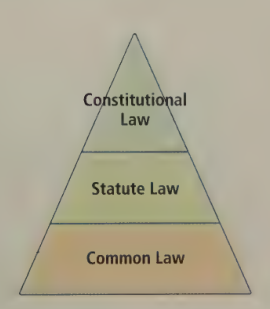
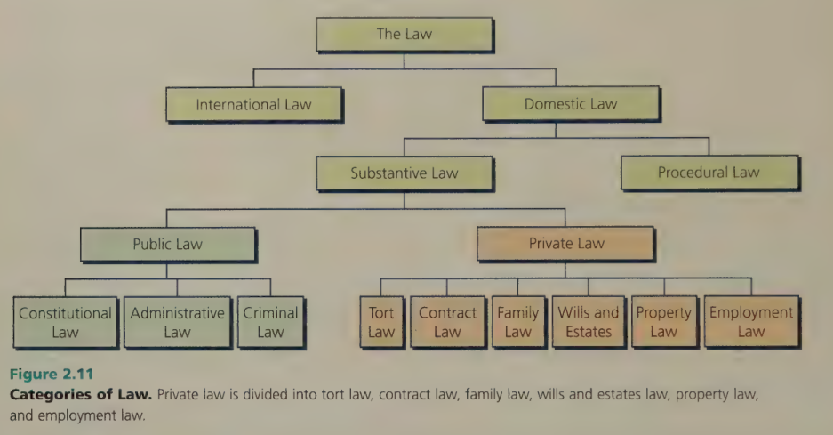

# C2 - Classifying Law

## Sources of Law in Canada

### Hiearchy of Supremacy of Law Sources

### Common Law

**English common law:** law that originates from decisions made by judges in previous cases

- Law is common to all
- Follows the rule of precedent (C1) or *stare decisis* (C1)
- **distingushing a case:** identifying a case as being sufficiently different from prev. cases to warrant a diff. decision

### Statute Law

**statue law:** law or act passed by government

- Examples
  - *Criminal Code*
  - *Highway Traffic Act*
  - *Youth Criminal Justice Act*

**jurisdiction:** authority to pass/enforce laws or to decide a case

#### Levels of Government

- Federal (nationwide)
- Provincial (jurdisdiction within province)

#### Federal Government

Federal government creates laws as set out in s. 91 (section 91) of the *Constitution Act, 1867*

Some Responsibilities:

- criminal law
- federal penitentiaries (jails)
- employment insurance
- banking and currency
- marriage and divorce
- postal services

*Example of Federal Law*

s. 15 of the *Tobacco Act*, S.C. 1997, c. 13, states:

> 15 (1) No manufacturer or retailer shall sell a tobacco product unless the package containing it displays, in the prescribed form and manner, the information required by the regulations about the product and its emissions, and about the health hazards and health effects arising from the use of the product or from its emissions.

*simplified:* tobacco products sold must warn about the negative health effects and what it emits

#### Provincial Governments

Provincial governments have authority to make laws within their own province, as set out in s. 92 of the *Constitution Act, 1867*

Some Responsibilities:

- hospitals
- police
- property rights
- highways and roads
- provincial jails

#### Local Governments

They make laws called **bylaws**

**bylaw:** law that deals with local issues, passed by city gov'ts.

Local Issues:

- height of backyard fence
- who clears snow from sidewalk
- how often garbage is collected

#### Aboriginal Governments

- Indian bands established under *Indian Act* (federal) are like local gov'ts.
- Each band has some authority to make bylaws that apply to their reserve lands
- Bylaws include
  - Regulation of road / bridge construction
  - Public works on reserve

**Aboriginal self-government:** self-government of Aboriginal nation formed through agreement btwn. Aboriginal group and federal gov't.

Has wider law-making powers than an Indian band &mdash; can make laws in respect to:

- marriage
- adoption
- education
- social and health services
- usually exercised by provinces

### Constitutional Law

**constitutional law:** body of law dealing w/ distribution and exercise of gov't. powers

- 1867: *Canadian Constituion* enacted via the *British North America Act*
- 1982: Constitution amended with *Constitution Act*
- Overrides all other laws
- If a law violates the *Constitution,* it is unconditional and can be striked down
  - i.e. Ontario gov't. in 2007 passed *Adoption Information Disclosure Act*, adoption info. is disclosed to birth parents/adopted children w/o consent
  - 2 days later: law is striked as unconstitutional bcz. it violated the Charter of Rights &mdash; rewritten and passed in 2008

## Categories of Law

### Flowchart

### International Law

**international law:** law that governs relations between independent nations

**diplomatic immunity:** agreement not to prosecute foreign diplomats for certain crimes while working in host country

- International Agreements Made
  - **extradition:** agreement to send person to other countries to be tried for crimes there
  - **free trade agreement:** they reduce / remove trade barriers
  - **defence treaty:** agreements with defenses like NATO (North Atlantic Treaty Organization)

192 nations are members of the United Nations (UN), created 1945

**International Court of Justice (ICJ):** World court (branch of UN) that hears disputes submitted by nations &mdash; based in The Hague, Netherlands

**International Criminal Court (ICC):** World court based in The Hague to try persons accused of serious crimes such as genocide, war crimes, and crimes against humanity

ICC is independent w/ 108 members incl. Canada. The US, Iran, Saudi Arabia, and some others are not members.

### Domestic Law

**domestic law:** laws that govern activity within a nation's borders

If a crime is committed in another country, Canada can't help you

The government of Canada does not extradite criminals who may face ***the death penalty***

### Substanstive and Procedural Law

**substanstive law:** law that defines rights, duties, and obligations of citizens and gov't.

**procedural law:** law that describes methods of enforcing rights and obligations of substantive law

Falls under domestic law

### Public Law

**public law:** law related to relationships between individuals and the state

All public laws are subject to the *Canadian Charter of Rights and Freedoms* and the *Constitution* (Charter part of Const.)

**Types of Public Law**

- **administrative law:** law that governs relationship between people and gov't. departments, boards and agencies
  - i.e. Workers' Compensation Board
  - Victims' Compensation Board
  - Liquor Control Board (some provinces)
  - Welfare and medical services
  - Citizens disagree &rarr; approach administrative tribunals &rarr; approach courts
- **Criminal law:** law that prohibits and punishes crimes, that causes harm to others
  - examples of crimes: murder, robbery, assault
  - described in *Criminal Code of Canada* and related federal statutes (cc)
  - (cc) i.e. *Controlled Drugs and Substances Act*, *Youth Criminal Justice Act*
  - Crime is carried out against society as a whole, case format is *R. v. Accused* where R stands for *Regina/Rex* (queen/king)
  - jurisdiction of fed. gov't. but provinces can administer and implement it
- **Constitutional Law**

### Private Law

**private law** (a.k.a. civil law): law governing relationships between individuals / organizations

- **tort law:** holds persons or private orgs. responsible for damages caused on another person accidentally or deliberately
- **contract law:** provides rules regarding agreements between people and businesses
  - if someone is unsatisfied by a purchase, they can seek legal assistance
- **family law:** deals with various aspects of family life
  - covers matters like marriage, divorce, property division upon separation, and custody of children
- **estate law:** law concerned w/ division and distribution of property after death
  - i.e. wills and division of property w/o a will
- **property law:** law that governs ownership rights in property
- **employment law:** governs employer-employee relationships
  - i.e. safety rules, hiring and firing, unions, discrimination and harassment