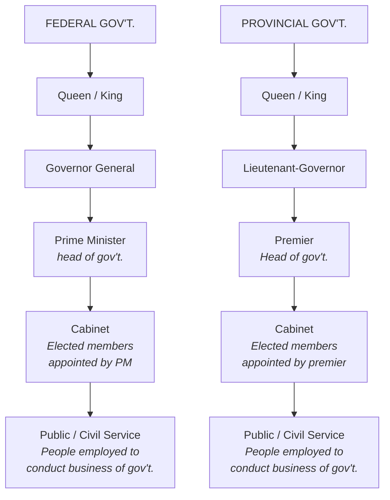
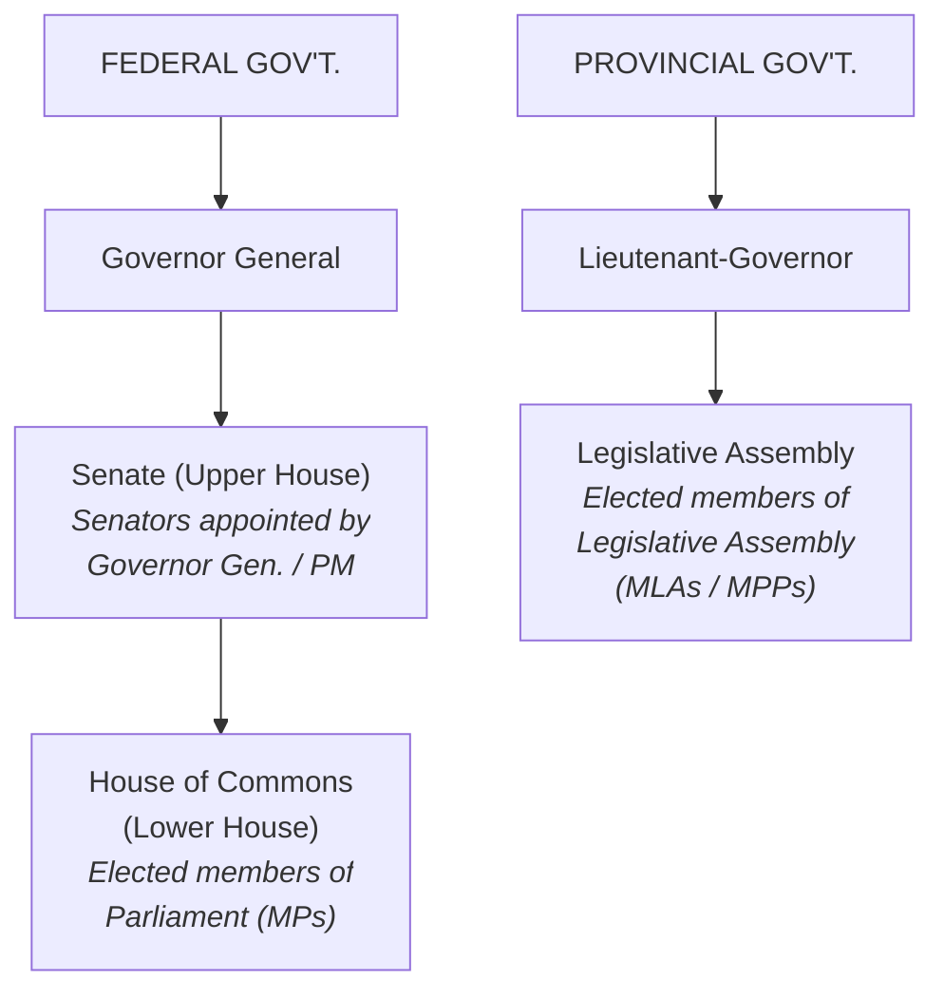
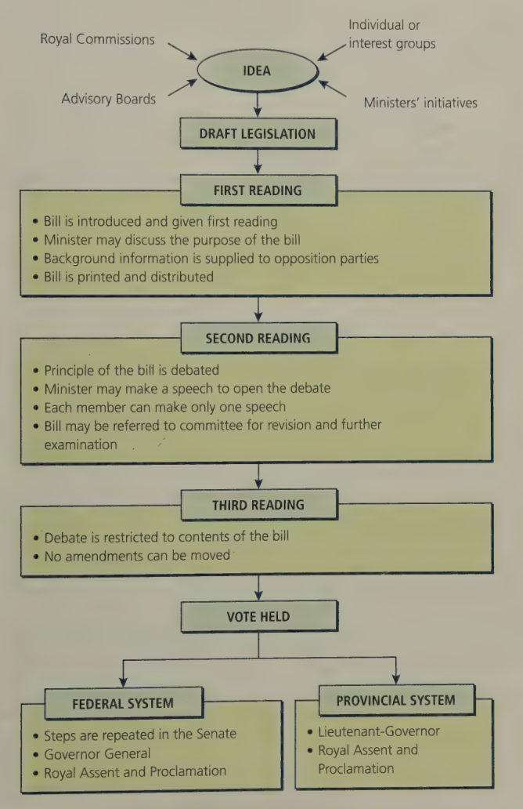
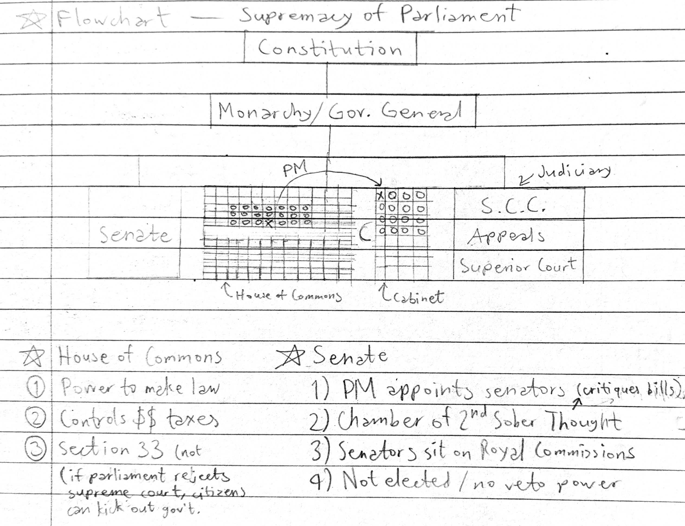

# C3 - Government and Statute Law

## The Constitution

### *British North America Act, 1867*

- Before 1867: Canada was a British colony and subject to British laws
- 1861-65: US Civil War &mdash; fears of American takeover of Canada
- John A. Macdonald, George Brown, and George-Étienne Cartier supported idea of independent Canada
- Ont., Qc., New Brunswick, and Nova Scotia worked together to create the *British North America Act*

---

- *BNA Act* passed on July 1, 1867 &rarr; made Dominion of Canada a country &rarr; Macdonald became 1st PM
- Set out rules for Canada's gov't. and what country it should be
- A constitution for a colony, not an independent country
- *BNA Act* recognized Canada as a separate political entity in the British Empire

### Federal System

*Rejected Models*

- United States: beautiful *Constitution* and *Bill of Rights*, but Civil War happened
- **unitary system:** British system of gov't. where all power was centralized to one national parliament

***Canada's System***

**federal system:** two-level system of gov't. where responsibilities are divided between the federal and provincial gov'ts.

- Federal gov't. can overrule a provincial law
- Canada's Constitution included all conventions of British sys. &rarr; monarch as head of state, Rule of Law

### Division of Powers

- Matters that affected entire country would be federal gov't.'s jurisdiction &mdash; s. 91 of *BNA Act*
- Provincial powers have localized nature and varies from prov-to-prov &mdash; s. 92 of *BNA Act*
  - s. 93 of *BNA Act*: educational responsibilities to provinces

#### Federal Responsibilities

|Col 1|Col 2|Col 3|
|-|-|-|
|Banking|Foreign affairs|Public debt|
|Bills of exchange|Indian affairs|Residual powers|
|Census, statistics|Marriage and divorce|Seacoast and inland fisheries|
|Citizenship|Nav. and shipping|Taxes|
|Currency, coins|Patents and copyrights|Trade and commerce|
|Defence|Prisons||
|Employment Insurance|Postal service||

#### Provincial Responsibilities

|Col 1|Col 2|Col 3|
|-|-|-|
|Compensation to injured workers|Maintenance of hospitals|Provincial courts + laws|
|Direct provincial taxes|Municipal institutions|Solemnization of marriage|
|Education|Natural resources||
|Labour and trade unions|Property and civil rights in prov.

#### Muncipal Powers

- No municipalities in *British North America Act*
- s. 92 of Act: Provinces have authority over municipal services
- Provinces gave responsibilities for local matters to municipal and town gov'ts.
- Municipalities can enact bylaws
- Municipalities are a *creation of the province*

#### Aboriginal Self-Government

- Fed. gov't. has responsibility for Indian and Inuit affairs
- Indian bands in *Indian Act* can make some local bylaws to their lands
- Some Aboriginal groups made agreements w/ fed. gov't. to make more laws
  - i.e. laws for marriage, adoption, education, social and health services

#### Residual Powers

**residual powers:** areas not specifically assigned to provincial jurisdiction are federal responsibilities &mdash; s. 91 of *BNA Act*

- i.e. in 1867, telecommunications and air travel wasn't a thing
- allows parliament to intervene in provincial activities where...
- ...the "peace, order, and good government of Canada" is affected
- Allows Canada to invoke emergency powers (nation under threat)

#### Doctrine of *Ultra Vires* and *Intra Vires*

In unclear areas, sometimes, both levels of gov't. attempt to make law

***intra vires:*** within power of gov't. to pass laws &mdash; *within jurisdiction*

***ultra vires:*** outside the power of gov't. to pass laws &mdash; *outside jurisdiction*

### *Statute of Westminster*, 1931

***Statue of Westminster*, 1931:** legislation passed in GB to extend Canada's law-making powers

- Gave Canada authority to make laws independent of Great Britain
- Gave Canada independence to make agreements (incl. trade) w/ other countries
- Did *NOT* give authority to amend *Constitution* w/o British approval

### Problems with the *BNA Act*

1. Every time Canada wanted to change / amend *Constitution*, it had to ask Britain for permission
   1. Disputes over responsibilities non-existant in 1867 despite s. 91 of the act &rarr; Canada had to ask Britain to include these powers
2. Confusion regarding division of powers like natural resources
   1. Federal gov't responsible for fishing
   2. Timber and wood in provincial jurisdiction
   3. Who was responsible for other resources like uranium, oil, water, or natural gas?
3. Nothing in *Constitution* guaranteed **civil liberties**

**civil liberties:** basic individual rights protected by law, like freedom of religion

## Patriating the Constitution

**patriate:** bring legislative power under the authority of the country it applies to

PM Pierre Elliott Trudeau wanted to bring home the *Constitution*

**History**

1. Trudeau threatened to bring back *Constitution* without provincial approval
2. Took case to Supreme Court and sort of won
3. Court ruling: Intra vires to patriate the *Constitution* but unwise according to unwritten principles of the *BNA Act*
4. 1981: Meeting in Sask. where premiers had 4-day heated debates and Aboriginal peoples lobbied to protect their rights
5. Québec sought more economic and cultural powers
6. In absence of Qc. premier René Lévesque, other premiers agreed on compromise bill
7. Lévesque found out next morning and furiously refused to sign the bill
8. April 17, 1982: *Constitution Act, 1982* signed into law by Queen Elizabeth II and PM Trudeau

### Key Elements of the *Constitution Act, 1982*

- **Principle of equalization:** essential services like health care, education, social services should be equally available to all parts of Canada
  - some provinces make more money than others
  - taxes are collected from provinces and are redistributed to the "have-not" provinces, so that they can provide these services
  - "have-not" province: province with lower GDP than the "have" threshold
- **Clarification of responsibility for natural resources:** natural resources like oil and natural gas are provincial jurisdiction w/ restrictions
  - restriction: prov. can't charge higher prices / limit supply when exporting non-renewable resources to another place in Canada
- ***Canadian Charter of Rights and Freedoms*:** Civil liberties are guaranteed in the *Constitution*
- **Rights of Aboriginal people** are recognized and affirmed

### Constitutional Conflict (Québec)

Québec never signed and approved the *Constitution Act, 1982*

Supreme Court says Québec was subject to the *Constitution* and Québeçois people weree protected by the *Charter*

1996: Federal gov't. appeals to Supreme Court to rule on Québec's right to separate from Canada unilaterally (without Canada's agreement)

1. Under the *Constitution of Canada*, can the National Assembly, legislature, or government of Québec declare independence from Canada unilaterally?
2. Does international law give Québec the right to secede (withdraw) unilaterally?
3. If Canadian and international law conflict on the right of unilateral declaration of independence, which takes precedence?

*S.C.C. Ruling*

- Québec does not have right to separate unilaterally under both the *Constitution* and international law
- If Québec should vote to separate, w/ a clear majority on a clear question, the fed. gov't. and provinces would be obliged to negotiate with Québec

#### History of Québec Separation

1. 1985: Brian Mulroney elected PM, promises to reopen disscusion w/ prov. on *Constitution Act* to reach agreement w/ Québec
2. 1985: Robert Bourassa's Liberal Party wins Québec elections and says he will accept *Constitution*
3. 1987: Mulroney and provincial premiers agree to *Meech Lake Accord* to recognize Québec as a distinct society
4. June 23, 1990: Premiers take *Accord* home for approval
5. 1990: Manitoba fails to approve *Meech Lake Accord* before deadline, so it dies
6. 1992: New constitutional meeting including Aboriginal representatives &rarr; *Charlottetown Accord* created but defeated in national referendum
   1. 54% Canadians voted "no"
7. 1994: Parti Québécois, separartist party, elected in Qc.
8. 1995: Referendum held for Québéçois sovereignty. Canadians travelled to Montréal to encourage voting "no". Referendum defeated narrowly.
9. 2000: *Clarity Act* passed, states future Québec referendums on sovereignty must have "clear" question and majority vote before Canadian gov't. negogiates separation

## Government and Lawmaking

### The Executive Branch

**executive branch:** administrive branch of government responsible for carrying out government's plans and policies

*Roles*

- set policy
- present budgets to legislature
- propose legislation
- implement laws passed by legislature

*Comprised of (Federal / Provincial)*

- **Prime minister / Premier:** leader of executive branch and country
- **Cabinet minister:** member of (provincial) parliament (MP/MPP) elected by PM to lead a specific responsibility &mdash; i.e. Finance Minister
- **Governor General / Lieutenant-Governor:** Symbolic head of the executive branch

### The Legislative Branch

**legislative branch:** branch of gov't. that makes, changes, and repeals laws

*Comprised of*

- Elected members of Parliament in House of Commons (fed.) / Legislative Assembly (prov.)
- Appointed senators in Senate (fed.)
- *Alt name for Senate:* House of "sober second thought"
- Senators can defeat a bill or send it back for revisions

### The Judiciary

**judiciary:** branch of gov't. responsible for Canada's court system + an independent third party for legal disputes and clarifications

*Levels of Courts*

- Supreme Court of Canada (S.C.C.)
- Provincial Court of Appeal
- Prov. Superior Court (serious offenses)
- Provincial Court (less serious matters)

*Appointments*

- Justices of S.C.C., Court of Appeal and Superior Court appointed by federal gov't.
- Judges of lower courts appointed usually by provincial gov't.
- Justices must interpret laws w/ the *Charter* and strike laws down that interfere w/ it

### Passing a Law

1. **bill:** proposed law &rarr; introduced to the legislature
   1. **government / public bill:** bill introduced by a cabinet minister
   2. **private member's bill:** bill initiated by private member (citizen, lobby group, corporation) that is introduced by an MP
2. **First reading:** Gather information &mdash; seek input from voters and conduct research on legislation
3. **Second reading:** Debate over bill; each member allowed to speak once about bill contents &rarr; if significant flaws found / good suggestions made, bill is revised by a committee
4. **Third reading:** Refersh member's minds about bill, including changes made &rarr; introduced typically in House of Commons but can be in Senate
5. **Final vote:** MPs vote on a bill and usually support their party's position
   1.  on controversial issues, free vote may be held to allow MPs to vote independent on party's influence
6. If bill passes, steps repeated in Senate before becoming law
7. Bill sent to Governor General (Crown's representative) and is assented in the name of the Queen / King, becoming law
   1. Queen / King through her/his representative could withhold consent and refuse to sign a bill, never happened
   2. Queen / King could also overrule the gov. general and withdraw her/his assent, never happened
   3. Queen / King no longer has real political power over Canada

Similar process in Prov. Level

1. Bill introduced to Legislative Assembly by MBA / MPP
2. Readings and vote taken
3. Bill goes directly to Lieutenant-Governor for royal assent

### Role of Individuals and Interest Groups

Individuals and interest group give suggestions to lawmakers

**lobby group:** people who try to influence legislators in favour of their cause

- Examples of lobby groups
  - Mothers Against Drunk Driving (MADD)
  - Coalition for Gun Control
  - Legal Eduaction Action Fund (LEAF)
- Methods used
  - Protests and rallies
  - Letter-writing campaigns
  - Petittions
  - Blockades

**royal commission:** people appointed by federal cabinet who influence changes in law related to their topic

### Supremacy of Parliament Flowchart

House of Commons (12 x 5) &mdash; top is party in power, bottom is opposition

Cabinet (4 x 8)