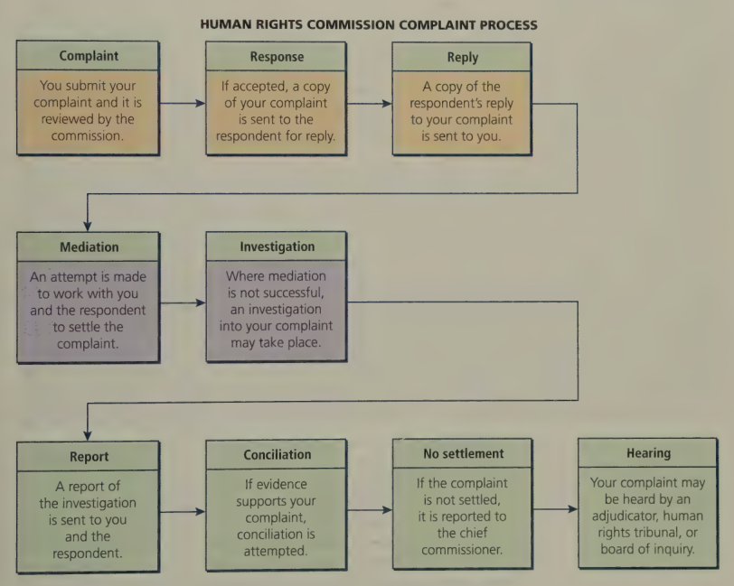

# C5 - Human Rights

## Human Rights Legislation

- **stereotyping:** having an oversimplified, standardized, or fixed judgment / characterization of a group of people
- **prejudice:** preconceived opinion based on stereotype or inadequate info
  - prejudice means to "pre-judge"
- **discrimination:** to treat someone / group of people differently due to stereotypes and prejudice

### International Human Rights Protection

*Universal Declaration of Human Rights, 1948:* International document written by the United Nations that set out fundamental human rights and freedoms

**Other Human Rights Documents by the UN:**

|Agreement|Year Adopted|
|-|-|
|Convention on the Prevention and Punishment of the Crime of Genocide|1948|
|Convention on the Rights of the Child|1959|
|International Covenant on Civil and Political Rights|1966|
|International Covenant on Economic, Social, and Cultural Rights|1966|
|Convention on the Elimination of All Forms of Discrimination Against Women|1979|
|Declaration on the Rights of Indigenous Peoples|2007|

UN agreements do ***NOT*** have the force of law

Power of agreements from mutual example and public pressure, UN does not enforce

*Example*

- 1996: Group of parents argued that gov't. of Ont. violated the Constitution by funding Roman Catholic schools but not independent Christian and Jewish day schools too
- S.C.C. ruled against parents
- One parent, Arieh Waldman, brought issue to UN &rarr; claimed Can. violating *International Covenant on Civil and Political Rights*
- 1999: UN rules in favour of Waldman
- Despite UN ruling, funding of Catholic schools continued
- 2001: Ont. gov't. passed law providing tax credit for parents sending children to private / independent schools

### *Canadian Human Rights Act*

*Canadian Human Rights Act, 1977:* Human rights act that applies to gov't. depts., Crown corps., and businesses / industries regulated by fed. gov't.

People who work in post offices, airlines, TV / radio stations, and chartered banks can seek remedy under *CHRA* if victims of discrimination

**Prohibited Grounds for Discrimination**

1. Race
2. National or ethnic origin
3. Age
4. Marital and family status
5. Pardoned criminal conviction
6. Colour
7. Religion
8. Gender (includes pregnancy and child-bearing)
9. Physical or mental disability (inclues dependence on alcohol or drugs)
10. Sexual orientation

***Indian Act***

S. 67 of the *Indian Act* restricts ability of people living / working in Aboriginal communities to file complaints of discrimination if it was related to the Act

Controls matters like:

- Registration / non-registration of people as First Nations members
- use of reserve lands
- education
- housing

Many First Nations people, particularly women, called for its repeal to challenge discriminatory provisions of the *Indian Act* and actions by the Department of Indian Affairs and Northern Developent.

## Administering Human Rights Legislation

### Filing a Complaint

- **complainant:** person making allegation of discrimination
  - provided w/ package to assist in filing complaint
  - prob. asked to fill out complaint form describing discriminatory events or circumstances
  - up to complainant to prove their case
- ***prima facie:*** legally convincing unless disproved by contrary evidence

*To establish prima facie case for discriminatory hiring,* you must prove:

1. you were qualified for the particular job
2. you were not hired; and
3. someone no better qualified thatn you was subsequently hired
   1. that person lacked distinguishing feature that represents **gravamen** of human rights complaint

**gravamen:** the grievance or main cause of accusation

Commission then informs you whether complaint is covered by provincial code

If covered, commission will serve your complaint upon the **respondent**, and they will formally respond to the allegations of discrimination

**respondent:** person / organization that the complainant alleges to have discriminated against him/her

After investigation, human rights officer writes report to inform parties of investigation results

Officer may try to resolve complaint through **conciliation**

**conciliation:** bringing conflicting parties together to resolve their differences

### Hearing a Case

- No resolution reached
- Case referred to an adjudicator, board of inquiry, or human rights tribunal
- Above are formal bodies that will hear the case and make a decision based on evidence
- Decision of board of inquiry can be appealed and sent of judicial review
- In Ont., decision made by Human Rights Tribunal may be appealed sometimes to the Divisional Court of the Ontario Court of Justice...
- ...or ultimately, to the Superior Court of Ontario

### Remedies

**Possible Remedies When Discrimination Has Occured**

- ordering the person / org. that violated human rights code to stop
- ordering respondent to pay the complaint for mental anguish or for any losses suffered in pay or benefits
- compelling an employer to give complainant back his/her job -or- to grant denied promotion
- ordering org. to adopt programs to relieve hardship or economic disadvantage, or to assist disadvantaged groups in achieving equal opportunity
- requiring org. to provide human rights and anti-discrimination training for all employees, develop detailed policies to eliminate discrimination and harrasment, or undertake similar remedies

If complainant feels that treatment / final judgment was unfair, they can contact the **ombudsman**

**ombudsan:** officer of provincial legislature who investigates complaints from anyone who feels they have been treated unfairly by those who provide provincial or municipal gov't. services

## Grounds of Discrimination

### Meeting Special Needs

Most prov. human rights codes prohibit discrimination based on disability and require employers to **accommodate** needs of workers w/ disabilities

**accomodate:** eliminate / adjust requirements or conditions to enable person to carry out essential elements of an activity or job

Under *Ontario Human Rights Code*, persons w/ disabilities have right to full integration and participation in society

Employers, landlords, service programs, others have duty to consider special needs:

- buildings, programs, procedures, services must be designed to include all persons equally and fully
- where it's impossible to remove barries w/o undue hardship, speical arrangements must be made so that disabled person can participate

**undue hardship:** result of a change that would, for example, affect the economic viability of the enterprise or produce a substantial health and safety risk that outweights the benefit of accomodating a particular group

### Goods and Services

Everyone has right to equal access to goods and services

- **goods:** merchandise / objects that can be purchased
  - i.e., books, computers, clothing
- **services:** way to meet consumer needs that do not involve purchase of tangible goods
  - i.e. banks, dry cleaners, hotels

### Accommodation and Facilities

**accomodation:** placre where people (want to) live

**facilities:** areas or buildings designated for public use

*Ex. of facilities:* parks, concert halls, hockey rinks

All people have the right to equal treatment in accommodation, protected by prov. human rights codes

*Ex. of discrimination for facilities:* Rink attendant jeers at women's hockey team and gives team less than allocated ice time. Manager does nothing after complaints. Rink attendent and manager have violated women's rights.

### Employment

Everyone has a right to "equal treatment with respect to employment"

#### Exceptions Under the Law

- Actions not considered discriminatory if they are "reasonable and justifiable" under the circumstances
  - i.e. higher car insurance fees for young driver; statistics show that younger drivers tend to file more claims
- ***bona fide* occupational requirement:** qualification essential for proper / efficient job performance
  - "bona fide" is Latin for "in good faith"
  - i.e. good eyesight required to be an airplane pilot
- **affirmative action:** gives advantages to groups who have been discriminated in the past
  - i.e. 2 equally qualified candidates, priority may be given to applicant from historically disadvantaged group
  - Often practised in orgs. that serve a particular community
    - i.e. female candidate chosen over more experienced male candidate as a security guard for a *women's shelter*

#### Constructive and Direct Discrimination

- **constructive discrimination:** employment policies that inadvertently exclude certain individuals
  - i.e. in the past, police dept's. had min. height requirement that excluded most women and many minority groups
  - more difficult to detect than direct discrimination
- **direct discrimination:** discrimination that is practised openly
  - i.e. refusing service to someone simply because he/she is part ofa particular group

#### Duty to Accomodate

- S.C.C ruled that employer has legal duty to accommodate an employee's individual needs
- Employer must take reasonable measures to implement policies / working conditions to meet special needs of employee
  - i.e. Employee takes day off on a certain day for religious reasons
  - Employer must try to resolve conflict to satisfy both parties
- Employer not expected to suffer **undue hardship** for an employee
  - i.e. employee has a physical disability and needs to carry boxes upstairs
  - undue hardship to install an elevator just for that one employee
  - reasonable solution: have someone else carry boxes upstairs and have the disabled employee do some of the other person's duties

#### Harassment

Everyone has right to be free from harassment

- **harassment:** persistent behaviour that violates human rights of the victim
  - i.e. racial, sexual, religious slurs
- **sexual harassment:** may include unwelcome sexual contact, remarks, leering, demands for dates, requests for sexual favours, and displays of sexually offensive pictures / graffiti

#### Poisoned Environment

**poisoned environment:** uncomfortable or disturbing atmosphere created by negative comments or behaviour of others

