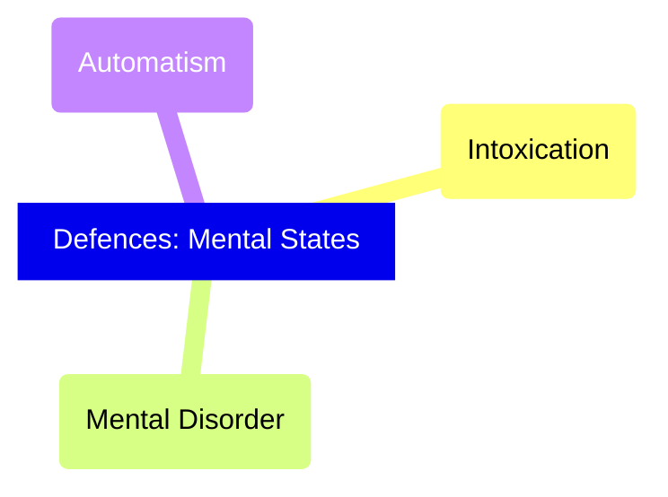
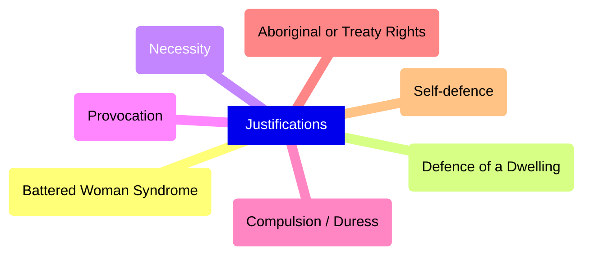
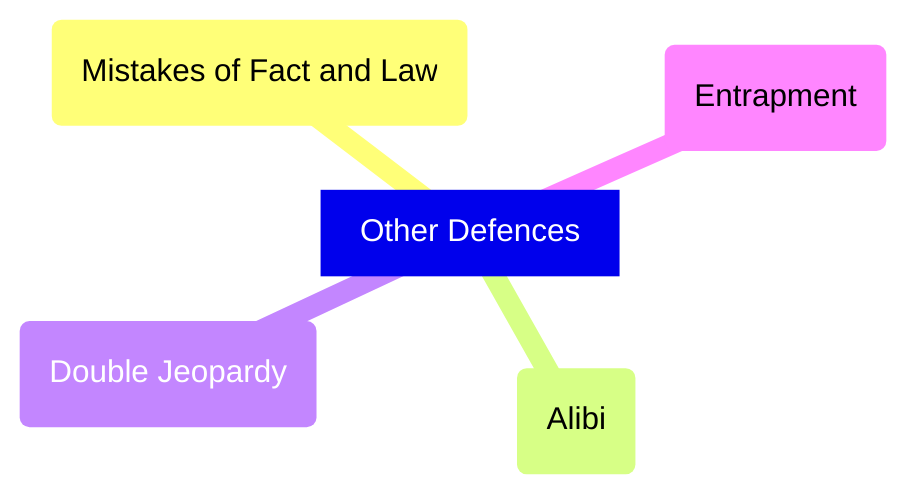

# C10 - Defences for the Accused

## Defences

**defence:** denial of, or a justification for, criminal behaviour

Most common defence is denial

## Mental States

- Is the accused mentally fit to understand the proceedings and to participate in his/her defence?
- If at any time there are reasonable grounds to suspect accused is mentally unfit
	- Judge issues assessment order
	- then decides on appropriate course of action based on assessment report

### Mental Disorder

- **mental disorder:** defined in the *Criminal Code* as a "disease of the mind" (s. 16)
- Someone w/ mental disorder cannot be criminally responsible
	- because he/she unable to form *mens rea* of offence
- Person presumed *not* to suffer from mental disorder until contrary proven "on the balance of probabilities"
	- how likely is it for person to suffer from mental illness?
- Must Satisfy One of Two Requirements
	- Mental disorder left accused incapable of appreciating the nature and quality of the act
		- i.e. accused repeatedly stabbed another person
		- but due to mental disorder, he couldn't foresee consequences of act
	- Mental disorder left accused incapable of knowing act / omission was wrong
		- i.e. Mr. Tk has a mental disorder that led him to believe Ayaan is an evil dictator wiping out Tamils in his country after Ayaan emailed him the N word
		- He pounces on Ayaan, roars at him, then tears his throat off
		- Psychiatrist testifies that Mr. Tk thought that he is protecting his people by killing Ayaan
		- Court concludes Mr. Tk did not know his actions were wrong
- If Court finds accused not criminally responsible
	- Judge may "make an order" concerning accused
		- absolute discharge
		- conditional discharge
		- term in psychiatric hospital
	- or refer the case to a provincially appointed Criminal Code Review Board
- Not used for less serious offences
	- period of confinement in mental facility > prison sentence (generally)

### Automatism

- **automatism:** condition in which a person acts without being aware of what he/she is doing
	- i.e. sleepwalker prepares a sandwich and eats it
	- i.e. severe concussion or misusing medication
- **insane automatism:** form of automatism caused by mental disorder
	- if proven, outcome same as mental disorder defence
- **non-insane automatism:** form of automatism not caused by mental disorder
	- like a concussion or medication
	- proven? acquitted

### Intoxication

- **intoxication:** the condition of being overpowered by alcohol or drugs to the point of losing self-control
- defence only to *specific* intent, not *general* intent
- accused may not be found guilty for specific intent offence, but may still be guilty of general intent offence
	- i.e. convicted of manslaughter instead of murder
- can apply to *general* intent if person's intoxication is so extreme &rarr; almost mental disorder
	- i.e. *R.* v. *Daviault* [1994] &mdash; Daviault drank so much alcohol and then raped 65-yr-old partially paralyzed woman
		- SCC ruled intoxication was so severe that he was incapable of forming even most basic intent to commit wrongful act
		- conviction = violating principles of fundamental justice
	- Followed by public outcry
	- Parliament quickly amended *Code* to make *self-induced intoxication* an invalid defence to general intent offences

## Justification

### Defences of Justification

### Self-Defence

- **self-defence:** the use of reasonable force to defend against an attack (s. 34 of *Code*)
	> 34. (1) Every one who is unlawfully assaulted without having provoked the assault is justified in repelling force by force if the force he uses is not intended to cause death or grievous bodily harm and is no more than is necessary to enable him to defend himself.
- **reasonable force:** only the necessary force needed to defend against an attack
	- depends on circumstances
	- threat to punch by grabbing collar &mdash; punch back, loosen grip, run
	- threat of life with weapon &mdash; severe injury / death acceptable
	- explicitly stated in s. 34 (2) of *Code*
	> 1. (2) Every one who is unlawfully assaulted and who causes death or grievous bodily harm in repelling the assault in justified if
	> 	2. (a) he causes it under reasonable apprehension of death or grievous bodily harm from the violence with which the assault was originally made or with which the assailant pursues his purposes; and
	> 	3. (b) he believes, on reasonable grounds, that he cannot otherwise preserve himself from death or grievous bodily harm

### Battered Woman Syndrome

- *R.* v. *Lavallee*, [1990] 1 S.C.R. 852 marked 1st time that battered woman syndrome used to advance justification of self-defence
	- Lavallee shot common-law husband in the back of the head as he left after violent argument
	- Couple often argued violently
	- Lav. treated in hospital for several serious injuries
	- Night of shooting
		- Husband slapped her on the face
		- Told her that he'd come back to kill her
		- Psychiatrist: Lav. felt like she'd actually die and she shot
	- Jury acquitted Lavallee
	- Manitoba Court of Appeal overturned acquittal
	- SCC restored acquittal
- In cases involving **battered woman syndrome**, jury should be instructed on following 3 elements:
	- why an abused woman might remain in an abusive relationship
	- the nature and extent of the violence that may exist in a battering relationship, and
	- the defendant's ability to perceive danger from her abuser
- Not a defence by itself
- **B.W.S.** is psychiatric explanation of abused woman's state of mind that can help advance defence of self-defence

### Defence of a Dwelling

- s. 40 and 41 of *Code* extends rules of self-defence to defence of "dwelling house"
- **dwelling house:** any building / other structure that is occupied on a temporary or permanent basis
- Person allowed to defend his/her dwelling from any unlawful entry and remove a trespasser who has entered
- Reasonable force allowed
- If trespasser resists owner's attempts to protect dwelling, trespasser is committing **assault**

### Necessity

- **necessity:** defence stating that accused had no reasonable alternative to committing an illegal act
- Conditions Requried for ***Necessity*** to Succeed
	- The accused must show that the act was done to avoid a greater harm
	- There was no reasonable opportunity for an alternative course of action that did not involve a breach of the law
	- The harm inflected must be less than the harm avoided
- Example
	- Bob the Builder gets hit by a metal rod and is bleeding severly
	- 911 is called but Bob's losing blood fast. Ambulance taking too long.
	- Tom rushes Bob in his car to the hospital. He speeds, drifts, and goes past red lights
	- Bob is sent to the hospital while the police charges Tom with dangerous operation of motor vehicle
	- Tom uses defence of necessity

### Compulsion or Duress

- **compulsion / duress:** defence in which the accused person is forced by threat of violence to commit a criminal act against his / her will
- **compulsion:** person was forced by threats or death / bodily harm
- **duress:** person is prevented from acting according to his / her own free will by threats or force of another
- i.e. Taxi driver forced at gunpoint to drive a bank robber to a certain point in city

S. 17 of *Criminal Code*

> 17. A person who commits an offence under compulsion by threats of immediate death or bodily harm from a person who is present when the offence is committed is excused for committing the offence if the person believes that the threats will be carried out...

- Controversial Provisions
	- threatener has to be physically present when offence is committed
	- threat has has to be "immediate" &rarr; on point of being carried out
	- In *R.* v. *Carker* [1967] S.C.R. 114 &rarr; Carker's appeal dismissed
		- Carker threatened to be knifed, kicked in the head, and have arm broken by several inmates if he didn't damage plumbing
		- Dismissed because threat was "immediate" and persons weren't "present"
	- 2001: *R.* v. *Ruzic*, S.C.C. found immediacy and presence provisions of s. 17 unconstitutional
	- Parliament yet to amend s. 17 as of 2009 (release date of textbook)

### Provocation

- **provocation:** words / actions insulting enough to cause a reasonable person to lose self-control
- applies only to crime of murder
- provocation may be considered as partial defence to reduce conviction to manslaughter
- Successful **Elements of Provocation**
	- A wrongful act or insult occurred
	- This act or insult was sufficient to deprive an ordinary person of the power of self-control
	- The person responded suddenly
	- The person responded before there was time for passion to cool

### Aboriginal or Treaty Rights

- Aboriginal peoples have certain extended rights over acts that would be illegal for other people
- S. 35 of *Constitution Act, 1982* guarantees Aboriginal peoples all existing rights + rights that will be acquired through land-claim agreements
- S.C.C. has to balance rights with sovereignty of the Crown
- Case should be resolved in favour of Aboriginal peoples when there is any doubt or ambiguity in applying s. 35
- *R.* v. *Sparrow* [1990] 1 S.C.R. 1075
	- Sparrow accused of fishing with net longer than allowed in federal *Fisheries Act*
	- Argument: He had "Aboriginal right" to fish for food
	- Justification of Infringement: Conservation of Canada's fisheries
	- SCC overturns conviction and orders new trial
	- Crown withdraws charges
- Anyone claiming an Aboriginal right must...
	- prove that the right exists
	- he / she was acting according to that right; and
	- that this right has been infringed by gov't. action
	- If all 3 points proven, gov't. continues case by justifying infringement

## Other Defences

### Chart

### Mistake of Law and Fact

- **mistake of law:** ignorance of the law
	- s. 19 of *Code*: mistake of law cannot be used as defence
	- approach traditionally justified on basis that criminal law represents common, fundamental values and laws that all people should know
	- Exception to s. 19
		- **officially induced error:** defence where accused relied on misleading legal advice from an official responsible for enforcing a particular law
		- i.e. Parked in no-parking zone, police officer tells driver to move car, driver moves car, another cop sees suspended lic., charges driver with driving motor vehicle with suspended license
		- Court may acquit driver if he/she can prove they honestly thought first officer was advising them to move car
- **mistake of fact:** defence that the accused made an honset mistake that led to the breaking of the law
	- i.e. Bob accidentally takes his friend's bike instead of his own, thinking his friend's was his own

### Double Jeopardy

- **double jeopardy:** legal doctrine that an accused person cannot be tried twice for the same offence
- if person tried for crime A &rarr; convicted for crime A &rarr; cannot be tried again for the same crime A

### Alibi

**alibi:** defence raised by accused claiming that he/she was somewhere else when the offence was committed

### Entrapment

- **entrapment:** defence against police conduct that illegally induces the defendant to commit a criminal act
- undercover police permitted to present suspect w/ opportunity to commit crime
- ❌NOT PERMITTED to
	- harass
	- bribe; or
	- induce...
	- ... person to break the law
- i.e. William is drug addict persuaded to sell drugs to undercover female cop
	- William resist cop's demands
	- Officer says she urgently needed drugs because she was sick
	- Officer bursts into tears and William agreed to sell
	- William arrested as he delivered the drugs
- If judge agrees w/ defence
	- Judge will "stay" the proceedings, stop trial
	- Does not acquit accused