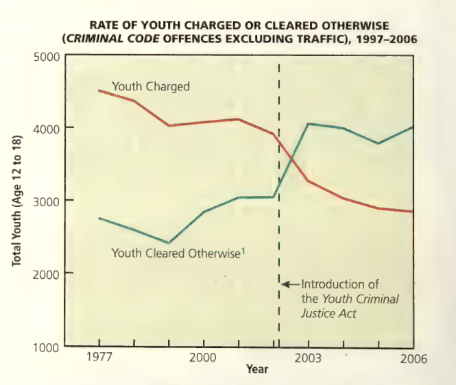
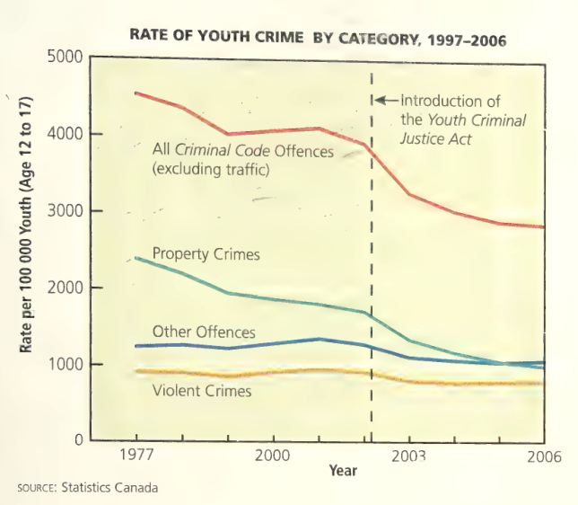
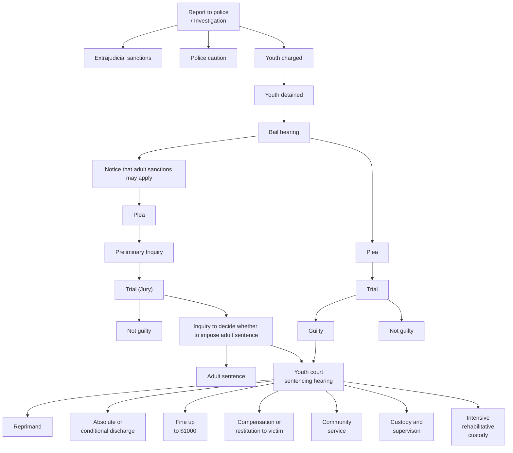

# C12 - Criminal Law and Young People

## Youth and Crime

- Statistics
	- Reported youth crime rose dramatically between 1984 - 1991 (peak '91)
	- American youth commit homicides 6-10x more than Canadian youths
	- Homicide rate of Canadian youths higher than that of other countries
- Reasons for youth crimes
	- Lack of self-confidence; troubles at home and school; pressure
- Factors influencing youth crime
	- abuse or neglect as children
	- spousal abuse / high conflict between parents
	- parents abusing drugs or alcohol
	- parents involved in criminal activity
	- leaving home and living on the streets
- Judges try to identify "ring leader" of crime during gang attacks

### Legislative Reform and Young People

- Before 1908: Children >7 yrs. who committed criminal offences tried as adults
	- if convicted, faced same punishment as adults (imprisonment, flogging, hanging)
- 1908: Parliament enacts ***Juvenile Delinquents Act***
- ***Juvenile Delinquents Act***
	- children who committed crimes described as **juvenile delinquents**
	- **juvenile delinquents:** children between ages of 7 and 16-18 (depending on province) who committed crimes or were considered "unmanageable" or "sexually immoral"
		- stems from children having lack of proper guidance
		- also incl. children who
			- ran away from home
			- skipped school
		- often applied discriminately
			- i.e. against sexually active girls
	- delinquent youths to be treated as misdirected children who needed encouragement and help in turning lives around
	- **training school:** custody facilities that provided disciplinary and vocational instruction to juvenile offenders
		- children sent for relatively minor offences
	- guiding principle: "welfare of the child"
- 1960s - 70s: Many Canadians critical of *Juvenile Delinquents Act*, arguing that "welfare" approach not working
	- Children not being rehabilitated
	- Juvenile delinquents reoffending upon release
	- Act gave judges and police broad powers over deciding child's "best interests"
	- Act failed to recognize legal rights of youths

### *Young Offenders Act*

- 1984: Parliament replaces *Juvenile Delinquents Act* with ***Young Offenders Act***
- ***Young Offenders Act*:** federal legislation replacing *Juvenile Delinquents Act* in 1984
- **young offender:** young person between 12 years up to 18th birthday who breaks criminal law
- Young offenders to be held accountable for crimes but at a lower level than adults
- Recognizes legal rights of young people as set out in *Charter*
- 1990s: Number of youth crimes reported increased, citizens calling on gov't. to take tougher action to youth crime
	- particularly for violent and repeat offenders
- 1990s: Amendments made
	- Increase of max. sentence for murder: 3 yrs. &rarr; 10 yrs.
- mid-1990s - 2000: Lobbying of fed. gov't. for tougher youth criminal legislation
	- 2000: Canada had highest rate of youth incarceration in world
	- Qc. only province took position that drastic changes not required
		- need to focus more on causes of root crime, not harsher punishment for youth offenders

### *Youth Criminal Justice Act*

- 2002: *YCJA* passed by Parliament as fed. gov't. conferred w/ provinces and various orgs.
- ***Youth Criminal Justice Act (YCJA)*:** federal legislation that replaced the *Young Offenders Act* that came in to effect April 1, 2003
- Age of youths covered: 12 to 18th birthday
- Purpose of *Act*: long-term protection of society
- Sets out ways to promote protection
	- addressing circumstances underlying a young person's behaviour
	- focusing on measures that will impact the youth's rehabilitation
	- making sentence match the crime
- Police required to consider measures other than custody for young people who commit minor offences
- Also makes provisions for ...
	- members of the youth's family
	- victim
	- youth workers
	- other members of the community
	- ... to be more involved in different stages of process
- Before 2008: Youths automatically given adult sentences if convicted of
	- first or second-degree murder
	- attempted murder
	- manslaughter
	- aggravated sexual assault
	- repeat "serious violent offences"
- After 2008: Youth presumed to be entitled to youth sentence
	- Crown may petition the Court to consider adult sentence
	- Identity of young person receiving adult sentence may be made known to public after sentencing

### Incapacity of Children

- **incapacity of children:** legal presumption that a child under 12 years cannot form the necessary *mens rea* to be convicted of a crime
- these children are to be dealt with by parents
- or according to social welfare / mental health laws of each province or territory
	- i.e. removal of child from parent's home to foster / group home
	- i.e. sending violent children for treatment to secure mental-health facility

### Summary of Legislation

#### *Juvenile Delinquents Act* (1908)

- age of youths covered: 7-16 or 7-18, depending on province
- child-welfare approach
- informal procedures
- lack of recognition of legal rights
- incidents of institutional abuse
- significant judicial discretion

#### *Young Offenders Act* (1984)

- age of youths covered: 12 to 18th birthday
- shift from welfare to criminal approach
- more emphasis on youths' taking responsibility for actions
- more emphasis on society's right to be protected
- rights under *Charter* and special rights for youths

#### Amendments to *Young Offenders Act* (1992 and 1995)

- max. sentence in youth court increased to 10 yrs. for murder
- easier transfers to adult court for 16 and 17-year-olds charged w/ serious offences

#### *Youth Criminal Justice Act* (2002)

- age of youths covered: 12 to 18th birthday
- limited use of custody
- seriousness of offence to be reflected by sentence
- measures other than court proceedings to be used for non-violent offences
- need to transfer youths to adult court eliminated by...
	- allowing adult sentences for presumptive offences...
	- if youth sentences insufficient to hold young offenders accountable
- publication of youth's identity if adult sentence imposed, but only after sentencing

## Legal Rights of Young People

*YCJA* provides additional rights to young people who may fail to exercise *Charter* rights through ignorance or fear

### Searches

- s. 495 (1) of *Code*: police permitted to search w/o warrant if they have reasonable grounds to believe search will uncover evidence that might otherwise be lost
- Different judges have different viewpoints on youth's privacy
	- *R.* v. *D.M.F.* [1999] A.J. No. 1086 (C.A.)
		- woman allowed cops to search her son's room for evidence, w/o son's permission
		- police seized pair of underwear as evidence that youth committed 2 sexual assaults
		- Alberta Court of Appeal dismissed youth's appeal and said seizure was lawful because mother consented to search
	- *R.* v. *W. (J.P.)* (1993)
		- father in BC gave police officer right to search son's room w/o search warrant
		- youth did not consent to search
		- officer found stolen goods and youth arrested when arriving home
		- youth acquitted; Judge ruled that father couldn't waive son's rights to privacy under s. 8 of *Charter*
- *R.* v. *M. (M.R.)*, [1998] 3 S.C.R. 393
	- S.C.C. rules that warrant is not essential when school authority searches student
	- School authority must have reasonable grounds to believe school regulations have been breached
	- Search must be "reasonable"
		- Intrusive search for weapons ✅
		- Male student searches female student's body for drugs ❌

### Rights Regarding Evidence

- All young suspects entitled to lawyer
- Youth must be informed that he / she has right to consult with parent or lawyer before answering questions
- ... and right to have parent or lawyer present
- Rights intended to prevent young people from giving statements w/o having opportunity to obtain proper legal advice
- Rarely to young's person advantage to give statements before consulting legal advice
	- even if youth committed act and thinks situation is hopeless
- 1990: S.C.C. rules that evidence couldn't be used in court against young accused if young person's rights had been violated during gathering of evidence, even if violation was minor
	- Implies young defendant could "get off" on technicality
	- Under *YCJA*, if officer doesn't fully comply with conditions, evidence may still be admitted if Judge finds only a "technical irregularity" occurred
	- Irregularity must not violate youth's rights or procedural protections

s. 146 of *Youth Criminal Justice Act*

> 146. (2) No oral or witten statement made by a young person who is less than eighteen years old ... is admissible against the young person unless
> 		- (a) the statement was voluntary
> 		- (b) the person to whom the statement was made had, before the statement was made, clearly explained to the young person, in language appropriate to his or her age and understanding that
> 			- (i) the young person is under no obligation to make a statement
> 			- (ii) any statement made by the young person may be used as evidence in proceedings against him or her
> 			- (iii) the young person has the right to consult counsel and a parent or other person...
> 			- (iv) any statement made by the young person is required to be made in the presence of counsel and any other person consulted ... unless the young person desires otherwise ....

### Publication of Identities

- Media can report on youth trials
- Publication of...
	- name or other identifying information about young accused
	- any other youth involved in trial (i.e. witness)
	- ... *is prohibited* ❌
- Importance: Many ppl. believe knowing youth's identity could prejudice teachers, classmates, or community members against the youth and his / her family
- Negative publicity could stigmatize youth and hinder rehab
- s. 110 of *YCJA*, identity of youth receiving adult sentence can be published, but only after sentencing

## Youth Criminal Justice System

### Youth Court Process in Criminal Justice System

### Community-based Measures

- Under *YCJA*, police officer's first option in dealing w/ first-time offender is to consider extrajudicial sanction
- **extrajudicial sanction:** participating in community-based programs aimed at having youth take responsibility for his/her actions instead of going to court
- In program, youth may be required to...
	- apologize to victim
	- replace or repair damaged property
	- return stolen goods
	- meet with the victim to find out how the crime affected him or her; or
	- perform some kind of community service for a certain period
- Programs related to type of crime
	- i.e. vandalism of community park
	- community service: plant flowers and rake leaves at public park for certain # of hours in a week
- Extrajudicial sanction can be used only if
	- the Crown prosecutor or police officer is satisfied that such a program would be appropriate
	- the young person agrees to participate in the program
	- the young person has been advised of his or her right to consult a lawyer regarding the program
- Young person's parents must be informed of program
- Victim also has right to know the kind of program the youth is participating in
	- Many programs try to involve victims in some way
	- Programs often invite victim to meet offender
- Any record of participation in extrajudicial sanction must be destroyed if youth does not commit any further offences for 2 years

### Youth Justice Court

- **youth justice court:** a special court for young people between 12-18 years who have been charged with a criminal offence
- Young person can be questioned, charged, and given notice to appear in youth justice court if...
	- offence is serious
	- police have reasonable grounds to believe a certain young person committed the offence
- If detained, young person entitled to bail hearing
- In deciding whether youth should remain in detention, Judge considers
	- seriousness of crime
	- likelihood that youth will appear in court if released
- If Judge has reason to believe youth will commit another crime before trial or fail to appear in court
	- Judge may order youth to remain in detention
- Detention very disruptive for young person
	- i.e. *R.* v. *M. (T.)* (1991)
	- Judge found that conditions in Toronto detention centre were "cruel and unusual"
	- Cells were hot, dirty, and overcrowded
- Young person who has passed his / her 18th birthday can be tried in youth justice court if person committed alleged offence before turning 18
	- i.e. Bob commits sexual assault on 14-year-old Anne when he was 16
	- Anne reports assault after Bob turns 18
	- Bob may be required to serve sentence in adult correctional facility if convicted

## Sentencing Options

- s. 38 of *YCJA* sets out principles that must be considered when sentencing young ppl.
- Meant to guide judges (and others involved in youth justice sys.) in how to interpret *Act*
- Main principle: Hold young person accountable for his / her actions by...
	- imposing sentence that is fair;
	- meaningful; and
	- helpful in process of rehabilitation
- Sentence to be proportionate to crime
- Sentence cannot be greater than punishment adult would receive for same crime
- Judge considers many factors before sentencing:
	- the extent to which the youth participated in the offence
	- the harm done to the victim and the community
	- any reparation that the youth has made to the victim
	- the amount of time the youth has already spent in detention
	- other crimes the youth may have committed
	- the content of the victim impact statement
- Judge also examines pre-sentence report
- **pre-sentence report:** report that provides Judge with background info. about offender
	- incl. school attendance;
	- performance records
	- relationship with parents
	- usually written by youth court worker (or probation officer)
- psychological / medical assessment may also be undertaken to help Judge
- Judge must consider all community-based sentencing options other than custody
	- especially when sentencing young Aboriginal offenders
	- requirement aimed at reducing high rate of Aboriginal youth custody
	- many Aboriginal leaders believe alts. give Aboriginal comm. more control over rehab and treatment of their youth

### Youth Sentences

- **youth sentence:** punishment imposed on a young person that takes into consideration the principles involved in sentencing people under 18 yrs.
	- option 1
	- i.e. youth could be discharged on condition that he / she
		- performs community service
		- pays fine; or
		- compensates victim for any damage / loss caused by offence
- Option 2: probation for specific period
	- generally, probation allows young person to live at home
	- must meet number of requirements such as
		- complying w/ curfew
		- attending school regularly
		- getting professional counselling
		- appearing in court if required
		- remaining within designated area
		- performing work in community
- **custody:** sentence entailing confinement within controlled facility; usually imposed on young person who commits serious crime 
- **custody and supervision order:** court order that sets out terms and conditions, requiring youth to spend 2/3 of sentence in custody and last 1/3 in community under supervision
- **open custody:** sentence directing youth to stay in group home or participate in a wilderness camp for a certain period
	- youth live under certain conditions; must obey all house rules
		- comply with curfew
		- attend meals on time
		- avoid drugs and alcohol
		- perform household chores
	- youth can continue to attend school
- **secure custody:** sentence that incarcerates young criminal in special youth facility
	- could be its own facility or a section of an adult prison
	- most facilities offer educational opportunities
	- *YCJA* restricts use to serious or repeat offenders only
- **youth worker:** person appointed by gov't. to monitor a youth's progress in the community
	- makes sure person released from custody follows conditions of supervision as specified in sentence
		- i.e. attending school or training program regularly
		- finding employment; or
		- participating in treatment program for alcohol / drug abuse
- Post-custody supervision aimed at helping youth reintegrate to society
- Probation, custody, and supervision cannot exceed 2 years in most instances
- Serious offences
	- Youth may receive 3 yrs. custody and supervision
	- first-deg. murder: max. penalty 10 yrs. custody
	- second-deg. murder: max. penalty 7 yrs.

#### Conferences

- Court may refer case to conference to determine most appropriate action
	- at any stage in youth sentencing process
	- referral might be made by judge
	- earlier stage: by police officer or Crown prosecutor
- Youth, parents, and victim typically meets with
	- facilitator
	- concerned professionals
	- members of community
	- ... to discuss situation and reach consensus about best response to offence
- Other parties who may attend
	- police officer
	- youth worker
	- teacher
- Can be held to determine if extrajudicial sanction would be more appropriate than court-imposed sentence

### Adult Sentences

- Crown seeks adult sentence instead of youth sentence
	- if youth found guilty of such serious offences that sentencing under youth legislation is not appropriate
	- Crown must notify youth of its intentions prior to trial
	- Notice given: youth has right to preliminary inquiry and trial by jury
	- Preliminary inquiries reserved for most serious offences
	- Onus on Crown to satisfy Court that youth sentence would not be sufficient to hold youth accountable
- Adult sentence may be considered *only* for youths who were at least 14 yrs. on date of offence
- Court considers num. of factors:
	- youth's background
	- seriousness of offence
	- age
	- maturity
	- accused's character
- Court imposes adult sentence if it finds youth sentence not a sufficient response
	- portion may be served in youth custody facility
	- offender placed in youth custody facility until they turn 18
	- youth over 18 at time of sentencing may serve sentence in adult facility

### Records

- Youth records kept in local police or RCMP databases
- Records of young person involved in extrajudicial measures program destroyed after 2 years
- People who have access to youth's record
	- the youth him/herself
	- parents of the youth
	- police
	- people involved in admin. of extrajudicial measure
- Teachers and school board can also be informed if
	- info. is necessary to ensure compliance w/ bail or probation requirements
	- or to promote safety of teachers and other students
- Victims may also have access to some info. about youths who committed offences against them