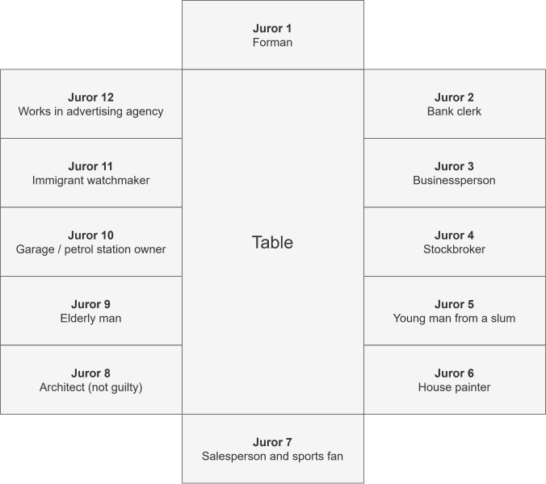

# C6, SS1 - 12 Angry Men

## Plot

- 12 citizens (white men) are in a jury trial to reach a verdict on an accused's guiltness (sentence: death penalty)
- Defendant: 16-year-old boy accused of killing his father, of a racial minority
- Initially, everyone except for one votes guilty
- Single juror (juror #8) is troubled by everyone else's rush to judgement
- Juror #8 suggests that the evidence is actually reviewed
- While evidence is discussed, various prejudices and internal conflicts are exposed
- Supposedly objective facts colored by personal attitudes and experiences
- Gradually, one by one, members of jury vote "not guilty"
- Finally, even the most adamant juror (#3) votes "not guilty" and that the boy's guilt has not been proved beyond "reasonable doubt"

## Importance and Other Elements

- *Themes:* democracy, racism, prejudice, class
- Sheds light on various strengths and weaknesses of American trial by jury
- Jurors are 12 white men
- US in mid. of Civil Rights Movement when movie released, forced to reassess whether America was truly the pinnacle of democratic virtue
- Forced to confront elements that undermined principle of equal justice under law
- Prejudice is a poisonous seed &mdash; will destroy American justice if allowed to flourish
- History of Prejudice
  - Women given right to serve on fed. juries after *Civil Rights Act, 1957*
  - 1973: Women given right to serve as jurors in all 50 states
  - 1975: Supreme Court ruled that excluding women from jury pool violated a person's right to a fair trial
  - 1979: Supreme Court rules tthat race and gender could not be used to strike potential jurors 
- *Message:* When we honour our civic responsibility to the country and to one another as human beings, justice can and will prevail

## Evidence &mdash; Strengths and Weaknesses

|Evidence|Strength|Weakness|
|-|-|-|
|**Knife (murder weapon)**|Knife found in victim's chest|Not unique|
||Proof of father's murder|No fingerprints on knife|
|**Eyewitness 1 (old man)**|Heard the boy say "I will kill you" downstairs|Witnesses can be wrong and ppl. make mistakes|
||Heard running footsteps|Did not actually see the murder|
||Rushed to stairwell and sees boy fleeing|How can old man run from his bedroom to the stairwell (>40') in 15 s?|
||Not related w/ murder victim or accused|Jurors tested that an old man running to the stairwell would take ~43 s|
||Also heard woman's screams across the street|Likely heard wrong due to high noise?|
|||How can he remember? He's an old man!|
|||He ***assumed*** it was the boy|
|**Eyewitness 2**|Woman sees murder happening through window of boy apt. while trying to sleep|How could she see the boy from 60' away at night?|
|*(old woman who lives in apt. across)*|Not related w/ murder victim or accused|Woman had marks on nose due to eyeglasses, *puts eyesight into doubt*, noone wears glasses in bed|
||Describes how murder happened, knife up and down into chest|Witnesses are ppl. and can make mistakes|
|**Movie Theater (no alibi)**|No one/alibi to prove that boy was actually at theater|The boy could've went to theater all alone|
||Boy could have lied about being at theater|Does not prove boy murdered father, he could've been elsewhere|
||Boy could not remember the films or stars in the film a few days after incident, police interrogation|How can ppl. at theater remember who was there the night of the murder?|
||Boy in court could've been told by his lawyer what movies to say in court|Humans have weak memory, it's hard to remember all details of a movie|
|||Boy remembered movies in court w/ stars, just not during interrogation|
|||Can a boy remember the movies under great emotional distress?|
|**Prior Convictions**|Threw rock at teacher|Not hard evidence to convict the boy|
||Stole a car and arrested for mugging|Convictions simply make the boy more *probable* to do the crime|
||Caught twice w/ knife fighting||
||Shows violent behaviour||
||Why wouldn't a boy like him not kill his father?||
|**Motive (physical abuse)**|Father beat up kid regularly|Does not prove accused's guiltiness|
||Reason for murder||

## Characters

*Positions of Jurors*

- **Juror #1:** Forman
  - middle class
  - petty, 35 yrs. old
  - wary and later impressed of his authority
  - not overly bright
- **Juror #2:** Bank clerk
  - meek and hesistant
  - nerdy
  - sturggles to make his own decisions
  - middle class
- **Juror #3:** Businessperson
  - head of messenger service
  - strong, forceful, extremely opinionated
  - humourless
  - intolerant of others' opinions that don't align w/ his own
  - forces his wishes/views upon others
- **Juror #4:** Stockbroker
  - upper class, wealthy
  - good speaker
  - presents himself well at all times
  - feels a bit above the rest of the jurors
  - self-aware
- **Juror #5:** Young man from a slum
  - lower class, mechanic
  - naive, frightened
  - takes obligations very seriously
  - can't speak up when elders speak
- **Juror #6:** House painter
  - working class
  - honest, dull-witted
  - comes up w/ decisions slowly and carefully
- **Juror #7:** Salesperson and sports fan
  - loud and flashy
  - more important things to do than sit on a jury
  - quick to anger and prejudice
- **Juror #8:** Architect
  - upper-middle class
  - quiet, thoughtful, gentle man
  - sees many sides to a question
  - truth-seeker
  - strong and compassionate
  - believes in and fights for justice
- **Juror #9:** Elderly Man
  - mild and gentle
  - long defeated by life
  - mourns for days where it was possible to be courageous
  - has heart issues
- **Juror #10:** Garage / petrol station owner
  - angry and bitter
  - disregard for life besides his own
  - been nowhere, going no where
  - has a bad cold
- **Juror #11:** Immigrant watchmaker
  - refugee from Europe
  - speaks w/ accent
  - ashamed, humbled, and almost "below" the others
  - seeks justice since he faced so much injustice
- **Juror #12:** Works in advertising agency
  - slick and bright
  - thinks of humans as percentages, graphs, and polls
  - can't connect w/ people
  - still trying to be a good fellow

## Principles of "Reasonable Doubt" and "Innocent Until Proven Guilty"

- **"reasonable doubt":** evidence is not convincing and overwhelming enough that a reasonable person will not have doubts about person's guilt
- **conscience:** sense of right / wrong that urges someone to act morally
- **"innocent until proven guilty":** Accused is innocent until the state finds enough evidence to *prove* that the accused is guilty
- *Greatest tragedy in judicial system:* Innocent cannot be jailed

## Strengths and Weaknesses of American Jury System (Play)

- **Strengths**
  - Judgement decided democratically
  - Judgement decided w/ a consensus and w/ usually unanimous decision
  - Collective judgement from ppl. w/ diff. viewpoints
  - Evidence checked before decision made
  - None of the jurors are legally trained
  - Many viewpoints are better than one viewpoint (12 heads are better than 1)
- **Weaknessess**
  - Jurors are all white men (only one demographic)
  - Tendency to show prejudice and discrimination towards particular party
  - Jurors (ordinary citizens) see jury duty as a hassle
  - Jurors hold societal biases
  - None of the jurors are legally trained

## Types of Persuasion

**persuasion:** the act of presenting arguments to move, motivate, or change your audience

|Type of Persuasion|Character who Employed Type|Pros|Cons|
|-|-|-|-|
|Reason and Logic &mdash; Physical Science and Evidence|Jurors #4, #7, #8|Backs up an accused's innocence or guiltiness|Similar logic can be used to contradict a decision|
|||Shows what is possible and what is not|May be insufficient, easily counterable w/ opposing logic|
|Popularity|Juror #4|People will listen to you|Opinions aren't backed up w/o also using diff. type of persuasion|
|||Your opinions take more precedence|Opinions may be out of "thin air"|
|Word and Testimony of Others|Jurors #3, #10|Ppl. who don't know accused can give honest observations and thoughts|How can you believe one person, but not the other?
||||People make mistakes!|
|Argument and Confrontation|Juror #3, #8|Demands further logic and reasoning|Can lead to a fight instead of a thoughtful discussion|
|||Counter other's thoughts|Your thoughts can be countered too|
|Slick Packaging and Marketing|Juror #12|Catches everyone's attention|Can be countered w/ evidence|
|||Persuades ppl. toward your opinion|Persuasion &ne; support w/ evidence|
||||Opinions may be out of "thin air"|
|Humour|Juror #7|Also catches attention|Reaction may be anger|
|||Loosens extreme thoughts and viewpoints|Reasoning must be backed up to be effective|
|Fear|Juror #10|Makes ppl. avoid thinking of alt. conclusions|Fails if person doesn't get scared and thinks of alt. conclusions|
|||Fear makes person decide quickly|Countering evidence can break fear|

## "Prejudice obscures the truth" and Total Impartiality

Juror #8: "Prejudice obscures the truth"

- Personal viewpoints, biases, and ways of seeing world interfere w/ our judgement
- Causes use to prejudge to a conclusion before analyzing evidence and finding out the truth
- **total impartiality:** judgement occurs 100% free from personal biases
- Total impartiality not possible bcz. our viewpoints shape how we analyze a situation
- W/O viewpoint &rarr; cannot analyze
  - similar to w/o working eyes &rarr; cannot see

## How Play is Allegory for US in 1950s-60s

- **allegory:** a story, poem, or picture that can be interpreted to reveal a hidden meaning
- At the time, USA was properous country w/ lots of freedom and oppertunity
- Play reveals that even country like USA has problems in justice and is not perfect

## Importance of Social Responsibility

- It is everyone's responsibility to seek the truth and uphold justice
- Problems in putting individual needs first
  - Ppl. not treated equally
  - Biased opinions take precedence over the truth
  - Everyone in competition to be more superior than the other

## The Role of Doubt

- Important to not come to a rapid conclusion w/o thoroughly checking the facts
- Everyone has right to a fair trial
- Must make sure that accused is actually guilty, especially in cases like the death penalty