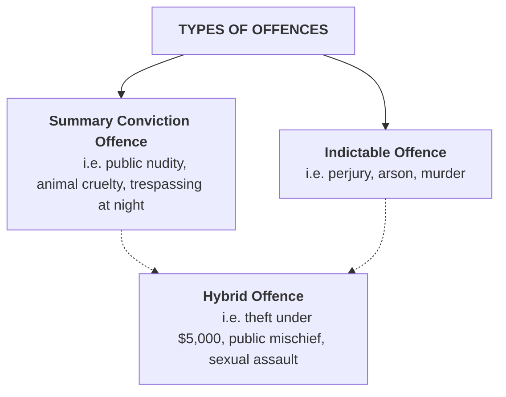
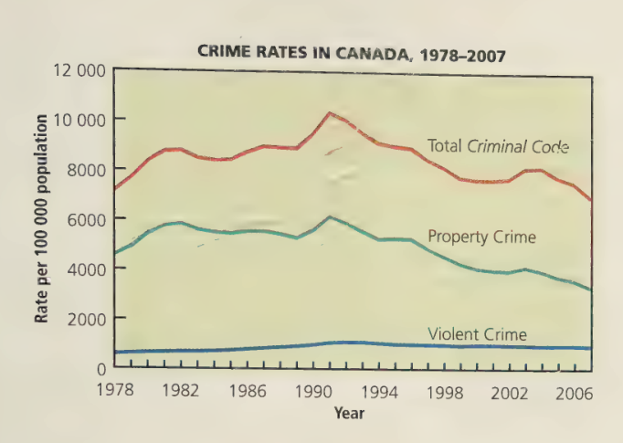
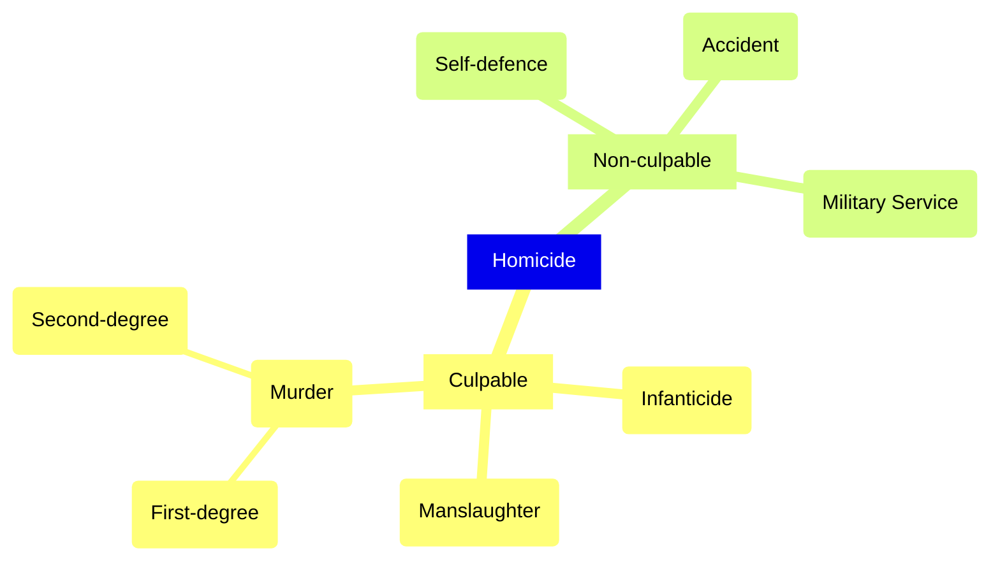
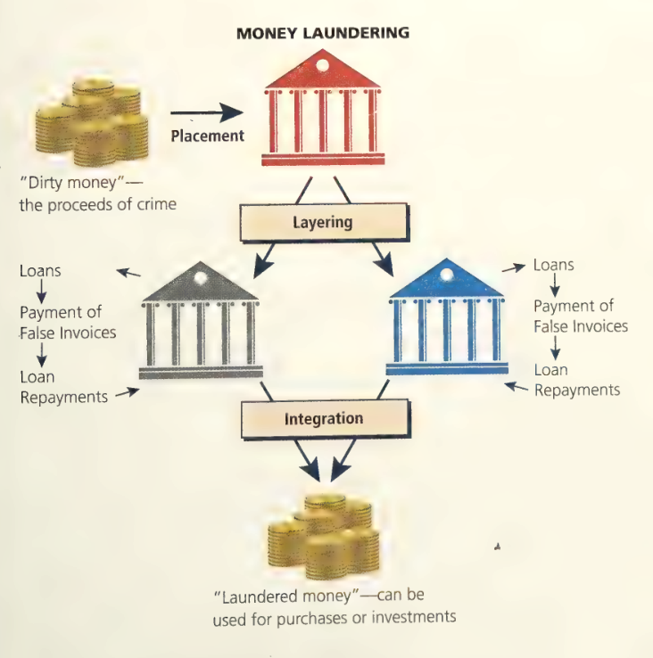

# C8 - Criminal Offences

## Levels of Offences

### Summary Conviction Offence

**summary conviction offence:** crime that is considered less serious and carries a lighter penalty

- Punishments
	- fine up to $5,000
	- imprisonment for up to 6 months
- "summary fashion": dealing w/ it quickly and simply
- tried in provincial court before a judge w/o a jury
- With permission from judge, accused doesn't have to appear in court but can be represented by a lawyer

### Indictable Offence

**indictable offence:** more serious crime that carries a heavier penalty

- Maximum penalties ranges from 2 years (common nuisance) up to life imprisonment (aggravated sexual assault)
- *Criminal Code* can also set minimum penalty
	- i.e. 4 yrs. for robbery
	- life in prison for murder
- Most serious indictable offences must be tried in Superior Court
- Offence w/ max. penalty of <5 yrs. imprisonment
	- trial in provincial court or Superior Court before judge w/o jury
- Offence w/ max. penalty >5 yrs.
	- accused can opt for trial in Superior Court
	- with judge alone
	- or judge and jury

### Comparison of Offences and Courts in Criminal Cases

| |Summary Offence|Indictable Offence|
|-|-|-|
|Limitation periods|Documents detailing charged must be filed within 6 mo. of offence date|No limitation on time when offence may be prosecuted|
|Prosecution|Private person many prosecute if Crown refuses to lay charges|Private person may prosecute w/ Crown's permission, but Crown almost always prosecutes|
|Pretrial procedures|No preliminary hearings|Preliminary hearings may be held|
|Type of court|Provincial court|Provincial or Superior Court|
|Method of trial|No jury trials|Accused can choose: judge alone ~or~ judge and jury|
|Presence of accused|Not required (may be repr. by lawyer)|Required
|Penalties|Limited to fines &le;$5,000 and/or &le;6 mo. in prison|Heavier penalties up to life in prison|
|Criminal record|Results from summary offence conviction|Results from conviction on indictable offence|

| |Provincial Court|Superior Court|
|-|-|-|
|Tries|summary conviction offences|indictable offences from s. 469|
| |indictable offences from s. 553|indictable offences from s. 554 where accused elects to be tried by judge alone|
| |electable offences from s. 554 where accused elects to be tried in prov. court|indictable offences from s. 554 where accused elects to be tried by judge and jury|
|Conducts|all preliminary hearings or inquires| |
|Hears Appeals| |from the provincial court|
| | |from the superior court, trial division|

### Hybrid Offences

**hybrid / dual procedure offence:** offence that Crown can try either as a summary or indictable offence

- Always explicitly stated in *Criminal Code*
- Treated as indictable by default until Crown formally elects
	- i.e. Bob has steady job and steals a banana one day, never stole before &rarr; summary
	- i.e. Bob is revealed to be Sob the Stealer who has long record of stealing &rarr; indictable

## Criminal Offences

### Classification of Offences in *Criminal Code*

|Part|Offence|
|-|-|
|Part II|Offences Against Public Order|
|Part III|Firearms and Other Weapons|
|Part IV|Offences Against the Administration of Law and Justice|
|Part V|Sexual Offences, Public Morals, and Disorderly Conduct|
|Part VI|Invasion of Privacy|
|Part VII|Disorderly Houses, Gaming, and Betting|
|Part VIII|Offences Against the Person and Reputation|
|Part IX|Offences Against Rights of Property|
|Part X|Fradulent Transactions Relating to Contracts and Trade|
|Part XI|Wilful and Forbidden Acts in Respect of Certain Property|
|Part XII|Offences Relating to Currency|

### Crime Rates in Canada, 1978-2007

## Offences Against the Person *(Part VIII)*

### Homicide

**homicide:** the killing of another human being, either directly or indirectly

*Criminal Code* definition

> 222(1) A person commits **homicide** when directly or indirectly, by any means, he causes the death of a human being.

- **culpable homicide:** killing for which accused can be held legally responsible
	- intentional or reckless killing
	- i.e. murder, infanticide, manslaughter
- **non-culpable homicide:** killing for which accused cannot be held legally responsible
	- i.e. death caused by unforseen accident, military killing under orders, self-defence or defence of another person

#### Types of Homicide Chart

#### Murder

- **murder:** intentional killing of another human being
	- form of culpable homicide
	- division into 2 categories, s. 231(1) of *Code*
- **first-degree murder:** murder satisfying following conditions:
	- It is planned and deliberate
	- One person hires another to commit murder
	- Victim is police officer, prison employee, or another person employed for public peace
	- Murder caused while committing or attempting to commit another serious offence, such as
		- hijacking
		- sexual assault (w/ weapon or causing bodily harm)
		- aggravated sexual assault
		- kidnapping
		- forcible confinement
		- hostage taking
- **second-degree murder:** murder that does not qualify as first-degree
	- def. from s. 231(7) of *Code*
- mandatory minimum sentence for murder: life in prison
- 1st degree murder: offender must serve 25 years before qualifying for parole
- 2nd degree murder: offender can apply for parole after serving 10-15 yrs., according to judge's sentence

#### Infanticide

- **infanticide:** killing of a newborn infant by the child's mother where...
	- the accused must be the victim's natural mother
	- the victim must be <12 mo. old
	- at the time of killing, accused must have been suffering from a mental disturbance caused by not being able to recover from giving birth to the victim
- Max. punishment: 5 years imprisonment
	- placed in *Code* 1948, when juries reluctant to convict mothers of murder
- Mother can plead to lesser charge of infanticide based on defences:
	- still suffering from affliction such as post-partum depression (depression after birth of child)
	- post-partum depression can happen anytime within 1st year after childbirth

#### Manslaughter

- **manslaughter:** any culpable homicide that is not murder or infanticide
- *actus reus:* killing someone unlawfully, even if unintentionally
	- i.e. Rob and Tuff fight in a bar, Tuff punches Rob's head and it hits corner of pool table, Rob dies from internal bleeding
- *mens rea:* any reasonable person could've foreseen that wrongful act would risk bodily harm "neither trivial nor transitory"
	- *(neither insignificant nor temporary)*
- Charge of manslaughter can be brought in criminal negligence resulting in death
	- i.e. parents withholding insulin from type I diabetic child relying on faith healing &rarr; child dies
	- charge: manslaughter or criminal negligence causing death
- **provocation:** words or actions that could cause a reasonable person to behave irrationally or lose self-control
	- defence to reduce murder to manslaughter
	- i.e. Woo and his ex-wife are arguing and his ex-wife slaps him. Woo gets so mad that he chokes his ex-wife to death
	- must be sudden, if Woo plans and snipes his ex-wife two days later &rarr; murder

### Assault

- most common form of violent crime: 82% of all crime
- **Level 1 Assault:** hybrid offence involving threatened or actual physical contact w/o consent, less serious
	- max. penalty: 5 yrs. imprisonment
	- i.e. pushing someone or threatening w/ violence
- **assault:** threatened or actual physical contact w/o consent which can either be:
	- intentionally applying force to another person, either directly or indirectly without that person's consent
	- attempting or threatening, by act or gesture, to apply force, or
	- accosting or impeding another person, or begging, while openly wearing or carrying a weapon or its imitation
- **Level 2 &mdash; assault with a weapon or causing bodily harm:** assault where accused injures a person that has serious consequences for the victim's health or comfort
	- may involve carrying, using, or threatening to use a weapon
	- hybrid offence, max penalty = 10 yrs. imprisonment
- **Level 3 &mdash; aggravated assault:** wounding, maiming, disfiguring or endangering the life of the victim
	- indictable offence
	- max penalty: 14 yrs. in prison

### Sexual Assault

- **sexual assault:** touching of a sexual nature that is not invited or consensual
- **Level 1 sexual assault:** sexual assault where victim suffers the least physical injury
	- def. in s. 271 (1) of the *Criminal Code*
	- may also be def. in s. 265 (1), violates victim's sexual integrity
	- 97% of sexual assaults reported fall into this level
	- hybrid offence, max penalty = 10 yrs. prison
- **Level 2 &mdash; sexual assault with a weapon, threats to a third party, or causing bodily harm:** form of sexual assault that involves the use of weapons, threats, or physical injury
	- max sentence = 14 years prison
- **Level 3 &mdash; aggravated sexual assault:** sexual assault that involves wounding, maiming, disfiguring, or endangering the life of the victim
	- most violent level of sexual assault
	- max sentence = life imprisonment
- Consent valid defence to sexual assault cases
	- if accused had an honest and reasonable, even if mistaken, belief that victim as consenting to sexual contact
	- Cannot be used in 3 instances
		1. when a victim says no via words or conduct like directly repulsing physical advances or struggling to escape an embrace
		2. when accused is intoxicated and not able to determine if consent has been given
		3. when accused was reckless or deliberately blind to victim's responses, or failed to take reasonable steps to find out if victim consented

### Suicide

- Suicide / attempted suicide not a crime since 1972
- Anyone who counsels person to commit suicide or aids / abets person to commit suicide is guilty of indictable offence
	- s. 241 of *Criminal Code*
	- Sue Rodriguez's petition to S.C.C.

### Motor Vehicle Offences

- Most motor vehicle offences under provincial jurisdiction
- Serious offences under the *Code*
- **"motor vehicle":** vehicle that is drawn, propelled, or driven by any means other than muscular power
	- s. 2 of *Criminal Code*
	- i.e. motorcycles, motor boats, cars

#### Dangerous Operation of a Motor Vehicle

- Crown must prove safety or lives of others endangered because ...
- ... driver failed to exercise same care a prudent driver would've exercised under same conditions
- i.e. Bob late for work, drives over speed limit, passes another motorist despite double line, forcing oncoming car off road
- hybrid offence
- max penalty = 5 years prison
- if offence causes bodily harm &rarr; max penalty = 14 yrs. prison

#### Failure to Stop at the Scene of an Accident

- s. 252 (2) of the *Criminal Code*
- anyone who is involved in motor vehicle accident and does not
	- stop
	- offer assistance
	- give his / her name and address
- ... presumed to show intent to escape civil / criminal liability
- known as **"hit and run"**
- hybrid offence
- Max Penalties
	- 5 years prison (default)
	- 10 years prison (acc. causes bodily harm)
	- life in prison (acc. causes death)

#### Impaired Driving

- Proof that driver is impaired
	- erratic driving
	- slurred speech
	- inability to walk a straight line
	- smell of alcohol on his / her breath
	- breath / blood test (measure alcohol in person's bloodstream)
- Offence to have "care or control" of motor vehicle while amount of alcohol in bloodstream exceeds 80 mg / 100 mL of blood
	- s. 253 (b) of the *Criminal Code*
	- a.k.a. exceeding .08 or over 80
- Police may demand driver to take **Breathalyzer test** if they have reasonable grounds to believe impaired person is/has been operating vehicle for *last 3 hrs.*
	- s. 254 of the *Criminal Code*
	- person who cannot take test due to medical issues may be asked to give blood sample instead
	- blood sample may only be taken by qualified medical practitioner
- Operating vehicle while impaired and refusing to provide breath / blood sample both hybrid offences
	- s. 255 (1) of the *Criminal Code*
	- severity of punishment increases w/ subsequent offences
	- impaired driving causing bodily harm &rarr; max. penalty = 10 yrs.
	- impaired driving causing death &rarr; max. penalty = life in prison
- Jul. 2, 2008: Provisions to deal w/ drivers on drugs under *Tackling Violent Crime Act*

## Offences Against Property *(Part IX)*

### Theft

**theft:** taking property permanently or temporarily, without the owner's permission

- most commonly reported criminal offence in Canada
- defined elaborately and precisely under s. 322 of the *Code*
- i.e. a friend allows me to use their car for 3 hours but I use it for 3 days

> 322. (1) Every one commits theft who fraudulently and without colour of right takes, or fraudulently and without colour of right converts to his use or to the use of another person, anything, whether animate or inanimate, with intent
>
> (a) to deprive temporarily or absolutely, the owner of it, or a person who has a special property or interest in it, of the thing or of his property or interest in it;
>
> (b) to pledge it or deposit it as security;
>
> (c) to part with it under a condition with respect to its return that the person who parts with it may be unable to perform; or
> 
> (d) to deal with it in such a manner that it cannot be restored in the condition in which it was at the time it was taken or converted.

- **colour of right:** the honest belief that a person owns or has permission to use an item
- **theft over:** indictable offence of stealing goods worth more than $5,000
	- max. punishment = 10 yrs. prison
- **theft under:** hybrid offence of stealing goods worth <$5,000
	- max. punishment = 2 yrs. prison

### Robbery

- **robbery:** theft involving violence or the threat of violence
- max. penalty = life in prison
- Statistics Canada
	- 2007: ~40% of robberies involved use of weapon (~11% used gun)

### Breaking and Entering

- **breaking and entering:** breaking or opening something in order to enter the premises without permission with the intent to commit an indictable offence
- "place" is usually
	- "dwelling house" &mdash; home
	- commercial building
- typical intent: robbery
- Not break and enter
	- Mario is camping and a snowstorm hits
	- Mario kicks down a cottage door and takes shelter
	- Mario stays until the storm blows out
- Max penalties
	- 10 yrs. in prison if breaking into commercial building
	- life in prison if breaking into "dwelling house"

## Other Criminal Code Offences

### Mischief *(Part XI)*

- **mischief** defined as:
	- wilfully destroying or damaging property or data
	- rendering property or data useless
	- interfering with the lawful use of property or data; or
	- interfering with any person in the lawful use of property or data
- s. 430 of the *Criminal Code*
- hybrid offence
- **"data":** any information prepared in a suitable form to use in a computer system
- s. 430 (2): anyone found guilty of mischief endangering another's life can be sentenced to ***life in prison***
- someone can be guilty of mischief (life in prison) even if no harm is done, but dangerous harm could've been done

#### Public Mischief *(Part IV)*

**public mischief:** providing false information that causes police to start / continue an investigation without cause

i.e. falsely reporting stolen car

### Fraud *(Part X)*

**fraud:** intentionally deceiving someone in order to cause a loss of property, money, or service

- Crown must prove (in order to convict):
	- accused purposely intended to deceive
- Some Types of Fraud
	- falsifying employment records
	- failing to collect fares
	- manipulating the stock market
	- forging trademarks
	- adding precious minerals to a mine to increase its value
- Penalties
	- Value of fraudulent transaction <$5,000
		- summary offence of fine or
		- indictable offence of 2 yrs. prison
	- Fraudulent transaction >$5,000
		- indictable offence
		- max. penalty = 10 yrs. prison

### Prostitution

- **prostitution:** the act of engaging in sexual services for money
- Act of prostitution itself not a criminal offence
- Criminal offence: act of soliciting (communicating for purpose of prostitution)
- s. 213 (1) of *Code* can be charged with soliciting if, in a place open to public view, he /she
	> (a) stops or attempts to stop any motor vehicle
	>
	> (b) impedes the free flow of pedestrian or vehicular traffic or ingreess
	>
	> (c) stops or attempts to stop any person, or in any manner communicates or attempts to communicate with any person, for the purpose of engaging in prostitution or of obtaining the sexual services of a prostitute.
- Summary conviction offence
	- Fingerprints and photographs not taken
	- Offender will not acquire criminal record
- Keeping a common bawdy house (s. 210) = summary offence
- **common bawdy house:** place kept, occupied, or used by a person for the purpose of prostitution or the practice of indecent acts
- Procuring and living off income of prostitution: indictable offences
	- max. penalty = 10 yrs. prison
	- max. penalty is 14 yrs. if prostitute <18 yrs.
	- most commonly enforced against procurers living off street whore incomes

### Gambling

- **disorderly house:** common bawdy house, common betting house, or common gaming house
- Gambling is not illegal by itself
- **common betting house:** place where people bet among themselves and where the keeper of the house receives portion of the winning bet
- Keeping a disorderly house = indictable offence
	- max. penalty = 2 yrs. prison
- Exceptions
	- *bona fide* social club &mdash; exempted from common betting / gaming house def.
	- club formed by people who get together for social purpose and to not make profit
	- betting at horse races also legal as long as track has gov't. approval and gov't. gets some betting money

## Drug Offences

- ***Controlled Drugs and Substances Act (CDSA)*:** federal statute that deals with narcotics and other controlled drugs
	- such as heroin, cocaine, marijuana (legal now)
	- passed on May 14, 1997
	- replaces *Narcotic Control Act* and parts of *Food and Drugs Act* dealing w/ controlled and restricted drugs
- **controlled substance:** any drug included in schedule I, II, III, IV, V

### Schedules and Possession Penalties

**Summary Offences** *[S]* 

> 1st Offence: $1,000 and/or 6 mo. prison
> Subsequent Offence: $2,000 and/or 1 yr. prison

|Schedule|Controlled Substances|Maximum Penalty for Possession|
|-|-|-|
|Schedule I|Opium and its derivatives, incl. codeine, morphine, heroin; Cocaine; Methadone|Indictable: 7 yrs.; Summary *[S]*|
|Schedule II|Cannabis and its derivatives incl. cannabis resin (hashish) and marijuana|Indictable: 5 yrs. less a day; Summary *[S]*|
|Schedule III|Amphetamines and their derivatives, incl. methamphetamine (speed) and MDA (ecstasy); LSD; DMT; Psilocybin; Mescaline|Indictable: 3 yrs.; Summary *[S]*|
|Schedule IV|Barbiturates; Diazepam (Valium); Anabolic steroids|Not an offence|
|Schedule V|Phenylpropanolamine; Propylhexedrine; Pyrovalerone|Not an offence|o

### Possession

- **possession:** state of having knowledge of and control over something
- Under the *CDSA*, it is illegal to be in unauthorized possession of any drugs listed in Schedules I-III
	- some may be prescribed for medical purposes only
- Rules for Possession
	1. Person in possession must know what the item is and have some measure of control over it
		- i.e. someone gives Bob cocaine, and he thinks it's sugar
	2. A person may be found in possession even if he / she gave the item in question to another person
		- i.e. Rob places his cocaine in Bob's bag, but he's charged with possession once the coke was found
	3. A person can be charged with possession even if he/she doesn't own the substance or have it in his/her possession
		- ... as long as the person knows about it and consents to its possession by someone else
		- i.e. Rob gives his cocaine to Bill for safekeeping. Bill can be charged with possession even if he had no intention to do anything with it

### Trafficking

- **trafficking:** offence involving selling, giving, transporting, or distributing *a controlled substance* and/or *an authorization for a controlled substance*
- Crown must prove beyond reasonable doubt that...
	- the accused possessed the controlled substance w/ intention of trafficking
	- ways to establish intention
		- qty. of drugs accused had was way greater than needed for personal use
		- scales, bags, lists of names, large amount of cash
- The *mere* offer to sell is enough to convict one of trafficking

|Substance|Type of Offence|Max. Penalty|
|-|-|-|
|Schedule I or II|Indictable|Life|
|Schedule III|Indictable; Summary|10 yrs.; 18 mo.|
|Schedule IV|Indictable; Summary|3 yrs.; 1 yr.|

### Money Laundering

- **money laundering:** practice of transfering cash or other property to conceal its illegal origin
- made illegal to prevent criminals from hiding their activites
	- s. 462 (31) of the *Criminal Code*
	- s. 9 of the *CDSA*
	- hybrid offence
- Crown must prove...
	- a) *Actus reus* &mdash; any use, transfer, possession of, sending, delivering, transporting, transmitting, altering, disposing of, or otherwise dealing w/ any proceeds with the crime
	- b) *Mens rea*
		- the *intention* to conceal / convert illegally obtained money / property
		- the *knowledge* that all or part of the money / property was illegally obtained
	- c) "Subject matter of the offence"
		- existence of money / property obtained by committing a criminal offence
		- participating in a conspiracy or an attempt to commit an offfence
		- counselling or being an accessory after the fact; or
		- committing any act / omission related to an offence
- Max. penalty
	- indictable offence: 10 yrs. prison
	- summary offence: $2,000 fine and/or 6 mo. prison
- s. 11 (8) of *CDSA*: police allowed to seize anything they believe on reasonable grounds has been obtained through a criminal offence
- s. 9 (3): legal for police to set up money laundering operation as part of a criminal investigation

