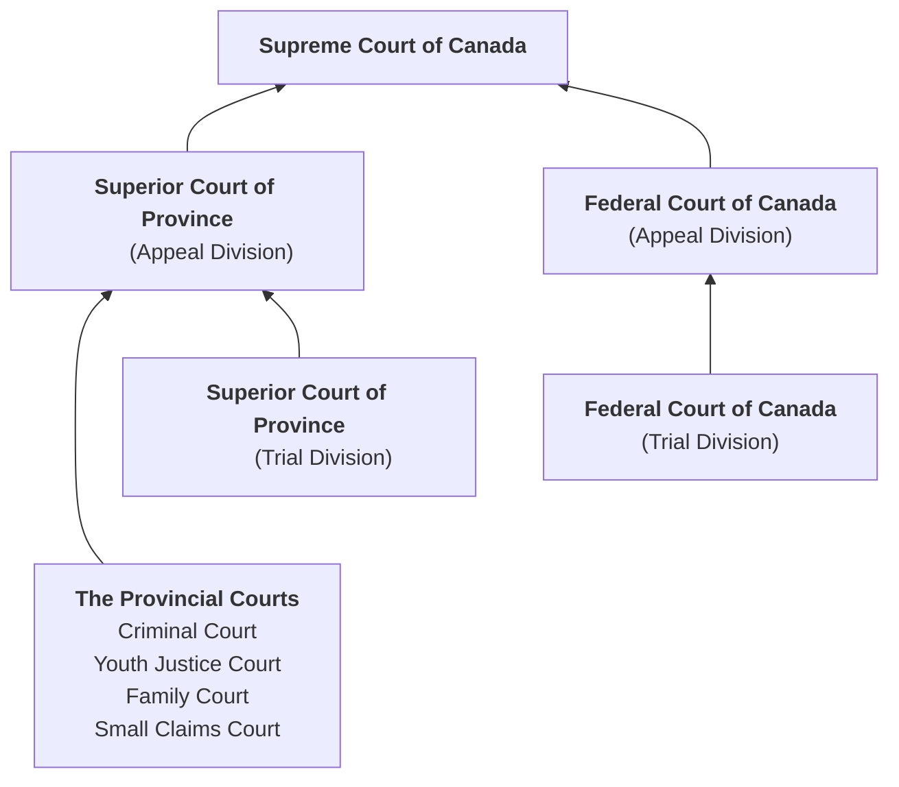
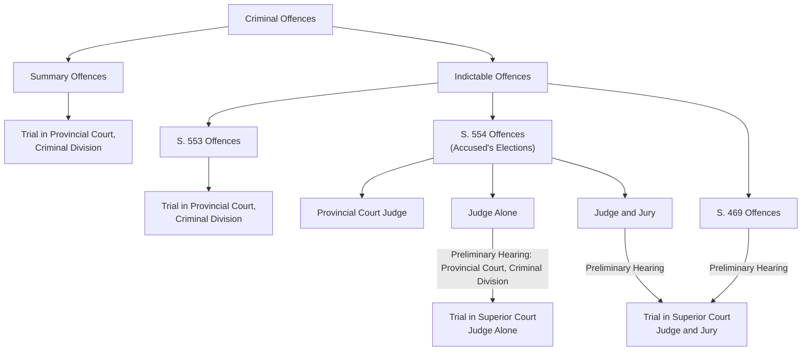
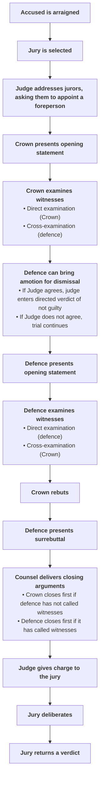

# C9 - Criminal Court System

## The Criminal Court Structure

- Derived from *Constitution Act, 1867*
- Federal gov't. responsible for criminal law
- Parliament created Supreme Court of Canada, Federal Court of Canada, and Tax Court of Canada
- Provinces responsible for organizing, administering, and maintaining criminal court system (i.e. Provincial Courts, Superior Courts)

### Criminal Court Structure

#### The Provision Court, Criminal Division

- **provincial court:** the lowest level in the hierarchy of Canadian courts
	- constituted under provincial statues
	- judges appointed by provincial gov't.
	- jurisdiction over summary offences and certain indictable offences
	- jurisdiction over violation of provincial statues and municipal bylaws
	- accused's first contact w/ criminal court system
- Indictable offences that *must* be tried by provincial court judge alone
	- found in s. 553 of the *Code*
	- i.e. mischief or theft <$5,000
- Indictable offences where accused can choose between judge alone or judge + jury
	- found in s. 554 of the *Code*
	- i.e. theft or fraud >$5,000
- **preliminary hearings:** judicial inquiry to determine whether there is sufficient evidence to put the accused on trial
	- screening process
	- protects accused from unnecessary trial
	- protects the Crown and the public from expense of a trial that may not be required
- **appeal:** application to a higher court to review the decision made by a lower court

#### Superior Courts of the Provinces

- **superior court of the province:** the highest level of provincial criminal and civil court system
	- consisting of trial and appeal division
	- jurisdiction in both civil and criminal matters
	- jurisdiction to hear all offences under s. 469 of the *Code*
	- jurisdiction of s. 554 offences, where accused elects judge alone or judge *and* jury
- Offences tried by a judge *and* jury unless accused and provincial Attorney General consent to trial by judge alone
- Appeals from trial division heard in appeal division
	- 3 or 5 judges hear cases and appeal won / lost based on majority decision

**Names of Superior Courts by Province / Territory**

|Province or Territory|Provincial Superior Court|
|-|-|
|Alberta|Court of Queen's Bench|
|British Columbia|Supreme Court of British Columbia|
|Manitoba|Court of Queen's Bench|
|New Brunswick|Court of Queen's Bench|
|Newfoundland and Labrador|Supreme Court of Newfoundland and Labrador|
|Northwest Territories|Supreme Court of the Northwest Territories|
|Nova Scotia|Supreme Court of Nova Scotia|
|Nunavut|Nunavut Court of Justice|
|Ontario|Superior Court of Justice|
|Prince Edward Island|Supreme Court of Prince Edward Island|
|Québec|Superior Court of Québec|
|Saskatchewan|Court of Queen's Bench|
|Yukon|Supreme Court of the Yukon Territory|

#### Procedure in Criminal Cases (Provincial)

### The Federal Court System

**court of appeal:** a court with the authority to review decisions made by lower courts

#### Federal Court of Canada

- **Federal Court of Canada:** court w/ jurisdiction to hear...
	- civil and criminal cases referred by...
		- federal boards
		- commissions
		- tribunals
	- and to rule on constitutional issues referred by the Attorney General
- Examples of referral sources
	- Immigration Appeal Board
	- National Parole Board

#### Supreme Court of Canada

- **Supreme Court of Canada:** highest (appeals) court in Canada; also deals w/ constitutional questions referred to it by federal gov't.
	- consists of a Chief Justice and 8 Justices (judges)
	- all appointed by federal gov't.
	- 3 justices must come from Québec, by law
	- By tradition...
		- 3 from Ontario
		- 2 from W. Canada
		- 1 from Atlantic Provinces
- Court sits in Ottawa for 3 session a year: winter, spring, and fall
- Cases heard by a panel of 5, 7, or 9 Justices
	- depending on type of Appeal
- High volume of cases in the system
- **leave:** permission to appeal decision from lower court to higher court
	- S.C.C. grants leave only for matters of national significance
	- ...or when decisions conflict in provincial appeals courts
- Fed. gov't. may as Supreme Court to provide advice or rule on speicifc questions relating to
	- Constitutional Issues
	- other federal matters
	- i.e. 1995 referendum of Québec, Canada

#### Other Courts

- 1983: Tax Court of Canada established to replace Tax Review Board
	- primarily responsible for hearing cases dealing w/ income tax matters
	- appeals heard in Federal Court of Canada
- Court Martial Appeal Court
	- hears appeals from courts martial in the Armed Forces
	- judges not from military, appointed from provincial superior courts or from Federal Court
- Nisga'a Court (Aboriginal Court)
	- functions same way as provincial court
	- appeals taken to British Columbia Supreme Court
	- Nisga'a Nation can only write laws that are quasi-criminal or regulatory offences
	- focus on community healing over punishment

## The Participants

- 2 Fundamental Principles
	- accused is innocent until proven guilty
	- guilt must be proven **beyond a reasonable doubt**
	- any doubts? accused acquitted
- **beyond a reasonable doubt:** standard of proof where the accused's guilt is proven to the extent that a reasonable person would have no choice but to conclude that defendant did indeed commit offence

### The Judge

- **judge:** court official appointed to try cases in a court of law and to sentence convicted persons
	- jury trial, judge known as "trier of law"
	- jury known as "trier of fact"
- **Justice of the Peace:** court official with less authority than a judge but who can issue warrants and perform some other judicial functions
	- number of functions especially in preliminary stages of case
	- can issue arrest or search warrants
	- in some jurisdictions, can hear cases involving infractions of municipal bylaws and certain prov. statutes like *Highway Traffic Act*

### The Defence

- **accused (a.k.a. defendant):** the person charged with committing a criminal offence
	- can represent themselves at trial
	- highly recommended to get a lawyer
- **duty counsel:** lawyer on duty in a courtroom / police station to give free legal advice to persons just arrested / brought before court
- **defence counsel:** lawyer who defends the accused on trial

### The Prosecution

- **Crown counsel (a.k.a. prosecutor):** lawyer representing the government, who brings legal proceedings against accused
	- must prepare by researching the law,
	- assembling evidence at trial
	- reviewing exhibits
	- taking statements from witnesses
- **evidence:** information that tends to prove / disprove elements of an offence
	- 1955: S.C.C. emphasized role of prosecutor is to bring forward credible evidence of a crime, **not** to simply obtain conviction

### Other Court Personnel

- **court clerk:** court official who assists the Judge
	- keeps record of trial exhibits
	- administers oaths
	- announces beginning and end of court session
- **court reporter:** court official who records everything said in court during a trial
- **transcript:** typed record of everything said in court during a trial
- **court security officer:** court official who maintains courtroom security and handles accused persons in custody
- **sheriff:** court official who summons, pays, secludes, and guards jurors as required
	- BC: sheriff also acts as court security officer and bailiff
- **bailiff:** court official who assists the sheriff

### The Witnesses

- **witness:** person who give evidence while under oath or affirmation in court
	- oath on the Bible; or
	- solemn affirmation to tell the truth
- **subpoena:** court order requiring witness to appear in court on certain date to give evidence
	- fail to appear = guilty of contempt + fined and/or jailed up to 90 days
- **perjury:** knowingly making false statements in court while giving evidence under oath / affirmation
	- serious crime under *Criminal Code*
	- max. penalty = 14 yrs. prison

### The Jury

- **jury:** group of 12 people who decide whether accused is guilty / not guilty in a criminal trial
	- chosen by Crown and defence counsel from pool of ordinary citizens
	- listen to arguments
	- examine evidence
	- follow Judge's instructions about the law
	- decide together whether accused is guilty beyond reasonable doubt or not guilty

## The Role of the Jury

### Qualifications

- Each prov. has own legislation, typical qualifications as follows...
- Canadian citizen
- &ge;18 years old
- Not a publicly elected politician or someone working in the justice system like
	- lawyers
	- prison guards
	- police officers
	- probation officers
- People called to serve as jurors may want to sometimes be exempted for
	- religious / health issues
	- fear of serious financial hardship (unable to work during trial)
	- exemptions available to those who served on jury within past 2 years
	- may apply to sheriff

### Jury Selection

- Potential jurors selected randomly from electoral polling lists
	- repr. wide cross-section of citizens in community
- **jury panel:** the large group of potential jurors
- **arraignment:** first stage of a criminal trial where defendant enters a plea of guilty or not guilty
	- pleads guilty = no jury required
	- pleads not guilty = jury required
- **challenge for cause:** the right of the Crown or defence to exclude someone from a jury for a particular reason
	- there are no limits to # of challenges
- **peremptory challenge:** the right of the Crown or defence to exclude someone from a jury without providing a reason
	- developed as a way of granting accused some control over adversarial process and against powers of the state
	- allows accused to say, "I don't want that person deciding my case."
	- serious cases (1st-degree murder / treason): 20 challenges allowed
	- less serious cases, >5 yrs. prison: 12 challenges allowed
	- cases <5 yrs. prison: 4 challenges allowed

#### Selection Process

1. Names of people on jury panel written on cards put into a box and selected at random
	- Selected names read aloud in court
2. Person whose name has been chosen goes to the front of the court and faces the accused
3. Either the Crown or the defence may object to a potential juror by challenging the individual
4. Either counsel may make a **challenge for cause** if they believe that the prospective juror
	1. a) has already formed an opinion on the case
	2. b) is physically unable to perform the duties of a juror
	3. c) has been convicted of a serious offence
5. After potential juror is accepted as suitable and impartial, either counsel can make a **peremptory challenge** (no reason required)
6. When selection completed, 12 jurors take the juror's oath
	> I swear to well and truly try and true Deliverance make between our sovereign lady the Queen and the accused at the bar, whom I have in charge, and a true verdict give, according to the evidence, so help me God.

## The Criminal Trial Process

- Criminal trial is an adversarial process that pits Crown against the accused
- S. 11 (d) of *Charter*: each person charged with an offence is to be "presumed innocent until proven guilty according to law"
- **burden of proof:** the Crown's obligation to prove the guilt of the accused beyond a reasonable doubt
	- Crown must prove guilt of accused
	- Accused does not have to prove innocence beyond reasonable doubt

### The Crown's Opening Statement

- Crown presents case before the defence because it has burden of proof
- Trial always begins w/ opening statement from Crown
- Statement
	- identifies offence committed
	- summarizes evidence against the accused
	- outlines way Crown will present its case
- Jury does not treat opening statement as evidence

### Examination of Witnesses

- **direct examination:** first questioning of a witness to determine what he/she observed about crime
	- a.k.a. examination-in-chief
- **cross-examination:** second questioning of a witness to test the accuracy of the testimony, performed by opposing counsel
	- also to demonstrate that there are contradictions in the witness's testimony that weaken Crown's case

### The Defence Responds

- **motion of dismissal:** a request by defence counsel that Judge dismiss the charges against the defendant
	- after Crown finishes calling witnesses
	- given if counsel believes Crown failed to prove guilt beyond reasonable doubt
- **directed verdict:** decision by the Judge to withdraw the case from the jury and enter a verdict of not guilty
- If Judge does not dismiss charges, and accused pleads not guilty, trial must continue
- Defence begins by summarizing case in opening statement
- Defence may choose to call witnesses to refute Crown witness testimonies or show reasonable doubt
- *Direct examination* done by defence &rarr; *cross-examination* done by Crown
- Defendant may choose to testify on his / her behalf but "cannot be compelled to be a witness" &mdash; s. 11 (c) of *Charter*
- After defence presents all evidence, Crown can *rebut*, and defence can then present a *subrebuttal*
- **rebut:** to contradict evidence introduced by the opposing side
- **surrebuttal:** a reply to the opposing side's rebuttal

### The Rules of Evidence

Crown / defence may object to questions asked by opposing counsel or to witness answers

#### Leading Questions

- Suggests witness to a particular answer
- Generally not permitted to ask witness leading question unless it involves fairly unobjectionable matter
	- i.e. age of witness
	- "You're 21 years old, aren't you?"
- Examples of disallowed and allowed questions
	- "Wasn't it Tom you saw stabbing Jerry with a knife?" ❌
	- "What did you see Tom do to Jerry?" ✅
- Counsel allowed to ask leading question in **cross-examination** as long as it pertained to previous testimony
	- "You want this court to believe you saw Tom stabbing Jerry?" ✅

#### Hearsay Statements

- **hearsay evidence:** evidence given by a witness based on information from someone else rather than personal knowledge
- Counsel may ask witness only about what witness saw / experienced first-hand
- Not admissible: Witness heard something from a third-party
- i.e. "Bob told me that he saw Tom stab Jerry." ❌

#### Opinion Statements

- Defense counsel / Crown cannot ask witness to give opinion about matter that goes beyond common knowledge...
- ...unless witness is recognized expert in certain field
- i.e. any eyewitness can give opinion about car colour
	- but only a car mechanic allowed to examine car could give opinion about condition of car's brakes

#### Immaterial or Irrelevant Questions

- **immaterial / irrelevant question:** question that has no connection w/ matter at trial
	- inadmissible
	- i.e. Defence counsel asks question to investigating officer about his personal life

#### Non-Responsive Answers

- Counsel questions witness &rarr; recieves answer that doesn't really answer question
- **non-responsive answer:** reply from witness that does not really answer question
- Counsel may ask Judge to direct witness to answer question properly

### Types of Evidence

#### Direct Evidence

**direct evidence:** testimony given by witness to prove an alleged fact

> i.e. eyewitness account of crime &mdash; Bob says that she saw Tom assault Jerry, then steal his cheese.

> rebuttal ex.: Tom's lawyer says that Bob's vision is poor and left his glasses at home on the "day" in question

#### Circumstantial Evidence

**circumstantial evidence:** indirect evidence that leads to a reasonable inference of the defendant's guilt

> i.e. no one saw Tom assault Jerry, but an officer finds Jerry's cheese in a jar with Tom's fingerprints. Bob also says he saw Tom enter Jerry's house.

- Allows Judge or jury to infer that Tom robbed Jerry
- Admissible in court unless connection between evidence &#8660; inference is too weak

#### Character Evidence

**character evidence:** evidence used to establish the likelihood that the defendant is the type of person who either would(n't) commit a certain offence

- Generally, Crown not allowed to attack the defendant's character
- Guards against jury's tendency to infer that defendant is guilty bcz. BAD CHARACTER!
- Defence counsel permitted to introduce evidence of the defendant's *good* character
	- or convince jury that he/she is *not* type of person to have committed offence
	- Crown allowed to rebut it
- Crown *is* allowed to bring evidence of defendant's past convictions if defendant testifies at his/her trial
	- not to be used to attack defendant's character
	- only for testing likelihood of defendant telling truth

#### Electronic Surveillance

- **electronic surveillance:** the use of any electronic device to overhear or record communications between two or more people
- **wiretapping:** interception of telephone communication
- **bugging:** recording a speaker's oral communication by using an electronic device
- admissible in court only if interception authorized beforehand by judge

#### Polygraph Tests

- **polygraph:** machine that allows a skilled examiner to detect physical signs that indicates whether a person being tested is lying
	- a.k.a. "lie detector"
	- measures
		- pulse
		- respiration
		- blood pressure
- examiner begins test by asking person control questions that have been designed to bring out answers known to be untrue
- examiner carefully observes person's physical reaction when making untruthful responses
- examiner then observes whether same reactions happen when person asked about criminal charges in question
- accuracy depends on competence of examiner &rarr; even highly skilled examiner will have <100% accuracy over time
- *results* of polygraph test
	- not admissible for determining whether defendant is lying / telling truth
	- whatever defendant says during test is admissible

#### Voir Dire

- ***voir dire:*** mini-trial in which jurors are excluded while the admissibility of the evidence is discussed
- Jurors asked to wait in jury room
- Judge, Crown, and defence discuss issue that is preventing trial from moving forward
	- like whether particular piece of evidence is admissible
- Common reason for *voir dire*: Was the defendant's confession given voluntarily?
	- defendant and other witnesses may be called to testify
	- Judge decides whether evidence is admissible
		- in whole
		- in part; or
		- not at all

#### Summary of the Case

- After all testimony has been given...
- ... each counsel presents summary of case in closing arguments
- If defence called witnesses during trial, defence closes first
- If not, Crown closes first
- Crown attempts to show defendant's guilt has been proven beyond reasonable doubt
- Defence will try to show that Crown has failed to establish *mens rea* or *actus reus*
- Not considered as evidence &rarr; helps jurors better understand case

### Charge to the Jury

- Given after summaries by both sides
- **charge to the jury:** the Judge's explanation to jurors of how the law applies to the case before them
- Judge also
	- advises jurors on how to consider the evidence
	- how to return a verdict in accordance with the law
- Judge must be very careful in charge to the jury, otherwise it may be **deficient**
	- Deficient charge most common basis for successful appeal
	- After charge, sheriff escorts jurors to jury room where they deliberate on their verdict
- Judge's role: decide on matter on law, what evidence is admissible
- Jury's role: decide on matter of fact, what evidence is believable
	- If jurors believe accused or don't know whom to believe, they *must acquit*
	- If jurors do not believe accused but have reasonable doubt on his/her guilt, verdict must be *not guilty*

### The Verdict

- Verdict reached &rarr; read out in open court
- Both counsels have right to ask that jury be polled &rarr; each jury member must stand and confirm his/her agreement with verdict
- Jury's verdict must be **unanimous:** everyone agrees on one thing
- **hung jury:** a jury that cannot reach a unanimous verdict
	- jury discharged, new jury selected to try case again

### Appeals

- Notice of appeal must be filed within short period of time (most cases 30 days)
- Appeals then heard in appeals court, then makes one of these rulings:
	1. to affirm the lower court's decision
	2. to reverse the lower court's decision; or
	3. to order a new trial
- Either side can appeal if
	- they find decision improper
	- they find the sentence improper (i.e. appeal to reduce / increase sentence)
- **appellant:** the party that files an appeal
- **respondent:** the party that responds to an appeal
- Appeal general heard by panel of 3-5 judges &rarr; Witnesses do not usually testify again
- Witnesses do not usually testify again at appeal
	- Lawyers instead use:
		- trial transcript
		- exhibits from trial
		- legal arguments prepared for appeal
- Appeals court then decides whether any errors in law have been made
	- majority vote sufficient
	- majority usually explains its decision in writing
	- dissenting judges can also issue written opinions on why they didn't agree w/ majority

### Stages in a Criminal Trial by Jury

