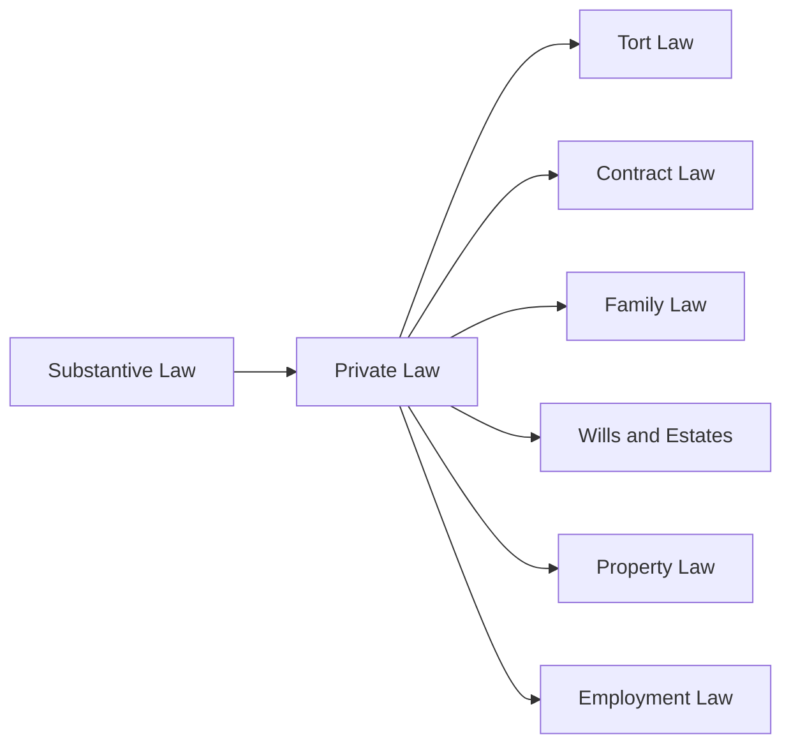
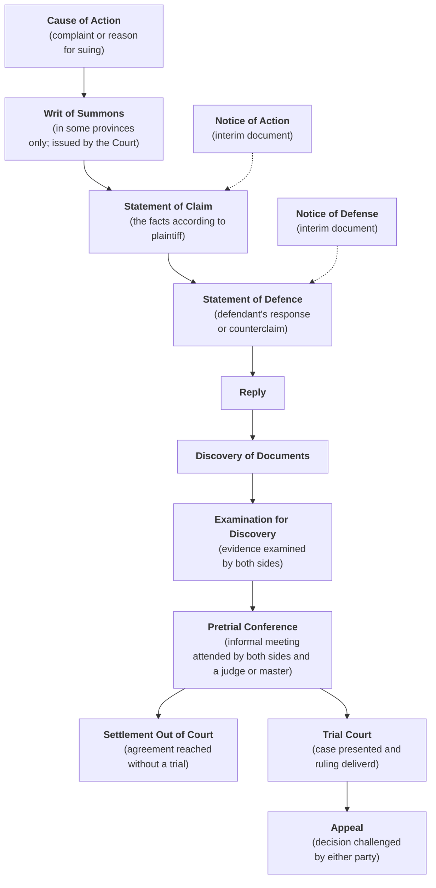
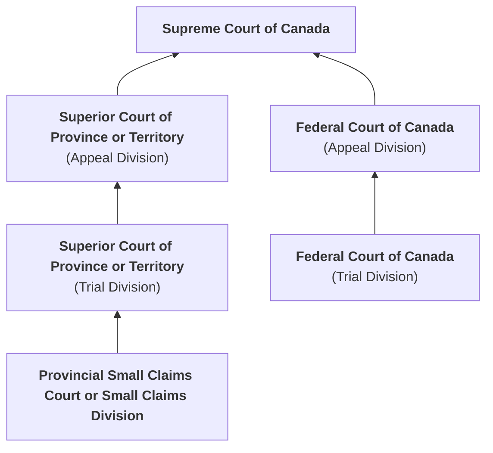

# C13 - Understanding Civil Procedures

## Private Law Procedures

- **private law:** law that deals with disputes between X and Y (X and Y may be:)
	- state
	- individuals
	- corporations

***Categories of Private Law***

### Parties Involved in Civil Actions

- **litigant:** parties involved in civil action
- **plaintiff:** party initiating a legal action
- **litigation:** legal action to resolve a civil dispute
- **damages:** compensation for a wrong suffered (usually money)
- **defendant:** party being sued in a civil action
- **liable:** legally responsible for wrongful action

**Citation:** *Plantiff* v. *Defendant*

Plaintiff must prove case on a **balance of probabilities**

**balance of probabilities:** weighing of evidence to decide whether plaintiff's or defendant's version of events is more convincing or likely to be correct

#### Minors and Parties with Disability

- **minor:** person under age of majority (<18-19 yrs., depending on province)
	- cannot sue or be sued in their own name
- **next friend:** adult who represents a child or a person under a disability who initiates civil lawsuit
	- a.k.a. litigation guardian
- **guardian *ad litem*:** person appointed to act on behalf of a minor or person under a disability being sued
	- literal meaning: "a guardian for the suit or for the purposes of the suit."
- **person "under a disability":** someone who cannot pursue activity due to a physical impairment

### Civil Action

- Complex civil actions or those involving significant amount of money are brought before a Superior Court
- **pleadings:** documents stating formal allegations by the parties regarding their claims and defences

#### Stages in a Civil Action

#### Starting an Action

Each province makes own rules about how actions are started and carried out

- In some provinces, process of civil suit begins with a **writ of summons**
	- issued by Court, informs defendant of claim, orders defendant to respond
- In most provinces civil suit starts with a **statement of claim**
- **writ of summons:** legal document that starts civil actions in some provinces
- **statement of claim:** document outlining facts supporting a civil action and remedy desired
	- should be concise and clear
	- defendant can ask for particulars if information is lacking
- **remedy:** relief sought by plaintiff
- **particulars:** specific details of a claim in civil action
- **default judgment:** judgment against party who has failed to defend a claim; awarded against defendant
- OPTIONS FOR DEFENDANT
	- ignore summons and statement of claim &rarr; **default judgment**
	- file statement of defence
	- accept liability and settle out of court

#### Statement of Defence

- **statement of defence:** response to the plaintiff's complaint, denying allegations in part or in whole
	- insufficient time: defendant files notice of defence and files statement later within specified period
- **counterclaim:** independent cause of action brought by the defendant against the plaintiff
	- defendant counter-sues plaintiff

#### Third-Party Claim

- **third-party claim:** complaint filed by defendant claiming that another party is at fault
- alternative to counterclaim
- claim alleges that a third party may be **liable** for all / part of damages plaintiff is seeking from defendant
- **cross-claim:** claim made between parties on same side of litigation
	- if plaintiff identifies >1 defendant

#### Reply

- Plaintiff has opportunity to reply to statement of defence
- if plaintiff intends to rely on different version of the facts that may...
	- take defendant by surprise
	- raise new issue

#### Examination for Discovery

- **examination for discovery:** examination of evidence by both sides before a civil trial
- parties entitled to question each other before a trial
- counsel has right to question any party with adverse interest in proceeding
- fewer restrictions on types of questions that may be asked
- lawyers may ask about
	- actual knowledge or events (also at trial)
	- any other information
	- beliefs they may have
- information usually recorded and used at trial
	- can be used to contradict testimony and speech before trial
- if litigant a corporation, officer or director is examined
	- obligation to be informed about case
	- may even have specific personal knowledge about it
- prevents element of surprise at trial
- provides both sides w/ opportunity to assess each other's strengths and weaknesses

#### Examination of Documents

- each side entitled to examine all relevant documents that other parties have in their control
- **affidavit of documents:** a list of documents relevant to the case that will be used at trial
	- must prepare before trial
	- documents outside affidavit cannot be used
- **privileged documents:** records and information that can be excluded from examination by other side in civil action
	- i.e. communications between lawyer and client
	- comments made by parties when they negotiate to settle case

#### Pretrial Conference

- **pretrial conference:** meeting where litigants meet their respective and a judge to try and reach a settlement before going to trial
- judge assists both parties to resolve as many unsettled issues as possible
- judge gives litigants unbiased opinion on possible outcome if they decide to take case to trial
- if parties fail to reach a settlement, different judge assigned for trial

#### Settlement Out of Court

**settle out of court:** all parties agree to resolve the dispute instead of going to court

- Court encourages settlements
- if person refuses to accept settlement that turns out to be as good as or better than result that refusing party obtains at trial...
- resulting party is penalized by having to pay costs for other party
- i.e. I sue for $10,000 and defendant offers to settle for $8,000
	- I refuse offer and win, but am offered only $7,000
	- I wasted everyone's time and I could've had $8,000 without a trial

#### Trial Court

- Most civil trials heard by Judge alone
- If trial is by jury, judge instructs jury on how to apply law to facts of the case
- no jury: Judge decides whether plaintiff or defendant should succeed 
- quantifying damages, especially ones inv. serious personal injury, most difficult part of case
- Court can order plaintiffs to provide security for a defendant's legal costs
	- ensures court costs are covered and to deter frivolous lawsuits
	- only plaintiffs who feel they have good grounds are prepared to provide security
	- security usually ordered when plaintiff does not live in or own property in province
- Defendant who loses responsible for all damages awarded by the Court
	- may also required to pay part of all of legal costs of other litigant
	- for many, cost of going to court so prohibitive it may act as deterrent

#### Appeals

- Challenge decision of trial to a higher court
- **appellant:** party that appeals
- **respondent:** party that responds to appeal
- some cases: litigants have automatic right to appeal
- other cases: they have to ask for "leave" to appeal
	- get permission to appeal decision
	- based on question of law or question of fact
	- Judge may have made a mistake
	- in some cases, appeals only granted on questions of law
	- usually required to appeal to SCC and only granted if case raises issue of national concern

### Class Action Lawsuits

- **class action suit:** lawsuit filed by 1+ individuals on behalf of a group
- Purpose: enable avg. citizens with a common complaint to challenge large corporations or...
- private citizens who can afford best and most expensive legal services
- 2008: 8 provinces: Ont., B.C., Qc., Alb., Sask., Mb. N.B., N.F.L. have class action legislation
	- N.S. and P.E.I. have pending legislation
- In all provinces, must first be established that class action procedure is the best way to resolve issue
- Prohibitive legal costs
	- Plaintiffs' lawyers will receive a cut of the monetary award only if successful

## Civil Courts

**binding:** final and enforceable in the courts

### Canadian Civil Court Structure and Avenues of Appeal

#### Provincial Small Claims Court or Small Claims Division

- fastest, least expensive way to settle disputes
- parties generally represent themselves or bring lawyer, law student, or agent to assist / speak on their behalf
- financial limit of cases varies by province, up to $25,000
- examples of cases heard
	- money owed for unpaid loans or rents
	- services performed
	- goods bought on credit or with bad cheques
	- property damage
	- personal injury

#### Superior Court of Province or Territory *(Trial Division)*

- cases involve larger sums than Small Claims Court and more complex disputes
- involve lawyers
- most trials heard by a judge alone
- some trials heard by a judge and jury
- examples of cases heard
	- class action lawsuits
	- contract disagreements
	- serious personal injury cases

#### Superior Court of Province or Territory *(Appeal Division)*

- hears appeals from Superior Court of province / territory
- cases generally heard by panel of 3 judges
- decisions can be appealed to S.C.C.

#### Federal Court of Canada *(Trial Division)*

- tries civil cases involving federal gov't.
- examples of cases heard
	- copyright and trademark claims
	- citizenship appeals
	- disputes about employment insurance or federal income tax

No notes for Federal Court of Canada (Appeal Division)

#### Supreme Court of Canada (S.C.C.)

- highest Court of Appeal for civil cases
- parties must get leave, or permission, to appeal
- decisions **binding** in all jurisdictions in the country

## Civil Remedies

### General Damages

#### Pecuniary

- **pecuniary damages:** monetary compensation for plaintiff's losses that can be calculated
	- i.e. loss of future earnings
	- cost of future case
- Judge must consider plaintiff's future earning capacity
	- i.e. potential earnings of seriously injured highly-paid actor or athlete vs. junior store clerk
	- also takes in to account life expectancy
	- young age = higher compensation
	- too young &mdash; factors to consider
		- plaintiff's marks high enough to get admitted to uni. or college?
		- demonstrate athletic or artistic ability?
		- plans for future career been discussed w/ anyone who could testify at trial?
- pecuniary losses for future care can mount to $1,000,000s 💲💲💲💲💲
- if arising from criminal case, defendant may be in prison and have no moolah

#### Non-Pecuniary

- **non-pecuniary damages:** compensation for losses that do not involve an actual loss of money and are difficult to quantify
- Courts tend to award similar amounts for similar non-pecuniary losses
- *stare decisis* applies &mdash; [[c1-law-and-society]]
- Upper limit for max. compensation for non-pecuniary damages
	- 1978: $100,000
	- as of textbook release: $311,000
- **aggravated damages:** compensation for intangible losses like humiliation or distress

### Special, Punitive, and Nominal Damages

- **special damages:** compensation for out-of-pocket expenses like...
	- drugs
	- therapy
	- ambulance services
	- vehicle repairs
- **punitive (or exemplary) damages:** damages imposed to punish the defendant for their conduct
	- awarded when defendant's conduct is so bad that court finds it "reprehensible" or "malicious"
- **nominal damages:** minimal compensation to acknowledge legitimacy of their complaints
	- i.e. Yves buys transit tokens
	- Fares increased by 10 cents
	- Yves informed he'd have to purchase more expensive tokens or incl. additional 10c
	- Yves argues he entered a contract with the transit agency, and they couldn't just change the terms later on
	- Yves won and permitted to exchange tickets for tokens w/o paying extra 10c

### Specific Performance

**specific performance:** court order requiring a party to fulfill the terms of a contract

- i.e. I go to buy a dog from a breeder and wait until dog is weaned
- When I go to pick up puppy, breeder informs you she changed her mind and doesn't want to sell the dog
- She offers to return deposit but you want the dog
- Court can order the breeder to sell you the dog

### Injunction

- **injunction:** court order requiring or prohibiting an action
- **mandatory injunction:** injunction that requires person to do smth.
- **prohibitory injunction:** injunction that prohibits person from doing smth.
- **permanent injunction:** permanent requirement / prohibition
- **interlocutory injunction:** temporary injunction
- Courts grant them to stop activities like...
	- applying dangerous chemicals
	- using copyrighted trademarks or materials
	- failure to comply = charge of contempt

### Enforcing a Judgment

#### Examination of a Judgment Debtor

- Defendant refuses to pay?
- Defendant examined as a judgment debtor
- **judgment debtor:** person who owes the defendant money
- Involves being questioned under oath to find out about assets
	- i.e. car, boat, motorcycle?
	- bank accounts or stocks?
	- who owes debtor money?
	- place of work? earning / salary?

#### Garnishment

**garnishment:** court order requiring third party (i.e. employer) to pay plaintiff money owed to defendant

- i.e. Court orders a cut of the wages earned to be paid to defendant until total amount paid
- Bank accounts, money due on contracts, and money owed by a third party to defendant can also be garnished
- Most provinces impose time limit
	- If settlement not paid, possible to renew order to debtor

#### Execution or Seizure

- Assets of debtor can be seized by sheriff or bailiff and sold to settle judgment
- Writ of execution typically filed w/ sheriff who arranges for seizure
- Notifies debtor if settlement is not paid within certain period, assets will be sold in payment
- Sometimes assets sold at public auction
	- after deducting costs for sale
	- rest of money paid to settle judgment
	- certain assets cannot be sold: clothing, furniture, tools worker needs to earn living

### Alternative Sources of Compensation

#### Motor Vehicle Liability Insurance

- For cases involving personal injuries from motor vehicle accidents
- Injured party may be able to recovery money from insurer of defendant's vehicle
- To address people who don't have liability insurance (legally required)
	- provinces set up *uninsured driver funds* to compensate ppl. suffering from uninsured drivers

#### No-Fault Motor Vehicle Insurance

- Provides immediate funds w/o evidence of fault
- May take many years to bring civil action to court and prove fault
- If someone suffers loss beyond coverage, victim may still bring in action for damages
- Victim's suit successful
	- earlier settlement deducted from eventual award

#### Workers' Compensation

- Compensation through provincial Workers' Compensation Fund
- Not available in all workplaces &rarr; below talks about covered workspaces
- Employer pays into fund, based on size and type of biz. op.
- Employee can still receive compensation even if they were at fault
- Claims usually settled quickly, benefits paid immediately
- If settlement insufficient to cover medical costs, worker can ask for case to be reopened and payments reviewed
- Workers' Compensation does not award for
	- pain and suffering
	- loss of enjoyment of life
	- amount of money paid considerably less than under a lawsuit
- Employees must apply to Workers' Compensation Board to receive benefits
	- Board decides who receives benefits, how much and for how long
	- Medical expenses usually covered
	- Lost wage awards limited to max. percentage of worker's avg. salary before injury

#### Criminal Injuries Compensation

-  Victims of violent crime find very difficult to recover court-awarded damages in civil suit
- Assailant may not have any assets, criminals rarely insured
- Criminal injuries compensation boards created to compensate victims
	- many plans incl. those of BC and Ont. have specific eligiblity criteria
	- i.e. victim must be completely innocent
	- victim did not instigate or participate in violent act in any way
	- limits to amount of money awarded

## Alternative Dispute Resolution

**alternative dispute resolution (ADR):** a way to settle disagreements other than by litigation

### Negotiation

**negotiation:** both parties discuss to reach agreement that benefits both parties

Good communication is key

### Mediation

**mediation:** process where neutral third party intervenes to bring two opposing parties to an agreement

- widely used alternative method for resolving dispute
- participation not always voluntary
- certain cases, Court orders parties meet with a mediator before a trial is scheduled
- mediator's purpose is to keep negotiations on track, cannot force either party to agreement
- both parties benefit
	- eventual solution is "shared" and not imposed by Courts will be more long lasting
	- creates sense of fairness
	- mediator can help create new ideas
	- mediation process is confidential and private, unlike court process

### Arbitration

**arbitration:** process where neutral third party hears both side of dispute, then makes a binding decision

- arbitrator has greater role
- arbitration can be legislated, often is in labour disputes
- both parties agree to choice of arbitrator and share cost for service
- arbitrators usually experts in specific area of law or in particular industry
- they hear and consider merits of dispute based on facts and applicable laws
- someone wins and someone loses
- many Aboriginal rights, titles, land claims and self-governments are resolved through ADR

### Pros and Cons of ADR

|Pros|Cons|
|-|-|
|Success rate 80-85%|Inappropriate for violence disputes|
|Informality|Not best option for those who want to publicize outcome|
|Privacy|Poor choice to establish legal precedent|
|Control of parties|Poor choice when outcome affects large group| 

## Sources

Law in Action 2nd Ed., Pearson