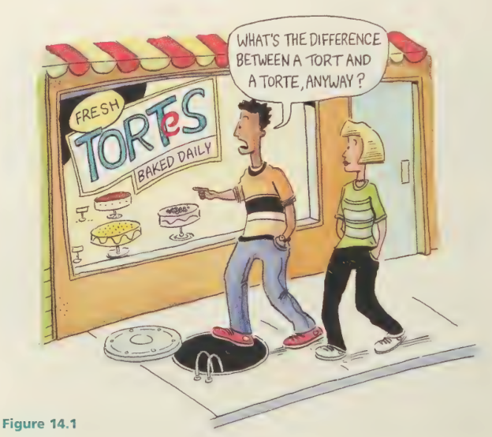
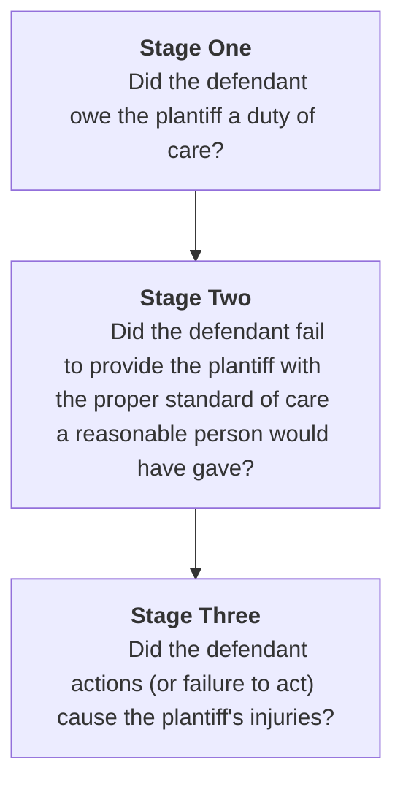
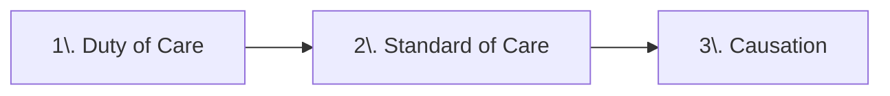
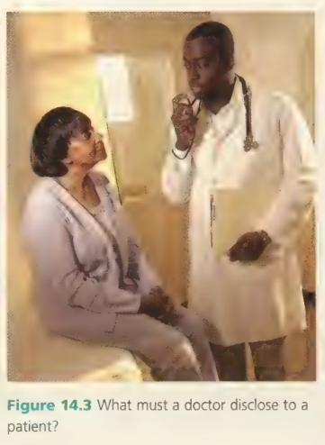
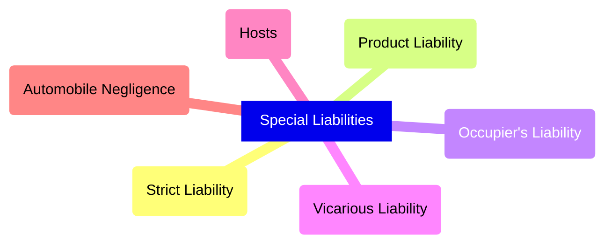

# C14 - Negligence and Unintentional Torts

## Torts

- **tort:** harm caused to a person / property for which the law provides a civil remedy
	- origin from Latin words: *tortum* ("wrong"), *torquere* ("to twist")
- **unintentional torts:** injuries caused by accidents / actions not meant to cause harm

*Important Image &mdash; Tort vs. Torte*

## Negligence

**negligence:** careless action that causes "forseeable" harm to another person you should have known

### Stages of Negligence Torts

⭐ MEMORIZE CHART

Answer must be "yes" to all three questions

### Stage One: Duty of Care

- **duty of care:** obligation to foresee and avoid careless actions that may cause harm to others
	- i.e. a person has a duty of care to a person walking on his sidewalk by cleaning it
- **neighbour principle:** duty of care to not harm your neighbour through carelessness or negligence
	- determined as a result of case *Donoghue v. Stevenson*
	- Before 1932: duty of care only required to people w/ contract or special relationship
- **foreseeability:** ability of a reasonable person to anticipate the consequence of an action
	- can foresee: not cleaning the floor? someone may slip
	- cannot foresee: opening the door, someone trips, falls backwards and injures person behind them

#### Case: *Donoghue* v. *Stevenson*, [1932] A.C. 562 (H.L.)

- Ms. Donoghue and friend stopped at café for drink
- Friend purchased bottle of ginger beer (non-alcoholic) for Mrs. Donoghue
- She drinks some of it, and finds remains of a decomposed snail, becomes very ill
- Sued manufacturer for negligence
- Manufacturer said it did not owe Donoghue duty of care since their contract was with the friend
- Trial judge dismissed but Donoghue appealed
- House of Lords reversed decision and cause of action could proceed
- Origins of the "neighbour principle"

### Stage Two: Standard of Care

- **standard of care:** degree of caution / conduct someone should exercise to not cause harm
	- very high standard of care: surgeon
	- fairly high standard of care: doctor
	- no standard of care: someone got hurt by someone else's actions
- **reasonable person:** someone who behaves in a way our society expects most people to behave
	- legal term, person w/ sensible reason, intelligence, and care

#### Professional Liability

**specialized standard of care:** degree of caution / conduct required of a person w/ a job of specialized training

Examples:

- doctors
- lawyers
- engineers

#### Medical Negligence

- Medical practitioner cannot \_\_\_\_\_\_\_\_ w/o patient's consent
	- touch patient
	- perform an operation
	- administer treatment
- Consent not always possible
	- i.e. emergency situation where patient is unconscious
	- health care providers can and will act w/o consent to save someone's life
- Consent must be voluntary &mdash; no pressuring
- Duty of care to inform patient
	- explain medical procedure patient will receive
	- significant / unusual risks involved
	- length of recovery
	- potential side effects
	- any alternatives to procedure
	- serious risks, even if their chances are very low

*Important Image &mdash; Doctor's Standard of Care*

What must a doctor disclose to a patient?

#### Rescuers

- Illegal in Québec to fail to assist someone in need of help
	- s. 2 of Québec *Charter of Human Rights and Freedoms*
	> Every human being whose life is in peril has a right to assistance. Every person must come to the aid of anyone whose life is in peril, either personally or by calling for aid, by giving him the necessary and immediate physical assistance, unless it involves danger to himself or a third person, or he has another valid reason.
- **Good Samaritan Law:** legal principle that protects rescuer who has voluntarily helped someone in distress from being sued if he/she causes that person harm
- rescuers typically have a low standard of care 

### Stage Three: Causation

#### Cause-in-Fact

- **cause-in-fact:** "cause and effect" connection between one person's actions and another's injuries
	- the injuries would not have happened "but for" the defendant's actions
	- i.e. teacher fails to provide life jackets for a canoe trip
	- student drowns
	- student wouldn't have drowned "but for" the teacher's negligence to provide life jackets
- **apportionment:** division of fault among different wrongdoers
	- e.g. teacher fails to provide life jackets for a canoe trip
	- student falls of boat and tries to swim to safety
	- careless boat driver hit her and she drowns
	- student wouldn't have fell "but for" the teacher's actions
	- student wouldn't have lost consciousness and drowned "but for" the boat driver's actions

#### Remoteness of Damage

- **remoteness of damage:** harm that couldn't have been foreseen by defendant due to lack of close connection between wrongful act and injury
	- i.e. someone speeds, they swerve to avoid hitting a dog, they go off road and hit a fence
	- staples in fence pop off, cows in farm accidentally eat staples and die
	- loss wouldn't have happened but for the speeders' actions, but the speeder couldn't have foreseen this happening
- **intervening act:** unforseeable event interrupts chain of events started by defendant
	- i.e. boat driver hitting student who fell off canoe on field trip due to teacher's failure to provide life jackets
	- boat driver did an intervening act
- **thin-skull rule:** rule stating that defendant is liable for all damages caused by negligence despite any pre-existing condition that makes plaintiff more prone to injury
	- "take your victim as you find him / her"
	- i.e. Bob leaves bike on sidewalk, Jane trips over it
	- Jane breaks bones instead of bruising due to suffering from osteoporosis
	- Bob liable for breaking her bones

## Special Types of Liability

### Product Liability

**product liability:** area of law that deals with negligence caused by manufacturers

Decided by *Donoghue* v. *Stevenson*

Minimum standard of care to prevent injury to consumers:

- the design of the product is free from harmful defects
- the product is properly manufactured
- the consumer is informed about how to use the product safely
- the consumer is warned of risks associated with using the product

### Occupiers' Liability

- **occupiers' liability:** duty of care of owners / renters / occupiers to ensure noone entering their premises is injured
- **invitee:** person invited on property for business person
	- i.e. the delivery guy
	- highest standard of care
- **licensee:** person w/ express or implied permission to visit socially
	- i.e. friend
	- standard of care to prevent injury
- **trespasser:** someone w/ no legal right or permission to be on your property
	- i.e. burglars, stalkers, and vandals
- Courts have difficulty distinguishing between invitees and licensees
	- many provinces, incl. PEI, N.S., Ont., Manitoba, Alb., and B.C. enacted occupiers' liability legislation
	- standard of care (SOC) of invitee = SOC of licensee

#### Children Who Trespass

- Children easily attracted to "risky" sites like swimming pools or playgrounds
- **allurement:** site or object that might attract children, causing harm
	- owners must take reasonable precautions to protect children from harm on their premises
	- i.e. high fences around swimming pools

### Vicarious Liability

**vicarious liability:** legal responsibility for the negligence of someone else

i.e. Employer of car shop liable if mechanic in shop fails to properly repair a car, and the car has an accident as a result.

### Hosts

- **host:** someone who serves alcohol to guests / paying customers
- **commercial host:** business who sells alcohol to customers
	- have statutory duty of care to patrons and a patron's negligent driving
- **social host:** hosts who serve alcohol to people in their home
	- law unclear
	- *Childs* v. *Desormeaux* &mdash; social hosts not liable for negligent guests
	- *Hamilton* v. *Kember* &mdash; parents may be liable for actions of guests invited by their children, if they were aware of a potentially risky situation

#### Case: *Childs* v. *Desormeaux* [2006] 1 S.C.R. 643

- Desormeaux was at party hosted by Dwight Courrier and Julie Zimmerman
- Desormeaux allegedly consumed at least 12 beers at "BYOB" event
- Only alcohol served by hosts was small glass of champagne
- Courrier checked if Desormeaux was O.K.
- Desormeaux drove his car into oncoming traffic and colliding head-on w/ vehicle driven by Patrician Hidden
- 1 passenger killed, 3 others badly injured, incl. plaintiff Zoe Childs, teenager, paralyzed from waist down
- Trial Judge determined reasonable person should've been able to foresee accident
- Judge believed duty of care negated due to social and legal consequences of imposing duty on social hosts
- Judge didn't hold Courrier and Zimmerman liable
- Zoe Childs appealed to Court of Appeal, and then SCC
	- result: not just and fair to impose a duty of care on Courrier and Zimmerman

### Automobile Negligence

- Many tort actions result from car accidents
- Different branches of law may be involved in a single accident
- i.e. driver may be charged criminally, fined for infraction of provincial motor vehicle legislation, sued in criminal court
- Every province / territory has regulations for motor vehicle owners
- Imposes ***vicarious liability*** on owner for any damages caused by his vehicle
- Vehicle owners required to carry liability insurance, may still have to pay if damages exceed coverage
- Driving w/o insurance = provincial offence
	- $5,000 - $25,000 in Ont. for first offence

### Strict Liability

**strict liability:** defendant is automatically liable for an injury caused by dangerous substance or activity even if they were not negligent

Typically pertains to

- fires
- vicious animals like pitbulls
	- some cases, owner may be liable even if dog has never bitten anyone before
	- other cases, dog's behaviour &ne; owner 100% liable
- environmental pollution
	- leaking of dangerous fumes or toxic waste

## Defences to Negligence

### Contributory Negligence

**contributory negligence:** plaintiff contributed to his or her own injury through his/her negligent actions

i.e. Speeding skier crashes into you while you stop to rest, breaking your legs, because he couldn't see

- you are 25% responsible by stopping where it is difficult to see
- skier is 75% responsible by speeding in a low visibility zone

### Voluntary Assumption of Risk

**voluntary assumption of risk (*volenti non fit injuria*):** no liability exists because plaintiff agreed to accept the risk normally associated with activity

> i.e. American football player cannot sue the NHL for his concussion because he knew concussions could happen in his sport

**waiver:** document signed by plaintiff, releasing defendant from liability in case of injury

> i.e. You are injured by a football in a football match. However, by buying the ticket, you released the stadium owner from liability

*You are not automatically released from liability when signing a waiver. The signing must be **voluntary**.*

### Other Defences

- These defences rarely occur, courts suspicious of such claims
- **inevitable accident:** accident was caused by something defendant had no control over and could not have prevented by any amount of reasonable care
	- i.e. driver crashes into another driver after being stung by bee, accident was inevitable
- **act of God:** accident was caused by an extraordinary and unexpected natural event
	- i.e. caused by tornadoes, earthquakes, floods
	- i.e. Bob's car was flung by a tornado on to Jessica's car
- **explanation:** defence where an accident occurred for a valid reason even though the defendant took every precaution
	- i.e. Jessica driving carefully, cautiously, and slowly and starts to brake
	- but her car slips on black ice and crashes into a fence

### Statute of Limitations

**statute of limitations:** law that specifies the time within which legal action may be taken

Expiry of time period a defence in tort case

Plaintiff can receive no compensation after time period, even if they could've won before the expiry or have suffered serious injuries.

### Case: *Hamilton* v. *Kember*, 2008 CanLII 6988 (Ont. S.C.)

- Chelsie Free, 17-yr-old high school student asked parents if she could have a party while they were away for weekend
- Parents agreed as long as Chelsie
	- restrict the guests to more than 20
	- serve no alcohol
	- anyone did become drunk, told to stop drinking
- Word got out in Chelsie's school about party
- Party became "open" and 80-100 students arrived
- Chelsie locked up parents' liquor cabinet and did not serve any guests
- Kyle Hamilton arrived at party drunk
	- encouraged by friends to leave a short time later
- While standing at side of road, Hamilton hit by vehicle driven by Jamie Kember
- Kember swerved to avoid crowd of students and hit Hamilton and friend
- Issue
	- Was Hamilton a trespasser?
	- Did Chelsie's parents' have a duty of care to ensure safety of persons on their property?
	- Plantiffs' argument: Party became "open" and no indication they were unwelcome
- Court Decision
	- Defendants had duty of care to plantiffs
	- Parents were aware that risk situation might develop
	- ...and alcohol would be consumed by underage guests
	- Parents at no time contact Chelsie to ensure instructions were being met
	- Chelsie also did not contact neighbour or police to help control situation getting out of hand
	- Rejection of defendant's argument to dismiss action

### Case: *Isildar* v. *Rideau Diving Supply*, 2008 CanLII 29598 (Ont. S.C.)

- jul 2003: Ali Isildar (28 yrs.) drowned in St. Lawrence River during deep dive
- Deep dive mandatory component of Advanced Open Water (AOW) scuba diving certification offered by defendant
- *Defendant:* Kanata Dive Supply (KDS), division of Rideau Diving
- *Plantiffs:* Isildar's widow and son (claiming damages for loss of Isildar and financial support)
- Case: Defendants owed duty of care to Isildar to provide competent diving instruction and ensure dive executed safely
- 2 groups diving evening
	- 1st group led by Chris Miller, 1st time teacher of program
	- 2nd group led by Sarah Dow, 1st time AOW teacher
		- Isildar's group
- Isildar took diving lessons before
	- First deep dive in cold water
- Protocol: Each student assigned a buddy
- Miller's group did dives first; river muddy, dive stirred up **slit and particles** making it difficult for divers to see
- Cloudy water, Isildar gets separated from buddy and he panics
- Sarah went to help him, unable to help him safely, went to get help from Chris Miller
- By that time, Isildar already drowned

**Legal questions:**

- Did defendants breach standard of care owed to Ali Isildar?
- KDS vicariously liable?
- Did Isildar contribute to his own death?
- Does Liability Release and Assumption of Risk Agreement signed by Isildar relieve them of liability?

**Decision**

- Dow breached her duty to Isildar that night
- She should've anticipated conditions on deep dive and known student divers could panic
- Dow failed to follow safe diving practices of "stop, think, and act"
- KDS vicariously liable for no reasonable system to assign AOW instructors
- Isildar liable for contributory negligence
	- should have obtained more cold dive experience before participating
	- 15% liable &rarr; Isildar
- Isildar signed liability release document (june 4, 2003)
	- relieves KDS or its employees from any liability
	- plantiff's argument: Isildar acting in course of instruction, did not consent to risky activity
	- ruling: Isildar was educated and understood liability releases (deny right to sue)
	- **Punitive damages not awarded**

## Source

Law in Action 2nd Ed., Pearson