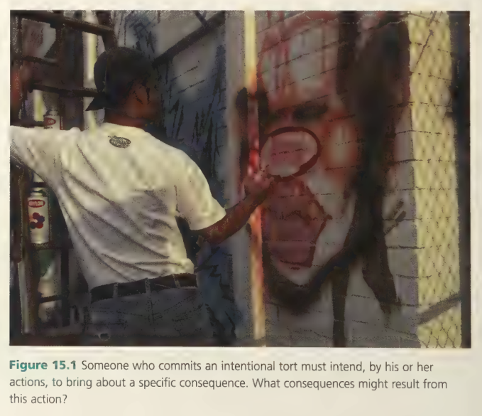
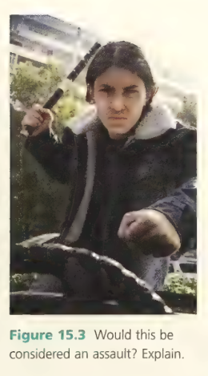
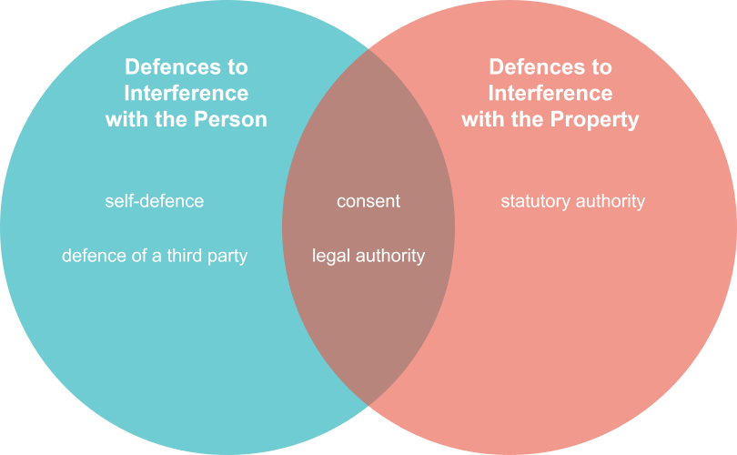
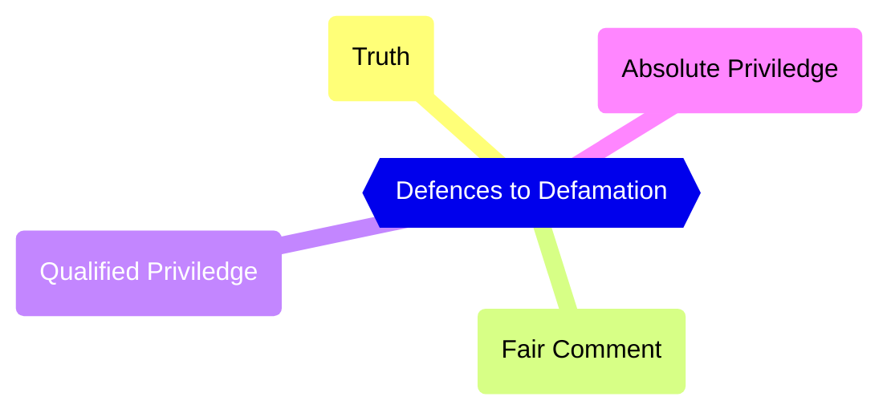

# C15 - Intentional Torts

## Intentional Torts

- **intentional torts:** actions intended to cause injury to others
- **intent:** the desire to commit an act for a specific purpose
- It is still an intentional tort if
	- you meant to injure one person but end up injuring another person

*Important Image &mdash; Intentional Tort &rarr; Trespass to Land (Property)*

Someone who commits an intentional tort must intend, by his or her actions, to bring about a specific consequence. What consequences might result from this action?

### Intentional Torts and Criminal Acts

- Events that are criminal acts may end up also having intentional tort cases
- *Purpose of Criminal Court:* Bring accused to justice and protect society from further offences
	- proof must be beyond reasonable doubt
- *Purpose of Civil Court:* Compensate victims for loss or injury
	- proof is based on a balance of probabilities

|If one person|it is the crime of|and also the tort of|
|-|-|-|
|hits another|assault|battery|
|holds another against his or her will|forcible confinement|false imprisonment|
|breaks into another's house (with the intent to steal)|break and enter|trespass to land|
|takes another's belongings|theft|conversion or trespass to goods|
|kills another|homicide|wrongful death|

## Intentional Interference with the Person

### Assault

*Assault Example: Threatening with Stick*

Would this be considered an assualt? Explain.

**assault:** offensive act that threatens imminent harm to another person where the plantiff believes the threat was genuine

i.e. If I threaten someone with a knife and say "I will kill you if you mess with my pussy again", that is a tort of assault

### Battery

**battery:** intentional, unauthorized physical contact that victims finds harmful / offensive

Someone can also be liable for just touching, even if there is no injury, as long as victim finds touch *offensive*

### Sexual Abuse

- victims seek compensation in civil courts
- also seek their assailants to be publicly exposed for their wrongdoing

#### Case: *F.H.* v. *McDougall* (2008), S.C.C. 53 (CanLII)

- F.H. was resident at Sechelt Indian Residential School in B.C.
- McDougall was...
	- Oblate Brother
	- junior and intermediate boys' supervisor
	- from 1965-1969
- Assaults alleged to have occurred when children were brought one-by-one into the washroom for cleanliness inspection
- F.H. told no one about assaults until 2000 when he told his wife
- Trial judge found F.H. to be credible witness
- Court of Appeal overturned conviction
	- Testimony from adult victims about long-time-ago events required independent corroboration
- **S.C.C. Appeal**
	- Question: Should standard of proving liability in civil cases involving wrongdoing be as high as it is for proving criminal guilt?
	- Decision
		- Restoration of trial Judge's decision
		- Decision based on which party presented case w/ greater likelihood of fact
		- Little evidence typically in sexual assault torts
		- If on balance of probabilities, assault did happen, sufficient to rule for plaintiff and make defendant pay
		- Even in criminal sexual assault cases, corroborating evidence not required

### Medical Battery

**medical battery:** performing wrong medical procedure or performing a procedure without the patient's consent

i.e. Doctor operates on wrong disc, does operation again, but doesn't let patient know of original mistake

- May not always be possible to obtain patient's consent, i.e. life-threatening emergencies where patient is unconscious
- Certain measures are to not be taken even in life-threatening circumstances for religious reasons (card)
	- i.e. Jevoah's witnesses don't accept blood transfusions

### False Imprisonment

**false imprisonment:** detention of a person without consent and without legal authority

- Plantiff must show liberty has been restrained
- Defendant must show restraint is legally justified to avoid liability
- Cannot sue if you "consent" to the arrest
	- i.e. security guard arrests you and you "consent" to avoid an embarassing scene

### Malicious Prosecution

**malicious prosecution:** trying someone wrongfully without reasonable and probable cause

**malice:** desire to harm another

*Conditions*

- Someone has to be charged with a crime when there are no reasonable grounds for the charge
- The individual instigating or continuing the proceedings must be motivated by malice
- Proceedings against the defendant must be resolved in defendant's favour
- The defendant suffers damages as a result of wrongful proceedings

### Nervous Shock and Mental Suffering

**intentional infliction of nervous shock or mental suffering:** deliberately shocking someone, causing the victim to suffer physical / mental harm

Pranks count if the victim suffers...

### Invasion of Privacy

- People increasingly concered about legal protection of privacy
- Governments reluctant to push privacy legislation for fear of...
	- interfering with certain freedoms like
		- freedom of the press
		- freedom of expression
- Must seek balance between privacy and public's legimate interest in info.
- Provinces deal w/ it differently
	- i.e. Alb.; Ont. *Personal Health Information Privacy Act*, but privacy invasion not a tort
	- others like B.C., Manitoba, NFL, and Sask. make privacy invasion a tort

### Issue: Have we traded privacy for technology?

#### Real-Life Situations

- 14-year-old girl murdered on jan. 1, 2008
	- identity of two teens accused of killing her immediately on social network, contrary to privacy protection of *YCJA*
- young executive loses dream job when his prospective employer sees drunken behaviour pictures at party on same site

#### George Orwell's *1984*

- written in 1948 by George Orwell
- predicted world where state security more important than personal privacy
- "BIG BROTHER IS WATCHING YOU" from book
- Should people be concerned?

#### Yes: Privacy Lost in Electronic World

- companies use specialized cameras to take photos of streets and sell them to sites / brokers
- Danger Example: woman fleeing from abusive relationship
	- car carrying cameras drives by her street and records her in front of her new home
	- husband later sees image on Google Maps
- smartphone tracks us and knows where are at all times
	- GPS on: precise location
	- GPS off: cellular network triangulation

#### Is Information Technology Safe?

- no point in human history, so much personal info. been collected and share
- unprecedented access into our private lives could have harmful consequences
- i.e. gov't. of UK proposed a database that would store info on every...
	- phone call
	- email
	- Internet visit
	- purpose: combat terrorism
- CCTV cameras used for surveillance, watching our every move
- soon, we won't be able to meet anyone anonymously in public place
- gov'ts can shut down protests and ID protesters any time

#### No: Privacy Is Adequately Protected

- 1999: Scott McNealy, chairman of Sun Microsystems said...
	- "you have zero privacy anyway. Get used to it."
- Right to privacy a modern concept
- People had little privacy throughout history
- Suspicious to crave privacy back then
- People...
	- lived together in caves
	- shared homes w/ extended family
	- lived in small towns and villages where everyone knew everyone else's business
- No one forced to post profile on social media
- Ann Cavoukian, Ontario *Privacy Commissioner*, says we have the primary responsibility of protecting our privacy
- We **choose** to give up some of our privacy in exchange of *convenience*, knowledge, and instant communication

#### Does Technology Protect Us?

- concern over CCTV misplaced
- cameras do not prevent crime, but make it easier for police to find criminals
- cellphones with GPS used to located people lost in remote places
- we should be vigilant about info. we choose to give out and gov'ts. enacted legislation to protect us
- privacy-protecting legislation, examples
	- Ontario: *Freedom of Information and Protection of Privacy Act* (guidelines about how info. and images can be used)
	- Schools, parents, and police warn of Internet dangers
	- Laws to prosecute pedos, cyberbullies, and others who use net w/ criminal intent

## Intentional Interference with Property

### Trespass to Land

- **trespass:** unlawful interference with the person, property, or rights of another
- **trespass to land:** intentionally entering one's property without permission or legal authority
	- if licensee refuses to leave when you tell them to &rarr; trespasser
	- you must ask trespasser to leave, and only use reasonable force if they refuse
	- "intent" = "intent to go on the land"

### Nuisance

- **private nuisance:** unreasonable, substantial interference with one's right to enjoy their property
	- form of trespass
	- if neighbour had party and played loud music all night long
		- you must prove some damage
	- if loud parties become a nightly event
		- Court decides activity is private nuisance
- **public nuisance:** unreasonable, substantial interference with interest affecting community at large
	- i.e. public health and safety
	- oil spills, accidental pollution of drinking water
	- gov't. usually sues for you
	- rare cases: plantiff gets harmed in a unique way, they bring action

### Trespass to Chattels

- **chattel:** moveable personal property
	- i.e. clothes, jewellery, cars, bikes, furnitures, art, CDs
	- no need to damage chattel to be sued, but no point
	- harassment by constantly trespassing to your chattel &rarr; warrants action

#### Conversion

**conversion:** unauthorized, substantial interference with another's property, which deprives owner of its use

- i.e. theft, "borrowing" w/o permission
- defendant simply has to "convert" your property to his or her own use
- i.e. taking someone else's bike and taking it on a three-day bike trip

## Defences to Intentional Interference

### Defences to Interference with the Person

#### Consent

**consent:** permission granted *voluntarily* for a *specific* act

- i.e. Jeremy consents to having pies thrown at his face for charity
- Charlene angry at Jeremy laced pie w/ pepper
- Jeremy didn't consent to having his eyes burned by the pepper on the pie
- Charlene liable for battery

#### Self-Defence

**self-defence:** legal right to use reasonable force to protect yourself against injury from another

Must prove:

- defendant was in immediate danger of actual or threatened harm
- use of force necessary to prevent personal injury
- force used was not excessive
- threat of physical violence must be real
	- unreal: John says he'll beat up Gadi from across the stadium
	- real: John shows up besides Gadi with his fists clenched

#### Defence of a Third Party

**defence of a third party:** legal right to use reasonable force to protect someone else from injury

> i.e. some guy threatens a bus driver with a bat, I'm a good supreme leader and I beat up the guy before he whacky whacky the bus driver

Even acceptable if defendant mistook a threat

#### Legal Authority

**legal authority:** the right to perform an act that would otherwise be a tort

- i.e. police officers can arrest and detain someone on reasonable grounds
- s. 43 of *Criminal Code*, parents and teachers have legal authority to discipline their students / children as long as they don't use excessive force
- firefighters, paramedics, and other medical personnel may be given authority to restrain someone / use force to protect themselves or others

### Defences to Interference with Property

#### Consent

- Someone gave you consent to be on their property
- You are not liable unless you damaged property or abused purpose for which you were allowed
- i.e. neighbour hires you to cut her grass
	- she has consented to you on her lawn cutting grass
	- she has not consented to you going in her bedroom to look for spicy tapes

#### Legal Authority

- some people have legal authority to trespass
- i.e. police officers if they have a search warrant
- i.e. public officials to check value of land for taxing or checking compliance w/ building codes

#### Statutory Authority

**statutory authority:** legislation grants someone authority to perform an act that could cause a nuisance (inevitable result)

> i.e. a bus route is approved on your street, you will hear noise from moving buses

## Defamation of Character

**defamation:** actions causing injury to a person's reputation or good name

### Slander

**slander:** oral statement / gesture that damages a person's reputation

Plaintiff must prove

- statements were made to someone other than the plaintiff
- statements referred to the plaintiff
- statements lower the plaintiff's reputation in the eyes of a "reasonable person"
- special / actual damages, like loss of income

If person overhears defamatory comment, statement is "published"

### Libel

- **libel:** defamation in a permanent form
- Permanent Form
	- writing
	- printing
	- recording
	- films / videos
- considered far more **serious** than slander
- i.e. Woo writes an article about how Zara is a filthy cheater and plagiarizer

### Defences to Defamation

#### Truth

**truth:** defences where comments alleged to be defamatory are verified and established facts

- strongest defence to defamation
- plaintiff will not succeed if defendant can prove statements are true
- Court must balance right to freedom of speech w/ person's right to have his / her reputation protected
- true statements can be very damaging
	- person devoted life to public service
	- same person convicted of selling drugs as a teenager

#### Fair Comment

- **fair comment:** defence where comments / opinions were honest and made without malice
- **malice:** improper / ulterior motive for publishing a defamatory statement
- i.e. music critic negatively reviews a concert

#### Absolute Privilege

**absolute privilege:** protection from liability for statements made in Parliament, in a legislature or courtroom, at a military hearing, or before a tribunal

- allows certain people like state officers, soldiers, and politicians to speak openly about others w/o fear of legal action
- protection ensures best interests of society are served

#### Qualified Privilege

**qualified privilege:** protection from liability for statements made in certain situations as long as they were made w/o malice

- app. when someone has duty to make statement or an interest to protect
- person receiving statement has duty / interest in receiving it
- i.e. employers and teachers often asked to write letters of reference for former employees and students
	- allows them to be honest and forthright on their assessment
	- employers may be sued for negligence if they do *not* tell the truth
	- courts favour freedom of speech over protection of reputation

### Case: *WIC Radio Ltd.* v. *Simpson*, [2008] S.C.C. 40 (CanLII)

**Background**

- Rafe Mair well-known and sometimes controversial host of show on WIC Radio
- Kari Simpson widely known social activist against positive portrayals of gay lifetstyle
- *controversial debate on radio:* Should materials dealing with homosexuality be introduced in public schools?
- Mair FOR: he believed it would promote tolerance
- Simpson AGAINST: she argued it would promote homosexual lifestyle
- Mair compared Simpson to Hitler, Ku Klux Klan, and skinheads

**Trial**

- Simpson sues for defamation
- Mair at trial testified that he had not implied that Simpson condoned violence toward gay communities
- Mair simply wanted to convey that Simpson was an intolerant bigot
- Trial Judge dismissed complaint noting that defence of fair comment applied
- Court of Appeal reversed trial Judge's decision
	- no evidence that Simpson had ever promoted / condoned violence against gays
	- Mair didn't testify that he had honest belief that Simpson would condone violence

**Legal Question:** What is the objective test that would grant a defence of fair comment?

**Decision (S.C.C.)**

- S.C.C. restored trial Judge's decision
- Mair did make defamatory comments about Simpson
- comments protected by fair comment bcz.
	- a) The comments were on a matter of public interest;
	- b) They were based on fact;
	- c) The comments were recognized as comment; and
	- d) The person who made the comment believed them to be true
- Court ruled that last test should be modified to read "if any person could honestly express that opinion based on the same facts"

## Source

Law in Action 2nd Ed., Pearson