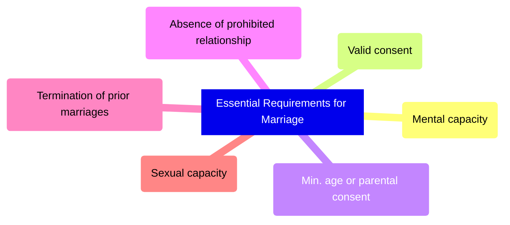
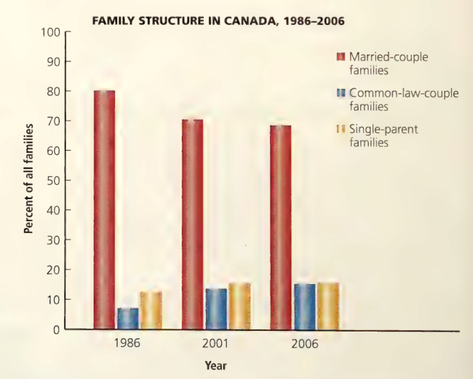

# C16 - Marriage

## Entering a Marriage

- **essential requirements:** federal laws that determine whether a person may marry
	- s. 91 (26) of *Constitution Act* gives jurisdiction to fed. gov't.
	- deal w/ individual's legal and personal capacity
- **formal requirements:** provincial and territorial laws regarding the *solemnization of marriage*
	- jurisdiction to prov. gov'ts. under s. 92 (12) of *Constitution Act*
- **solemnization of marriage:** marriage ceremony

### Essential Requirements for Marriage

- Does not meet requirements? Marriage declared **void *ab initio***
- **void *ab initio*:** declaration that a marriage is null and void
	- never took place
	- Latin for "from the beginning"

#### Mental Capacity to Marry

- **mental capacity:** one's ability to understand the nature of one's actions (contract) and to voluntarily enter into a contract
	- understand responsibilities in a marriage
- reasons for mental incapacity
	- alcohol
	- illness
	- drugs
- mental capacity must exist at time marriage took place
- marriage remains valid if problems arise after ceremony

#### Freedom of Consent

- **consent:** agreement to enter a marriage willingly
	- cannot marry under duress
- **under duress:** being forced into marriage through fear &mdash; criteria:
	1. they are afraid of the consequences if they do not marry
	2. their fear reasonable
	3. their fear is caused by someone else
	4. i.e. Jane Jones' father Chris Jones forces Jane to marry w/ threats of an honour killing by shotgun
- **mistake:** confusion or error about the identity of the person someone is marrying or about the purpose of the ceremony
	- i.e. Anna marries her fiancé's identical twin  ✔
	- i.e. Anna thinks she married a millionaire, but he's not ❌

#### Age of Consent

- historically: 14 (boy) and 12 (girl)
- currently
	- 18 in Alb., Manitoba, Ont., P.E.I., Qc., Sask.
	- 19 elsewhere
	- 16 in provinces (w/ parental consent)
	- 15 in territories (w/ parental consent)
- many Canadians felt that these ages were too low
- young people who wish to marry must obtain parental consent before marriage

#### Absence of a Prohibited Relationship

- *Marriage (Prohibited Degrees Act)*
	- prohibits sanguinity
	- affinity prohibited prior to 1991
- **sanguinity:** blood relationships
	- cannot marry close relatives
	- person cannot marry their
		- father / mother
		- grandfather / grandmother
		- son / daughter
		- brother / sister
		- grandson / granddaughter
- **affinity:** close relationships through marriage
	- repealed in 1991, still stated in s. 2 of *Act*
	> 2 (2) No person shall marry another person if they are related
	>
	> (a) lineally by consanguinity or adoption;
	>
	> (b) as brother and sister by consanguinity, whether by the whole blood or by the half-blood; or
	> 
	> (c) as brother and sister by adoption.
	> 
	> 3 (2) A marriage between persons who are related in the manner described in paragraph 2 (2) (a), (b), or (c) is void.

#### Prior Marriages

- **monogamy:** being married to one person at a time
- **bigamy:** being married to two people at the same time (type of polygamy)
	- criminal offence in Canada
	- max. punishment: 5 yrs. prison
	- 2nd and subsequent marriages considered illegal and void
- **polygamy:** being married to more than one person at the same time
- **annulment:** declaration by the Court that a marriage never existed
- prior marriages must be ended by annulment, divorce, or death of one's spouse before new marriage
- *"presumption of death" certificate:* spouse is presumed dead and there is no reason to believe that person is alive; can remarry
	- Ont: if spouse continuously absent for at least 7 years
	- 7 yrs. not required in unusual circumstances like accidents (i.e. plane crash)
	- if presumed dead spouse returns back alive, 2nd marriage void

#### Sexual Capacity

- **consummation:** legally validating a marriage through sexual intercourse between spouses
	- essential requirement
- both parties must have sexual capacity, otherwise annulment
- inability to consummate must be from physical / psychological problem
	- refusal is not enough to have void marriage
	- absence must exist prior to consummation (i.e. man injured after wedding)

### Formal Requirements for Marriage

#### Marriage Licence or Publication of Banns

- **marriage licence:** legal document authorizing marriage of applicants
	- requirement in most prov. / territories
	- can be purchased wherever authorized by province
	- i.e. municipal gov't. offices in Ont.
- **banns of marriage:** public declaration in a church announcing a couple's intention to marry
	- announced by member of clergy
	- couple may marry 5 days following last reading of banns

#### Marriage Ceremony

- must be witnessed by 2+ people over 18
- ceremony conducted by someone authorized by law
	- i.e. member of religious org. in religious ceremony, judge, Justice of the Peace, marriage commissioner
- each party must declare that he/she is not aware of any impediment to marriage
- couple being married must take each other as his / her "lawful wedded" husband or wife
- person preforming ceremony must pronounce couple "husband and wife", "partners for life", or "married"

### Aboriginal Customs

- **custom marriages:** marriage ceremonies between Aboriginal spouses that follow traditional practices
- *Noah Estate* (1961)
	- Marriage between 2 Inuit people: Noah and Igah valid?
	- Igah and daughter argued that Igah was not Noah's legal wife because Noah aware of territorial laws of marriage
	- but Noah chose to not follow them
	- Judge determined marriage valid bcz. it was a valid Inuit marriage
- Inuit custom marriage requirements
	- woman's consent to man's proposal
	- agreement of both sets of parents

## Families Today

- 1950s: middle-class family had stay-at-home mother and father as sole income earner
	- people married for a family
- TODAY: many women have own careers and work at least part time outside of the house
	- some men stay at home
	- many people choose to live as common-law partners
	- some couples choosing not to have children
	- blended families (1+ family unit) more common

### Cohabitation

- **common-law relationship:** intimate relationship between two individuals who are not legally married
- **cohabitation:** legal description / term describing common-law relationship

- Unmarried partner did not have legal responsibility to support each other
- Ont: partners living together for 3+ yrs. regarded as spouses for support obligations
	- if they have child: no time limit, do not have to live together
	- both parents legally responsible for supporting their child
- Legal status of cohabitation &ne; married status
	- obtain rights only when living together for set period
	- signing legal contract
	- registering partnership in some provinces like N.S.

#### *Pettkus* v. *Becker*, [1980] 2 S.C.R. 834

**Background**

- Rosa Becker met Lothar Pettkus in 1955 and started living together soon
- Rosa suggested marriage but Lothar said they should wait until they knew each other better
	- never married
- next 5 yrs: Rosa paid the rent and looked after household expenses
- Lothar saved his money for future investment in beekeeping farm (all savings under Lothar's name)
- 1961: couple buys farm under Lothar's name
	- couple eventually establishes beekeeping business
	- ran for next 14 years
	- business expansion
	- 1973: net profit of $30,000
- 1970s: relationship deteriorated
- Rosa left Lothar, alleging she had been beaten and abused
- She then seeked 1/2 interest in property, worth $300,000

**Legal Question:** How should assets and property of a common-law partnership be divided when the relationship terminates?

**Decision**

- trial judge awards Rosa 40 beehives, w/o bees and $1,500 *(Rosa appeals)*
- appeals court judge determined Rosa and Lothar lived together as husband and wife for ~20 yrs.
- 1/2 property awarded to Rosa *(Lothar appeals)*
- S.C.C. upholds Ontario Court of Appeal ruling
- Rosa Becker never received share of property bcz. Lothar refused Court's decision

#### Domestic Contracts

- **domestic contract:** legal agreement that defines rights and obligations of married or cohabiting partners
- **cohabitation agreement:** domestic contract that sets out the rights and obligations of both partners
	- can give unmarried partners same rights / obligations as married partners
	- deals w/ issues that may arise during relationship, after separation, or in event of death
	- cannot contract out of obligation to support their children
- **marriage contract:** domestic contract that deals with specific aspects of the marriage
	- incl. division of property in the event of...
	- divorce
	- separation
	- death

### Redefining Marriage

- 2002: Ontario Superior Court of Justice ruled that common-law def. of marriage being between man and woman violated s. 15 of *Charter*
	- redef. "voluntary union for life of two persons"
- feb 1 2005: recognition of same-sex marriage, Bill C-38
- jul 20, 2005: *Civil Marriage Act*
	- does not force religious institutions to provide marriage ceremonies for same-sex couples
- *Divorce Act* had to change *spouse* to be "either of two persons who are married to each other"

## Ending a Marriage

**separation agreement:** domestic contract that sets out the terms and conditions of the separation, such as:

- division of assets and property
- support payments
- other important matters
- Courts normally not involved except in cases of disputes

### Divorce

- **divorce:** legal termination of valid marriage
- **petition for divorce:** document providing reasons for the divorce and arrangements for support payments and child custody
- **petitioner:** the person seeking a divorce
- **respondent:** the spouse being "sued" for divorce
- Divorce cases decided by judge of Superior Court
	- majority of divorce cases finalized on basis of sworn documents w/o trial and w/o parties' seeing a judge
	- contest usually about economic / child-related issues in court, not divorce
- Judge cannot grant divorce w/o being satisfied that "reasonable arrangements" have been made to support children
- Divorce granted? takes effect on 31st day after decision made
- Waiting period provides dissatisfied party w/ opportunity to appeal and allows for reconciliation
- **certificate of divorce:** legal document that terminates a marriage

#### Obtaining Divorce (History)

- Before 1968: hard to obtain divorce
	- no fed. *Divorce Act*
	- grounds for divorce varied from province
	- grounds: adultery, cruelty, abandonment
	- **adultery:** sexual intercourse by a married person with someone other than his/her spouse
	- spouses might claim adultery just to get a divorce
- 1968: *Divorce Act* passed
	- unifies divorce process
	- still complicated
	- petitioner had to establish cause for divorce
- 1985: *Divorce Act, 1985* passed
	- courts less concerned about fault
	- matter of did it break down? not why did it break down?

### Marriage Breakdown

- **marriage breakdown:** failure of marriage established by 1+ yrs. separation, adultery, or cruelty
	- only grounds for divorce under *Divorce Act, 1985*

#### Living Separate and Apart

- 1-year separation period
- most common way couples demonstrate marriage breakdown to courts
- old legislation: 3-year separation period
- spouses must live "separate and apart"
	- usually happens by separation of homes
	- can happen in same home, as long as there is barely any interaction

#### Adultery and Cruelty

- 1-year separation period not required in case of adultery / cruelty
- **adultery:** sexual intercourse by a married person with someone other than his/her spouse
	- establish by reasonable proof or spouse's admission
- **cruelty:** mental or physical behaviour of one spouse causing harm to the other, making staying together intolerable
	- often referred to as spousal abuse
- ***Criminal Spousal Abuse***
	- *physical abuse:* punching, slapping, burning, cutting, stabbing, and shooting (assault)
	- *psychological abuse:* stalking, damaging property, making threats
	- *financial abuse:* taking a partner's paycheque and withholding money for food / medical treatment
	- *sexual abuse:* sexual activity or touching w/o consent
- **collusion:** agreement between spouses to lie or deceive the Court in order to obtain a divorce
	- prevents divorce from being granted

### Case: *M.* v. *H.*, [1999] 2 S.C.R. 3

**Background**

- 1980: M. and H., 2 women began living together in same-sex relationship
- Started own ad business, purchased businesses, and vacation property
- 1992: relationship deteriorated and M. eventually left common home
- M. financially disadvantaged and filed for support payments under Ontario *Family Law Act*
- M. knew claim would not be successful because "spouse" could only be someone of the opposite sex
- M. intended to challenge def. under the *Charter*

**Legal Question:** Did the words "a man and woman" in the definition of "spouse" in the Ontario *Family Law Act* discriminate against cohabiting partners of the same sex?

**Decision**

- Judge ruled that def. of "spouse" in *Family Law Act* discriminatory
- Declared that "a man and woman" should be changed to "two persons"
- H. appealed and Ontario Court of Appeal upheld decision
- Decision appealed to S.C.C.
- S.C.C. found that definition of "spouse" violated the equality provisions set out in s. 15 of *Charter*

> Section 29 of the *Family Law Act* established differential treatment on the basis of a personal characteristic, namely sexual orientation. This discriminates in a substantive sense by violating the human dignity of individuals in a same-sex relationship.
> 
> &mdash; Justice Peter Cory