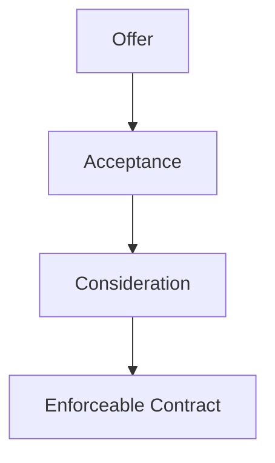

# C18 - Contract Law

## Classifying Contracts

- **contract:** agreement between 2+ competent parties that can be enforced in court; *legally binding* agreement
- **bilateral contract:** agreement by both parties to do something for each other
	- i.e. go to work; get paid on payday
	- take a cab ride; driver expects payment
	- friend sells me used DVD for $10, I agree
		- friend gets $10, I get DVD

### Oral Contracts and Written Contracts

- **oral contract:** verbal agreement between 2+ parties
	- lack hard evidence / witnesses to prove contract has been made
	- break golden rule of contract: "get it in writing"
- **written contract:** agreement between 2+ parties in which the terms are set out on paper or by Internet communication
	- easier for courts to enforce

### Implied Contracts and Express Contracts

- **implied contract:** agreement in which the parties enter a contract through their conduct
	- i.e. dropping money in fare box of a bus; entered contract even though no words spoken
	- contract: bus ride (service) for money
- **express contract:** agreement in which the terms have been discussed and agreed upon in advance
	- i.e. Bob sells John his laptop
	- They agree on a price and the laptop is sold

### Contracts Under Seal

- **contract under seal:** written agreement bearing a red sticker, handwritten dot, or the word *seal*
	- a.k.a. specialty contract, deed
- some provinces: sale / mortgage of land must be under seal to be enforceable

## Elements of a Contract

***consensus ad idem*** (meeting of the minds): a clear understanding between the parties of the terms of the contract and the willingness to abide by them

### Offer

- **offer:** clear proposal to another party to enter into an agreement on certain terms
- **offeror:** person who makes the offer
- **offeree:** person who receives the offer

#### Making a Valid Offer

- offer must be intended seriously and its terms must be certain
	- offer made as a joke / out of frustration is not valid
	- i.e. I sell my chess pieces because I'm angry I got 2nd place in the chess tournament
- if reasonable person thinks offer is serious, there is likely a binding contract

#### Invitation to Treat

- **invitation to treat:** a communication intended to elicit offers from the persons who receive it
	- i.e. "For Sale" sign, advertisements
	- whether communication is offer or invitation to treat depends on *intent* of sender
- intent determined from language used and surrounding circumstances
- if someone reasonable thinks ad is offer, person may have to live up to offer
- *Carlill* v. *Carbolic Smoke Ball Company*, [1893] 1 Q.B. 256 (C.A.)

#### Communicating an Offer

- offer is not an offer until it has been communicated to the party for whom it is intended
- offers may also be communicated via an ad
- important to know *when* the offeree became aware of the offer or *if* the offeree was even aware of the offer

#### Ending an Offer

- not reasonable for indefinite offer
- **lapse:** to be terminated or cease to exist
- offer **lapses** if not accepted before date set out in offer
	- or if offeror dies, becomes mentally incompetent, or goes into bankruptcy
- **revoke:** to withdraw or take back
- offer can be **revoked** by offeror before it has been accepted by offeree
- **counteroffer:** an offer made in response to an existing offer
	- i.e. I sell Toti my rare Pokémon card for $1,000
	- Toti says that he wants the Pokémon card for $800 instead

### Acceptance

- **acceptance:** clear indication by the offeree to enter into a contract on the terms set out by the offeror
	- no contract w/o acceptance
	- offer may state *how* acceptance must be made, but normally, acceptance valid if it is clear

#### Communication of Acceptance

Rules that govern acceptance:

1. Acceptance of an offer is usually required to be active
	- inaction or silence &ne; acceptance
	- removes uncertainty of whether offeree has accepted
	- avoids "foisting," forming of contract w/o offeree's consent
		- i.e. company sends product to home stating that if not returned within 7 days, you would've purchased them
2. The contract is formed when the offeror receives notice of acceptance from offeree
3. Acceptance must be made in a reasonable manner, or in the form required by the offeror
	- generally, acceptance communicated in same way offer was communicated
4. When the offeror has expressly required acceptance by mail, or it is clear that the mail may be used ... *acceptance is completed as soon as the letter is mailed*
	- even if offeror never receives letter
	- "postal acceptance" rule puts risk of losing letter on offeror
5. An offer cannot be accepted if the offeree knows it has been revoked by the offeror

---

- **unilateral contract:** contract formed when the offeree accepts an offer by performing an act requested by the offeror
	- i.e. finding a lost dog for $1,000 after newspaper notice for lost dog
	- however, no contract formed if person finds lost dog but is unaware of newspaper notice

### Consideration

- **consideration:** something of value that either benefits the party who receives it or is a loss / inconvenience to the party who provides it
	- i.e. buying a magazine from a store: magazine (buyer's benefit), money (seller's benefit)
- can be anything w/ monetary value
	- i.e. Rachel agrees to mow lawn if I agree to give her my Leafs tickets
- can be refraining from something you usually do
	- i.e. Bob watches basketball games every Saturday but he agrees to drive me to a football game on one Saturday in exchange for my Pokémon card

#### Gratuitous Promise

- **gratuitous promise:** offer that gives benefit to offeree only
- non-enforceable contract in Court most of the time
- exceptions
	- Eli makes generous pledge to hospital's building fund
	- hospital begins renovations from pledge
	- if Eli refuses to honour pledge after renovations,...
	- Court may enforce contract (constitutes consideration)

#### Valid Consideration

- **present consideration:** something of value that is exchange at the time a contract is formed
- **future consideration:** something of value that is exchanged after a contract is formed
	- i.e. delivering goods / services to my home

#### Invalid Consideration

**past consideration:** benefit conferred before contract has / is alleged to have been formed

i.e. you help someone, they promise you money after your help, they don't pay

## Invalidating Factors

### Incapacity to Contract

**capacity:** the ability to enter into and understand a legally binding contract

#### Minors

Most contracts with minors are unenforceable in court

- ***Enforceable Contracts***
	- minors bound by contracts for purchase of necesaries
	- **necessaries:** basic items a person requires to function in society, such as food, clothing, shelter, and medical / dental services
	- minor only obligated to pay fair and reasonable price for goods or services
	- must be beneficial to minor and cannot be disadvantage
- ***Voidable Contracts***
	- **voidable contract:** a contract that can be avoided / not carried out
	- until minor leaves contract, adult who agreed is bound by it
	- **ratification:** indication of willingness to be bound by a contract after reaching age of majority
		- i.e. Leslie, a minor, purchases motorcycle for $1,500 making monthly payments of $100
		- She can stop making payments and return motorcycle at any time as long as she's a minor
		- After turning 18, she is now bound by the contract
	- **repudiation:** indication by words / conduct that one does not intend to honour the obligations of a contract
		- for contracts that are binding *unless* minor repudiates them upon reaching age of majority
- ***Void Contracts***
	- **void contracts:** agreements without legal force
	- i.e. youth unknowingly sells valuable baseball card to adult
	- Courts can force the adult to return baseball card
- ***Parental Liability***
	- parents not liable for their children failing to pay for goods not considered necessities
	- most merchants don't make deals w/ minors unless parent / guardian willing to co-sign contract
		- agreement that parent / guardian agrees to fulfill minor's obligation to pay if minor doesn't

#### Incapacitated Persons

- People incapacitated bcz. of mental incompetence do *not* have capacity to contract
- Law assumes such individuals cannot understand terms of a contract
	- no meeting of minds
- Contract for necessaries enforceable but only if at reasonable price
- Contract involving non-necessaries voidable by incapacitated party if other party knew / should've known about incapacity
- Contracts made by ***intoxicated persons*** voidable if such persons can prove they were so impaired they didn't understand what was going on
- Must void contract within reasonable period

### Illegality

- enforceable contract must be formed for a legal purpose
- **legal purpose:** purpose not forbidden by law
- contracts for illegal purpose are VOID
	- i.e. agreeing to mow the lawn for Top Quality Tiger Cocaine
- contracts to commit torts illegal
- **rescission:** restoring parties to the positions they would've occupied had there been no contract
	- what Courts do if a contract is void normally
	- does not happen for illegal contracts
	- Courts only help if one party was innocent and unaware of illegal act

### Contrary to Public Policy

**contrary to public policy:** against the morals and ethics of a community / society

Result: rescission unless nature of contract is offensive

|Contracts Contrary to Public Policy|Example|
|-|-|
|Contracts interfering with the administration of justice|&bull; paying a witness to testify|
|Contracts that unduly restrain trade|&bull; making it a condition of sale of a business that the purchaser never open a similar business anywhere|
|Contracts that restrict competition|&bull; agreements among merchants to sell product at certain price &bull; mergers among companies that would reduce competition|
|Contracts that are bets or wagers|&bull; gambling and betting outside provincially licensed facilities *(gambling debts in legal place enforceable)*|
|Contracts injurious to the state|&bull; paying a member of the provincial legislature to vote for / against a bill|

### Mistake

- **mistake:** an error about an important term of a contract
- **common mistake:** both parties make the same mistake
	- i.e. Connie's record collection destroyed in fire while she and store owner making a deal
	- contract void bcz. both parties thought that Connie still had record to sell
- **mutual mistake:** both parties are mistaken but they make different mistakes
	- i.e. Connie's records are 78s and she thinks store sells 78s;
	- store owner thinks records are LPs and his store sells only LPs
	- Court rules in favour of most reasonable position
	- contract void where both positions equally reasonable
- **unilateral mistake:** one party is mistaken and the other party knows it
	- i.e. Connie tells store owner that she is selling everything but her Elvis Presley collection
	- Store owner sees a rare Elvis record, says nothing, and takes it
	- Connie later notices record is missing, but owner refuses to return it, saying "a bargain is a bargain"
	- Court would not allow store owner to keep Elvis record
- **clerical mistake:** error made in recording the details of a contract
	- i.e. $20,000 written in contract by mistake instead of agreed $10,000
- ***non est factum*:** Latin for "it is not my deed"; defence to void a contract
	- more common when fewer people could read
	- now restricted only to occurrences of fraud or misrepresentation
	- neglection to read not enforceable

### Misrepresentation

- **misrepresentation:** false or inaccurate statement of fact that causes the other party to enter into a contract
- ***caveat emptor:*** Latin for "let the buyer beware", implying that a purchase is made at the buyer's risk
	- i.e. Asif knows that a mall going to be built on vacant land across street when he puts house up on sale
	- Asif under no obligation to share this info.
	- misrepresentation when Asif lies about the info. or doesn't share it when asked about it

#### Innocent Misrepresentation

- **innocent misrepresentation:** false statement that is honestly believed to be true by the other party
- contract voidable on victim's option
- depends on whether terms of contract have been executed (carried out)
	- if not, Court is more willing to set contract aside
	- if executed, it will be set aside only if what was received is so diff. from what was *supposed* to be received...
	- ... that it amounts to a failure of consideration
	- i.e. inexperienced clerk tells Jake that his new lawn mower will never need to have its blades sharpened
	- contract executed? unlikely to have contract set aside but damages can be paid if misrepr. became term of contract

#### Fraudulent Misrepresentation

- **fraudulent misrepresentation:** statement that the maker knows is false, made with the intent to cause another party to act on the statement
- i.e. salesperson sells Mark a used car that has been in an accident even though Mark states he wants a car that had *not* been in an accident

### Duress

- **duress:** use of unlawful threats or pressure to force someone into a contract
- ways of duress
	- threats of physical harm to person or his/her family
	- threats to someone's property
	- threats of imprisonment
	- financial threats
	- threats to reveal information that would be embarrassing / scandalous to person

### Undue Influence

- **undue influence:** pressure arising from a special relationship between parties that create power imbalance, making it impossible for subordinate / less powerful party to freely give consent
- in Court, must demonstrate that subordinate party was coerced into agreeing
- generally involves unequal bargaining position
	- i.e. nephew was his elderly aunt's caregiver
	- he completely dominated her actions
	- induces her to sell him all of her property at very low price
- situations involving undue influence (always)
	- lawyer contracting w/ client
	- doctor contracting w/ patient
	- parent contracting w/ minor child
	- adult contracting w/ senile parent

### Unconscionability

- **unconscionability:** unreasonable advantage taken of one of the parties to a contract
	- Courts generally reluctant w/ contract on basis that bargain is unfair
	- intervene in extreme cases, like this one
- i.e. Larry trying to sell snowmobile worth $3,500 in mid-July bcz. he needs $1,100 to make mortgage payment
- Bonnie offer $1,100 bcz. he knows Larry needs the money

## Carrying Out the Contract

**privity of contract:** only the parties to the contract enforce the rights and obligations created by the contract

### Discharging a Contract

- discharged contract = contract brought to end = parties no longer bound by any obligations within it

#### Ways to Discharge Contract

|Method of Discharge|Definition|Example|Court Involvement|
|-|-|-|-|
|**Performance**|Completion of obligations under contract|Tom contracts Bob to roof his house; Bob roofs the house|Courts not invovled|
|Substantial performance|Carrying out essential elements of contract|Shell orders 500 barrels of oil from Alberta Petrol, but only 499 delivered|Courts may be involved in order to determine if contract substantially performed|
|Discharge by agreement|Parties to contract agree to end contract|Pulp mill needs more lumber that originally contracted for, it agreees w/ logging company for new contract for more lumber|Courts not involved|
|Discharge by **frustration**|Parties to a contract cannot carry out terms of agreement bcz. *events beyond parties' control* prevent them from doing so|Dan signed a contract with Bogie Lake Golf Club for the annual O'Malley Invitational Tournament for 100 golfers. Severe thunderstorm prevents play on the day.|Parties to contract cannot sue for breach as long as any money paid and any goods provided returned|

#### Breach of Contract

- **breach of contract:** failure by a party to perform the obligations agreed to in the contract
	- does not necessarily terminate contract
	- some cases, party released from contractual obligations
	- some cases, party who has not received may have to continue performing obligations and can only sue for damages
- **specific performance:** court order requiring a party to fulfill the terms of a contract

#### Breach of Condition

- **condition:** a very important term of a contract
- condition not fulfilled &rarr; failure of consideration
- breach of condition means repudiation of contract
- i.e. I ordered a truck but got a van. I don't have to pay.

#### Breach of Warranty

- **warranty:** minor term of a contract
- i.e. Madeline contracted to paint Elissa's dining room
	- terms of contract = paint splatters removed from windows after painting done
	- job done beautifully but paint splatters not removed
	- Elissa has to pay Madeline
	- She can deduct payment to pay someone else to remove paint splatters
- **exemption clause:** clauses that release a party from liability

#### Remedies for Breach of Contract

- **damages:** money awarded by the Court for actual losses resulting from a breach of contract
	- i.e. Madeline agreed to paint Elissa's tool shed and neglected to paint trim
	- Elissa could sue for damages amounting to cost of having job completed
	- court would only reward Elissa w/ money lost from damage
- **mitigation of damages:** obligation on part of the injured party to attempt to minimize losses suffered
	- injured party must attempt to lose less when contract breached
- **injunction:** court order *requiring* a party to do something or *prohibiting* an action
	- i.e. force a shipping company to deliver my package after neglect

## The Sale of Goods

- *Sales of Goods Acts*
	- "goods:" personal property such as TVs, books, and furniture
	- do not cover sale of land
	- do not cover *services* such as banking

### Title and Risk

- **agreement to sell:** agreement where the title to the goods is transferred to the buyer in the future
- Rules of who suffers losses if goods damaged / destroyed
	- **Rule 1:** When item to be purchased is available in the store, title passes to buyer as soon as contract is made
		- even if you go to pick up bought product next day and it is destroyed
		- *unconditional sale of specific goods in a deliverable state*
		- can be changed to make store agree to be responsible until product picked up
	- **Rule 2:** If the seller has to do something to specific goods to put them in deliverable state, then title does not pass until changes have been made and purchaser notified
	- **Rule 3:** On certain occasions, title passes only after there has been some type of evaluation of the goods (i.e. weighing, measuring, testing)
	- **Rule 4:** Sometimes the buyer may take goods away in order to test them. Title automatically passes to buyer if buyer neglects to return goods / pay for goods.
	- **Rule 5:** In some cases, goods being contracted for have not yet been manufactured or are an unspecified part of a large amount
		- i.e. order of new car at dealership not built yet
		- title passes to buyer once
			- a) car had been manufactured
			- b) the dealer advised buyer that car was ready
			- c) buyer accepts car

#### Standardized Terms

- *c.i.f.*: "cost, insurance, and freight"
	- title passes to buyer early
	- seller accepts responsibility to pay cost of transporting and insuring goods until arrival
- *f.o.b.*: "free on board"
	- seller bears risk until...
	- goods placed on board carrier chosen by buyer
- *c.o.d.*: "cash on delivery"
	- seller maintains title and control
	- ...until goods delivered to buyer and paid for

### Manufacturer's Warranties

- **manufacturer's warranty:** promise from manufacturer to repair its product without cost to the purchaser within specified period
- manufacturer responsible for replacing any defective parts only for specified length of time
- "warranty card" outlines conditions of warranty (comes w/ item at time of purchase)

### Implied Conditions and Warranties

- **implied conditions:** essential elements of a contract that are not specifically stated in contract
- implied in *Sale of Goods Act*

|Implied Conditon|Example|
|-|-|
|The seller has the right to sell the goods|If the seller does not have this goods, the rightful owner can take them back|
|The goods must be of a merchantable quality|If you purchase a gas BBQ, it mush be in good working order and capable of cooking food|
|The goods must be fit for a particular purpose|If you tell a store clerk you need rope for lifting your boat out of the water, the rope the store sells you must be strong enough to do the job.
|The goods must comply with their description|If you see a white couch in a store but order it in a different colour, you must receive the identical model in the chosen colour|
|Goods sold by sample must comply with the sample|If your hockey team purchases uniforms based on sample provided by seller, the goods you receive must be of the same quality and materials as the sample.|

### Remedies for Breach of Sale of Goods

#### Buyer's Remedies

- **default:** failure to do something required by law
- if seller *defaults* on contract,...
- if seller *misrepresents* product, contract may be rescinded
	- damages can be awarded if misrepresentation negligent or fraudulent
- if seller *breaches a condition*, contract may be rescinded or goods can be rejected by buyer
	- buyer can alternative demand money paid to be returned
- if there is a *breach of warranty* by seller, buyer can use breach as valid reason not to pay all or part of purchase price
	- buyer can sue for damages if buyer suffers damages exceeding price

#### Seller's Remedies

- if goods *have not been delivered*, seller may exercise their **lien** against goods
	- **lien:** the right to hold / dispose of another person's property in payment for a debt (owed money for good)
- if goods *are being transported to an insolvent buyer*, seller may exercise right of **stoppage in transit**
	- **insolvent buyer:** buyer unable to pay
	- **stoppage in transit:** returning goods to a seller before they have been delivered to a buyer
- seller *may reseller the goods*
	- after notifying buyer and providing adequate time to make payment
	- if goods are perishable, seller need not delay sale bcz. produce may spoil

## Protection for Consumers

### Federal Consumer Law

- *Competition Act* deals w/ dishonest business practices and misleading advertising
- **bait and switch:** advertising an item at a low price and maintaining a small amount of stock in hopes of luring consumers to purchase higher-priced goods
	- illegal under *Competition Act*
	- penalty: fine, jail, both
- does not offer any form of compensation for the consumer (civil court)

### Provincial Consumer Law

#### Door-to-Door Selling

- *Consumer Protection Act* or *Direct Sellers Act*
- The buyer has a right to cancel the contract for a period of 10 days after receiving the written copy of the contract
	- "cooling-off period"
	- allows buyer to consider whether they actually want to purchase, w/o sales pressure
- The buyer may cancel the contract within the ten-day period by giving proper notice to the seller
	- in person, by mail, or other forms in *Act*
	- buyer must retain proof of cancellation
- The cancellation has the effect of rescinding the contract
	- return to original state
	- money returned to buyer, goods returned to seller

#### Buying on Credit

- "buying on credit": purchase via loan or instalments (w/ interest charges)
- hidden costs
- prov. passed laws requiring contracts to set out
	- annual interest rate charged; *and*
	- cost of borrowing the money

### Property Situated on a Reserve

S. 89 (1) of *Indian Act* &mdash; restriction on mortgage, seizure and so on, of property on a reserve by non-First Nations peoples

> 89 (1) Subject to this *Act*, the real and personal property of an Indian or a band situated on a reserve is not subject to charge, pledge, mortgage, attachment, levy, seizure, distress or execution in favour or at the instance of any person other than an Indian or a band.

- in case of non-payment, non-First-Nations seller cannot seek lien against property or seize such property
- First Nations ppl. and bands may have trouble purchasing goods on credit (too risky for lender)
- s. 89 (2) of *Indian Act* provides that where seller maintains right to property or right of posession,...
	- seller may exercise rights set out in contract
	- sellers should ensure title to goods remains w/ seller until buyer pays
	- or sale takes place on condition that asset can be repossessed for non-payment