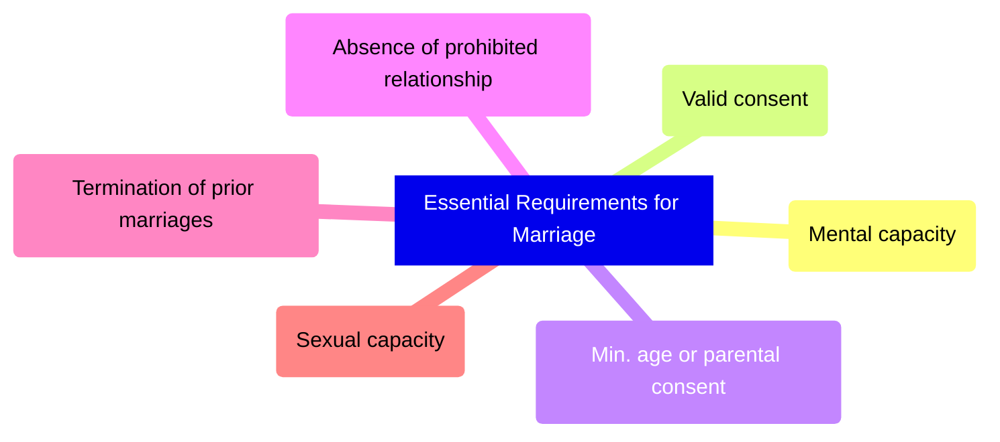
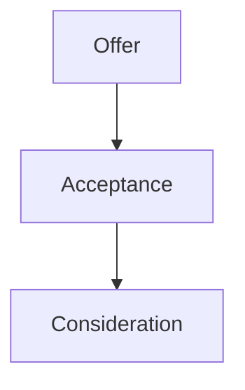
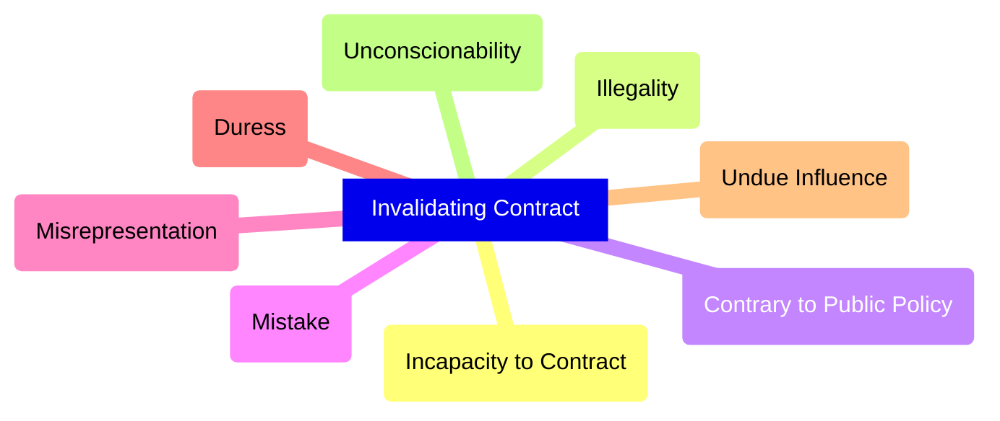
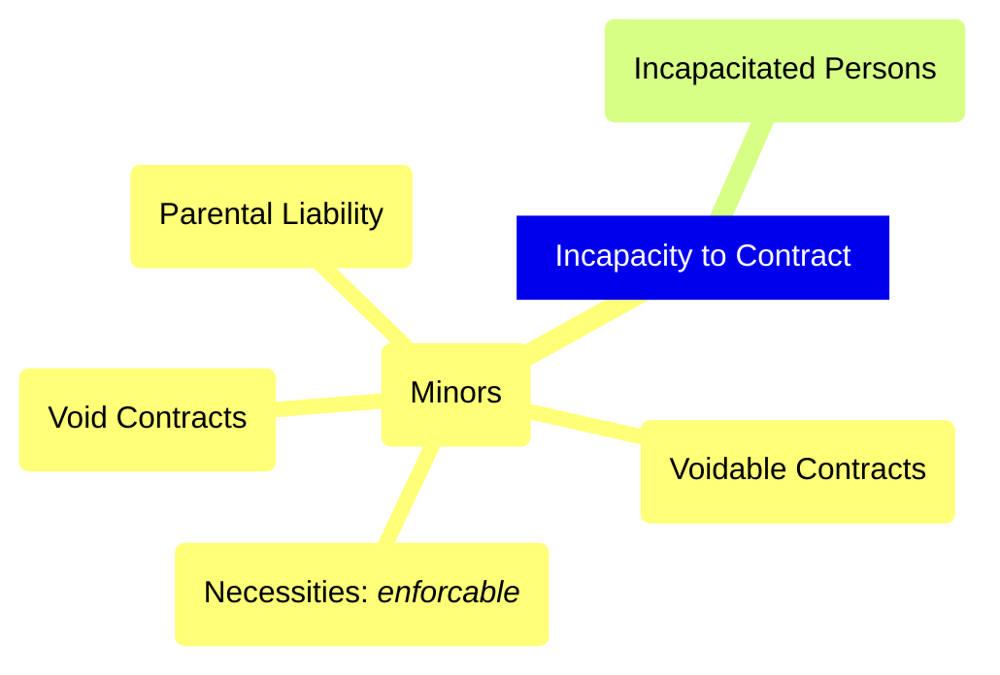
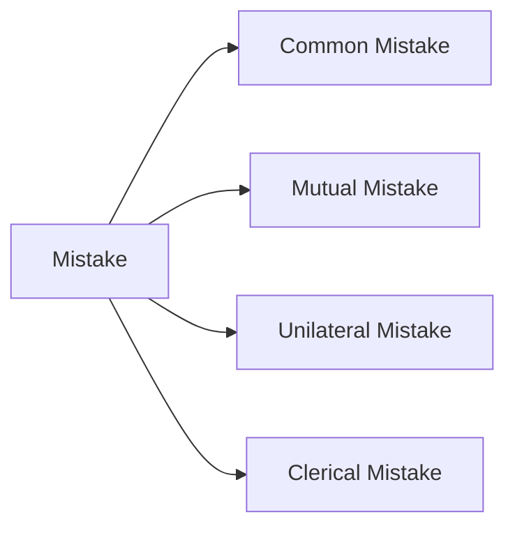
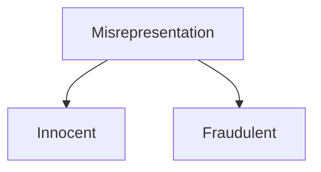
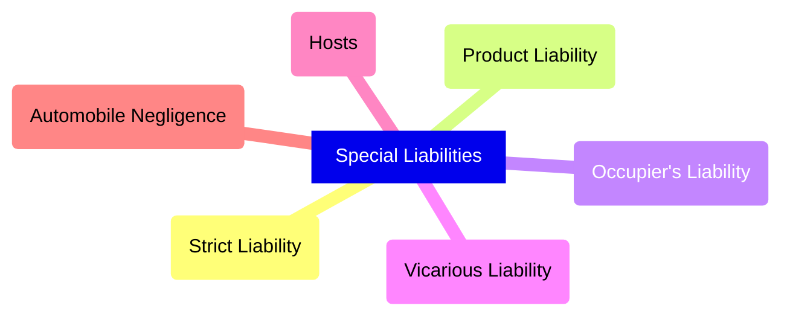
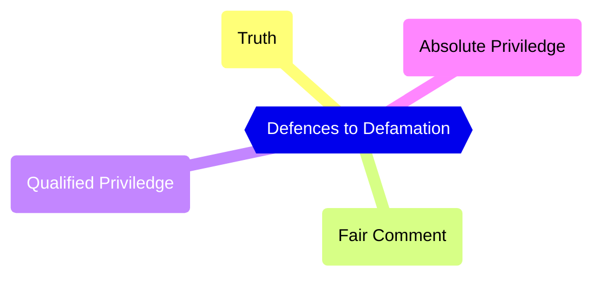

# CY - Exam Review

## Part A: Knowledge

### Crimes v. Torts (Fill in the Blanks)

|If one person|it is the crime of|and also the tort of|
|-|-|-|
|hits another|assault|battery|
|holds another against his or her will|forcible confinement|false imprisonment|
|breaks into another's house (with the intent to steal)|break and enter|trespass to land|
|takes another's belongings|theft|conversion or trespass to goods|
|kills another|homicide|wrongful death|

### Essential Elements of a Marriage (Short Ans.)

More detail: [[c16-marriage]]

### Essential Elements of a Contract (Short Ans.)

- Offer
	- offer must be communicated
	- *invitation to treat* (not an offer)
- Acceptance is not valid from inaction
	- *unilateral contract*: acceptance by performing act requested
	- burden shifted to offeror (offeree sends acceptance = accepted)
- Consideration
	- ✔ *present consideration*, *future consideration*
	- ❌ *past consideration*

More detail: [[c18-contract-law]]

### Invalidating a Contract (Short Ans.)

More detail: [[c18-contract-law]]

## Part B: Thinking &mdash; Case Studies

### Cases Oversimplified

- *Pettkus* v. *Becker*: Rosa B. and Lothar P. &rarr; cohabitation &rarr; beekeeping business [p. 479]
- *F.H.* v. *McDougall*: Indigenous man sex. assaulted by Oblate brother McDougall [p. 446]
- *WIC Radio Ltd.* v. *Simpson*: Simpson sues WIC Radio bcz. host Rafe Mair compared her to Nazis, KKK and skinheads [p. 466]
- *M.* v. *H.*: Girls in same-sex relation; support payments denied; challenges "spouse"  as "man and woman" under *Charter* [p. 492]
- *Derrickson* v. *Derrickson*: Rose and William &rarr; denied William's reserve properties under B.C. *Family Relations Act* &rarr; superseded by *Indian Act* [p. 512]

### *Pettkus* v. *Becker*, [1980] 2 S.C.R. 834

**Background**

- Rosa Becker met Lothar Pettkus in 1955 and started living together soon
- Rosa suggested marriage but Lothar said they should wait until they knew each other better
	- never married
- next 5 yrs: Rosa paid the rent and looked after household expenses
- Lothar saved his money for future investment in beekeeping farm (all savings under Lothar's name)
- 1961: couple buys farm under Lothar's name
	- couple eventually establishes beekeeping business
	- ran for next 14 years
	- business expansion
	- 1973: net profit of $30,000
- 1970s: relationship deteriorated
- Rosa left Lothar, alleging she had been beaten and abused
- She then seeked 1/2 interest in property, worth $300,000

**Legal Question:** How should assets and property of a common-law partnership be divided when the relationship terminates?

**Decision**

- trial judge awards Rosa 40 beehives, w/o bees and $1,500 *(Rosa appeals)*
- appeals court judge determined Rosa and Lothar lived together as husband and wife for ~20 yrs.
- 1/2 property awarded to Rosa *(Lothar appeals)*
- S.C.C. upholds Ontario Court of Appeal ruling
- Rosa Becker never received share of property bcz. Lothar refused Court's decision

**Legal Significance**

- established the principle where one party should not benefit unjustly from the expense of the other
- recognition of property rights during cohabitation
- confirmed that contributions beyond money count (i.e. household labour, support)

### Case: *F.H.* v. *McDougall* (2008), S.C.C. 53 (CanLII)

**Background**

- F.H. was resident at Sechelt Indian Residential School in B.C.
- McDougall was...
	- Oblate Brother
	- junior and intermediate boys' supervisor
	- from 1965-1969
- Assaults alleged to have occurred when children were brought one-by-one into the washroom for cleanliness inspection
- F.H. told no one about assaults until 2000 when he told his wife
- Trial judge found F.H. to be credible witness

**Legal Question:** Should standard of proving liability in civil cases involving wrongdoing be as high as it is for proving criminal guilt?

**Decision**

- Court of Appeal overturned conviction
	- Testimony from adult victims about long-time-ago events required independent corroboration
- S.C.C. Appeal Decision
	- Restoration of trial Judge's decision
	- Decision based on which party presented case w/ greater likelihood of fact
	- Little evidence typically in sexual assault torts
	- If on balance of probabilities, assault did happen, sufficient to rule for plaintiff and make defendant pay
	- Even in criminal sexual assault cases, corroborating evidence not required

**Legal Significance**

- Reinforces existing standard that civil suits are based on a *balance of probabilities*
- Judge favours more likely scenario
- Corroborating evidence not required for sexual assault cases even in criminal cases

### Case: *WIC Radio Ltd.* v. *Simpson*, [2008] S.C.C. 40 (CanLII)

**Background**

- Rafe Mair well-known and sometimes controversial host of show on WIC Radio
- Kari Simpson widely known social activist against positive portrayals of gay lifetstyle
- *controversial debate on radio:* Should materials dealing with homosexuality be introduced in public schools?
- Mair FOR: he believed it would promote tolerance
- Simpson AGAINST: she argued it would promote homosexual lifestyle
- Mair compared Simpson to Hitler, Ku Klux Klan, and skinheads

**Trial**

- Simpson sues for defamation
- Mair at trial testified that he had not implied that Simpson condoned violence toward gay communities
- Mair simply wanted to convey that Simpson was an intolerant bigot
- Trial Judge dismissed complaint noting that defence of fair comment applied
- Court of Appeal reversed trial Judge's decision
	- no evidence that Simpson had ever promoted / condoned violence against gays
	- Mair didn't testify that he had honest belief that Simpson would condone violence

**Legal Question:** What is the objective test that would grant a defence of fair comment?

**Decision (S.C.C.)**

- S.C.C. restored trial Judge's decision
- Mair did make defamatory comments about Simpson
- comments protected by fair comment bcz.
	- a) The comments were on a matter of public interest;
	- b) They were based on fact;
	- c) The comments were recognized as comment; and
	- d) The person who made the comment believed them to be true
- Court ruled that last test should be modified to read "if any person could honestly express that opinion based on the same facts"

**Legal Significance**

- Fair comment defence should not include element of honest belief
- Only requirement should be that it's based on some *facts*
- Shift of focus from speaker's mindset (hard to prove) to factual basis
- Protects freedom of expression of journalists, media, and talk hosts

### Case: *M.* v. *H.*, [1999] 2 S.C.R. 3

**Background**

- 1980: M. and H., 2 women began living together in same-sex relationship
- Started own ad business, purchased businesses, and vacation property
- 1992: relationship deteriorated and M. eventually left common home
- M. financially disadvantaged and filed for support payments under Ontario *Family Law Act*
- M. knew claim would not be successful because "spouse" could only be someone of the opposite sex
- M. intended to challenge def. under the *Charter*

**Legal Question:** Did the words "a man and woman" in the definition of "spouse" in the Ontario *Family Law Act* discriminate against cohabiting partners of the same sex?

**Decision**

- Judge ruled that def. of "spouse" in *Family Law Act* discriminatory
- Declared that "a man and woman" should be changed to "two persons"
- H. appealed and Ontario Court of Appeal upheld decision
- Decision appealed to S.C.C.
- S.C.C. found that definition of "spouse" violated the equality provisions set out in s. 15 of *Charter*

> Section 29 of the *Family Law Act* established differential treatment on the basis of a personal characteristic, namely sexual orientation. This discriminates in a substantive sense by violating the human dignity of individuals in a same-sex relationship.
> 
> &mdash; Justice Peter Cory

**Legal Significance**

- set precedent regarding legal def. of "spouse" in Ont.
- recognition of same-sex relationships
- Court gave gov't. of Ont. 6 months to change def.
- other prov. followed suit in amending laws to incl. same-sex relationships

### Case: *Derrickson* v. *Derrickson*, [1986] 1 S.C.R. 285

**Background**

- Rose and William Derrickson were members of Westbank First Nation in BC
- Rose sought divorce
- She applied under BC *Family Relations Act* for a half-interest in properties that William had been granted under s. 20 of *Indian Act*
- Rose prepared to accept compensation in lieu of property
- Supreme Court of British Columbia dismissed Rose's application
	- fed. *Indian Act* supersedes prov. *Family Relations Act*
	- on appeal, Court of Appeal stated that Rose was not entitled to interest of land; but she should be compensated financially

**Legal Question:** Do the provisions dealing with division of family assets in British Columbia *Family Relations Act* apply to reserve lands held by an Aboriginal person?

**Decision**

- S.C.C. held that right to possess reserve lands is a federal matter
- Court awarded Rose compensation for her interest
- Court could not award her equal division she would have had under prov. legislation
- Critics argue that this law puts Aboriginal women at a disadvantage bcz. majority of Certificate of Possession holders are men

**Legal Significance**

- affirmed federal jurisdiction over reserve lands
- limits on app. on family property rights on reserve lands
- shows that Indigenous women can only rely on compensation, not fair share to land
- highlights legal gap in protecting Indigenous women
- exposure of systematic gender equality (most Cert. of Possession holders men)

## Part C: Communication

### P. 425, Special Types of Liability

Link to *Donoghue* v. *Stevenson* [1932]

Donoghue sues ginger beer manufacturer after her drink had a snail in it

### P. 469, Essential Elements of a Marriage

Link to *Al-smadi (father and next friend of Emman Al-smadi)* [1994]

Emman Al-smadi (14) married Ra'A Ahmed Said (26) Islamically w/ father's consent

Initially rejected (against public interest), but later approved (Emman mature and Ra taking PhD for EE)

### P. 478, Cohabitation &amp; Single-Parent Familial Trends

Link to *Pettkus* v. *Becker*

### P. 458, Defences to Defamation

Link to *WIC Radio Ltd.* v. *Simpson*

## Part D: Application

#### [[cx-case-study|The Article]]